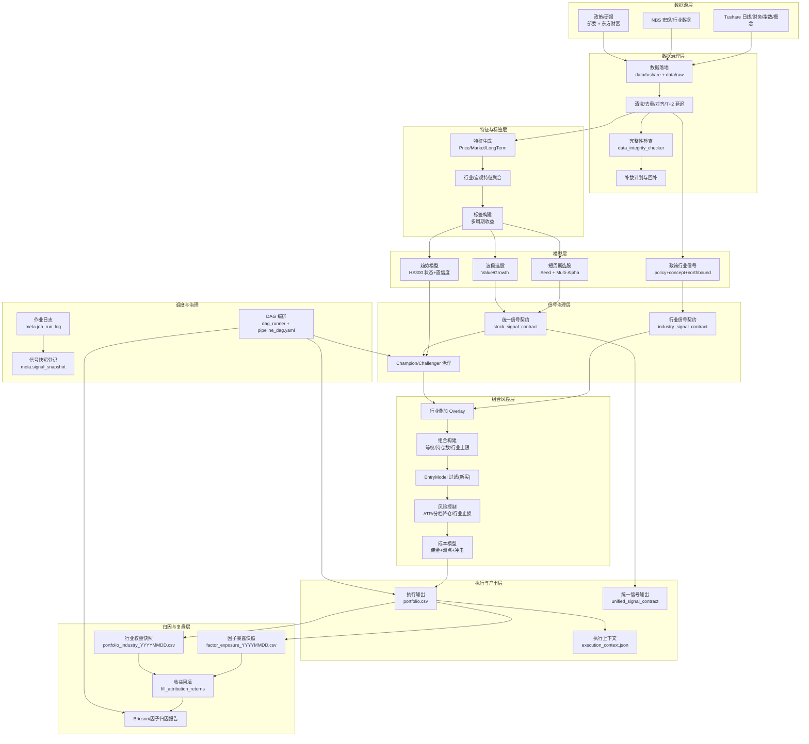

# Sage股票智能交易平台总架构设计文档

## 0. 参考与约束
**参考来源**：
- `docs/CHATGLM聊天记录.md`
- `docs/CHATGPT聊天记录.md`
- `docs/豆包聊天记录.md`
- `docs/项目总体架构设计设想.md`
- `docs/宏观经济预测模型设计文档.md`
- `session/iflow-session.jsonl`

**约束条件（已确认）**：
- 研究/回测为首要目标，中线低频（周频调仓，月度重训）
- 仅A股，股票池为沪深300（允许历史成分）
- 策略目标：收益/回撤平衡（风险调整收益最大化）
- 模型路线：规则 + 树模型（LGBM/XGBoost）为主，LLM仅辅助
- 数据源优先级：Tushare > NBS > Eastmoney > Akshare
- 回测约束：交易成本单边千分之5，T+1卖出，财报/公告/北向T+2延迟
- 风控约束：最大持仓10，单股上限30%，单行业上限40%（申万一级）
- 日志规范：`logs/<module>/<YYYYMMDD>_<NNN>.log`
- 测试框架：`pytest`

---

## 1. 架构目标与边界
### 1.1 架构目标
1. **统一信号契约**：所有策略输出统一结构，执行层只读单一入口。
2. **Champion/Challenger治理**：线上只有一个冠军策略，其余影子运行。
3. **可追溯数据链路**：从原始数据到组合输出均有文件产物与日志。
4. **可扩展执行层**：当前输出“建议持仓”，后续可平滑接入实盘下单。

### 1.2 当前边界（已落地）
- 已落地到“组合建议输出”，未直接对接券商交易接口。
- 买卖交易阶段目前是“生成目标持仓/权重 + 风控上下文”，非自动下单。

---

## 2. 分层架构（生产链路）
```
数据源层 → 数据治理层 → 特征/标签层 → 模型层 → 信号治理层 → 组合风控层 → 执行输出层 → 监控复盘层
```

| 层级 | 主要职责 | 关键模块 |
|---|---|---|
| 数据源层 | 拉取行情/财务/宏观/政策文本 | `scripts/data/*` |
| 数据治理层 | 清洗、对齐、缺失审计、延迟处理 | `scripts/data/macro/*`、`scripts/data/policy/*` |
| 特征/标签层 | 个股/行业/宏观特征生成，标签构建 | `sage_core/features/*`、`scripts/models/*` |
| 模型层 | 趋势、短周期选股、波段选股、政策行业信号 | `sage_core/trend/*`、`sage_core/stock_selection/*`、`sage_core/strategy/*`、`scripts/strategy/*` |
| 信号治理层 | Champion/Challenger治理、多策略组合、统一信号契约 | `sage_core/governance/*`、`sage_core/execution/signal_contract.py`、`sage_core/portfolio/multi_strategy.py` |
| 组合风控层 | 多策略组合、仓位管理、行业暴露约束、增强风控（ATR止损/分档降仓/冲击止损）、交易成本模型 | `sage_core/portfolio/*`、`sage_core/backtest/cost_model.py` |
| 执行输出层 | 生成组合建议、执行上下文 | `sage_app/pipelines/run_weekly.py` |
| 监控复盘层 | 日志、摘要、回测评估、问题归因 | `logs/*`、`data/signals/portfolio/*`、`data/backtest/*` |

---

## 3. 全流程图（从数据到交易）


---

## 4. 调度节奏（每日 / 每周 / 每月）
> 原则：日频“更新数据和中间信号”，周频“做一次完整决策”，月频“重训模型”。

### 4.1 每日任务（D）
| 阶段 | 任务 | 入口脚本 | 主要产出 | 供下游使用 |
|---|---|---|---|---|
| D1 数据拉取 | 日线/财务/北向/指数更新 | `scripts/data/tushare_downloader.py` | `data/tushare/**` | 趋势、选股、主线 |
| D2 宏观更新 | PMI/CPI/收益率等补齐 | `scripts/data/macro/*` | `data/tushare/macro/**` | 宏观与行业景气 |
| D3 政策抓取 | 部委新闻/政策文本/研报 | `scripts/data/policy/fetch_*` | `data/raw/policy/**` | 政策行业信号 |
| D4 政策信号 | 去重、置信度、来源稳定性 | `scripts/data/policy/policy_signal_pipeline.py` | `data/processed/policy/policy_signals.parquet` | 行业信号契约 |
| D5 概念热度 | ths概念热度与行业映射 | `scripts/strategy/concept_signals_from_ths.py` + `build_industry_concept_bias.py` | `data/signals/industry/industry_concept_bias.parquet` | 行业信号契约 |
| D6 行业契约 | 合并 policy/concept/northbound | `scripts/strategy/build_industry_signal_contract.py` | `data/signals/industry/industry_signal_contract.parquet` + `snapshot_latest` | 周频执行信号叠加 |
| D7 巡检监控 | 数据完整性与异常检查 | `scripts/macro/check_macro_data.sh`（及后续巡检） | 检查日志/告警 | 运维与回补 |

### 4.2 每周任务（W）
| 阶段 | 任务 | 入口脚本 | 主要产出 | 供下游使用 |
|---|---|---|---|---|
| W1 周流程运行 | 全链路决策（趋势+短周期选股+波段选股+组合） | `sage_app/pipelines/run_weekly.py` | `portfolio_YYYYMMDD.csv`、`execution_context_YYYYMMDD.json` | 交易执行/回测复盘 |
| W2 短周期策略治理 | Champion/Challenger输出与晋升决策 | `sage_core/governance/*`（被W1调用） | `promotion_decisions.jsonl`、`champion/challenger/*.parquet` | 冠军策略切换 |
| W3 波段策略调仓检查 | 趋势切换检测与调仓决策 | `sage_core/strategy/trend_driven_long_term.py`（被W1调用） | `long_term_rebalance_decision.json` | 波段持仓调整 |
| W4 选股契约 | 统一执行入口信号（短周期+波段） | `sage_core/execution/signal_contract.py`（被W1调用） | `stock_signal_contract_*.parquet`、`long_term_signal_contract_*.parquet`、`execution_signals_*.parquet` | 组合构建 |
| W5 复盘分析 | 收益/回撤/换手/风控命中 | 回测与报表脚本 | 周报与问题清单 | 参数调优与迭代 |

### 4.3 每月任务（M）
| 阶段 | 任务 | 入口脚本 | 主要产出 | 供下游使用 |
|---|---|---|---|---|
| M1 月度重训 | 选股模型重训（LGBM或规则回退） | `scripts/stock/run_stock_selector_monthly.py` | 模型文件、特征重要性、训练摘要 | 周流程选股 |
| M2 计划维护 | 阈值与配置复核 | `config/app/*.yaml` | 配置版本记录 | 下月运行稳定性 |

---

## 5. 当前"周流程"执行明细（你最关心）
`run_weekly.py` 每次执行，按以下顺序：

1. **加载行情输入**：优先 `raw`，为空则回退 `data/tushare`。
2. **趋势判定**：自动加载沪深300指数（`index_000300_SH_ohlc.parquet`），输出 `state/confidence/position_suggestion`。
3. **短周期策略竞争**：运行 Champion/Challenger，按治理规则确定线上冠军。
4. **波段策略调仓检查**：检查趋势切换，决定是否调仓（ENTER/EXIT/REDUCE/HOLD/REBALANCE）。
5. **统一信号契约**：生成 `stock_signal_contract`（短周期冠军+影子）和 `long_term_signal_contract`（波段策略）。
6. **行业叠加**：读取 `industry_signal_snapshot_latest.parquet`，形成 `execution_signals`。
7. **多策略组合构建**：按70/30资金分配，合并短周期和波段持仓，生成统一组合（最大持仓15）。
8. **仓位与风控**：趋势门控 + 波动率目标 + 单股/总仓位检查。
9. **输出产物**：组合文件 + 执行上下文（可追溯）。

---

## 6. 关键产物清单（阶段 → 文件 → 用途）
| 阶段 | 文件 | 用途 |
|---|---|---|
| 政策行业信号 | `data/processed/policy/policy_signals.parquet` | 政策行业打分源 |
| 概念行业偏置 | `data/signals/industry/industry_concept_bias.parquet` | 概念热度映射行业偏置 |
| 行业统一契约 | `data/signals/industry/industry_signal_contract.parquet` | 行业层标准化输入 |
| 行业最新快照 | `data/signals/industry/industry_signal_snapshot_latest.parquet` | 周流程行业叠加输入 |
| 短周期选股契约 | `data/signals/stock_selector/contracts/stock_signal_contract_<trade_date>.parquet` | 短周期冠军/挑战者统一信号 |
| 波段选股契约 | `data/signals/long_term/long_term_signal_contract_<trade_date>.parquet` | 波段策略选股信号 |
| 波段调仓决策 | `data/signals/long_term/rebalance_decision_<trade_date>.json` | 波段策略调仓动作记录 |
| 执行信号 | `data/signals/stock_selector/contracts/execution_signals_<trade_date>.parquet` | 组合构建直接输入（短周期+波段合并） |
| 组合建议 | `data/signals/portfolio/portfolio_<date>.csv` | 目标持仓与权重（多策略合并） |
| 执行上下文 | `data/signals/portfolio/execution_context_<date>.json` | 当次决策解释与复盘 |

---

## 7. 买卖交易阶段（当前与目标）
### 7.1 当前状态
- 已有“可执行建议组合”，并预留了券商执行入口（`scripts/stock/run_broker_execution.py`，当前 PingAn 为 dry-run stub）。
- 交易阶段仍是**人工/半自动**：读取 `portfolio_*.csv` 与 `execution_context_*.json` 做下单，或用 dry-run 生成券商提交回执。

### 7.2 目标状态（下一阶段）
1. 增加 `broker_adapter`（仿真优先、实盘其次）。
2. 增加订单生命周期：下单 → 回报 → 成交 → 持仓对账（详见 `2.24 Sage股票智能交易平台平安证券实盘执行闭环设计文档.md`）。
3. 增加执行约束：涨跌停、最小成交额、滑点模型、撤单重试。
4. 增加交易审计：订单日志、成交偏差、执行质量报告。

---

## 8. 当前默认调度建议
- **每日**：D1~D7（建议收盘后 18:00~22:00）
- **每周**：W1（建议周五收盘后；当前默认可用 `weekly` 手工触发或外部cron）
- **每月**：M1（每月首个交易日收盘后重训）

---

## 9. Q&A
- Q: `run_weekly.py` 是不是“每周只跑一次”？
  A: 脚本本身是“单次执行”，是否周频由调度器决定；建议周频执行。

- Q: 趋势模型是否每周跑？
  A: 在周流程中会跑一次（输入是日线指数）；若需要可单独做日频趋势任务。

- Q: 现在算不算自动交易？
  A: 目前是"自动生成交易建议组合"，尚未完成券商下单闭环。

---

## 10. 增强风控模块

### 10.1 模块位置
`sage_core/portfolio/enhanced_risk_control.py`

### 10.2 风控机制（5层）

| 层级 | 机制 | 触发条件 | 动作 |
|---|---|---|---|
| L1 | Confidence 动态仓位 | 趋势模型 confidence 变化 | 按 confidence 线性缩放总仓位 |
| L2 | ATR 止损 | 个股价格跌破 entry_price - N×ATR | 强制卖出该股票 |
| L3 | 行业止损 | 行业累计收益低于阈值 | 禁止买入该行业 |
| L4 | 分档降仓 | 组合回撤超过阈值 | 按回撤深度分档降低总仓位（15%→半仓，25%→清仓） |
| L5 | 冲击止损 | 单日亏损超过阈值 | 次日强制降仓 |

### 10.3 配置项（RiskControlConfig）

```python
@dataclass
class RiskControlConfig:
    atr_stop_multiplier: float = 2.0      # ATR止损倍数
    atr_period: int = 14                   # ATR计算周期
    max_single_weight: float = 0.30        # 单股最大权重
    max_industry_weight: float = 0.40      # 单行业最大权重
    drawdown_reduce_threshold: float = 0.15  # 回撤降仓阈值
    drawdown_clear_threshold: float = 0.25   # 回撤清仓阈值
    impact_stop_threshold: float = -0.05     # 冲击止损阈值（单日）
    industry_stop_threshold: float = -0.10   # 行业止损阈值（累计）
```

---

## 11. 交易成本模型

### 11.1 模块位置
`sage_core/backtest/cost_model.py`

### 11.2 成本构成

| 成本项 | 公式 | 默认参数 |
|---|---|---|
| 固定成本 | `turnover × fixed_rate` | 单边千分之5（含佣金+印花税） |
| 滑点 | `turnover × slippage_rate` | 千分之1 |
| 市场冲击 | `impact_coeff × sqrt(turnover × portfolio_value / avg_daily_volume)` | Almgren-Chriss 简化模型 |

### 11.3 总成本
```
total_cost = fixed_cost + slippage + market_impact
```

回测引擎默认启用完整成本模型（`use_advanced_cost=True`），可回退到简单成本率模式。

---

## 12. 买卖点模型（EntryModel）

### 12.1 模块位置
`sage_core/execution/entry_model.py`

### 12.2 模型类型
Logistic 回归（`EntryModelLR`），轻量快速，易于解释。

### 12.3 特征体系

| 类别 | 特征 | 说明 |
|---|---|---|
| 价格位置 | `price_ma{5,10,20,60}_ratio` | 价格相对均线的偏离度 |
| 成交量 | `volume_ma{5,10,20}_ratio`、`volume_price_corr` | 量价关系 |
| MACD | `macd`、`macd_signal`、`macd_hist`、`macd_signal_cross` | 趋势动量 |
| K线形态 | `is_doji`、`is_hammer`、`is_shooting_star` | 反转信号 |
| 波动率 | `volatility_5d`、`volatility_10d` | 短期波动 |
| 趋势强度 | `trend_strength_20` | 线性回归斜率 |

### 12.4 标签规则
- 未来 N 天（默认10天）累计收益 ≥ 5%
- 且未来 N 天最大回撤 ≥ -3%
- 满足两个条件则 label=1（好的买入时机）

### 12.5 集成方式
在回测引擎 `SimpleBacktestEngine._rebalance()` 中，止损过滤之后、score 排序之前调用：

```
选股器打分 → 止损过滤 → EntryModel过滤（仅新买入）→ score排序 → 取topN → 权重计算 → 风控调仓
```

- 仅过滤新买入的股票，已持有的股票不受影响
- 需要60天历史数据用于特征计算
- 未训练或未传入时自动跳过（向后兼容）
