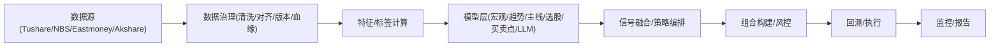

# Sage股票智能交易平台总架构设计文档

## 0. 参考与约束
**参考来源**：
- `docs/CHATGLM聊天记录.md`
- `docs/CHATGPT聊天记录.md`
- `docs/项目总体架构设计设想.md`
- `docs/宏观经济预测模型设计文档.md`
- `session/iflow-seesion.jsonl`
- `docs/legacy/chat_session.md`
- `docs/legacy/conversation-2026-02-11.md`

**约束条件（已确认）**：
- 研究/回测为首要目标，中线低频（周/月为主）
- 仅A股，模型以**规则 + 树模型**为主
- 数据源优先级：Tushare > NBS > Eastmoney > Akshare
- `data/` 不强制入库（文件为主，版本化与血缘必须）
- 依赖管理：`requirements.txt` + `environment.yml`
- 测试：`pytest`
- 日志：`logs/<module>/<YYYYMMDD>_<NNN>.log`

---

## 0.1 技术选型（已确认）
**总体原则**：低频、可解释、可替换、稳健优先。

| 模块 | 默认技术方案 | 说明 |
|---|---|---|
| 趋势状态 | **日级别均线确认（主线）** | MA20/MA60 + 斜率 + 连续确认；HMM仅研究 |
| 宏观/行业 | 规则为主 + 轻量树模型（LGBM） | 低频、滞后性强，规则更稳 |
| 选股排序 | LGBM vs XGBoost | 双模型对比，风险调整收益目标 |
| 买卖点过滤 | 规则过滤 + 简单打分 | 涨跌停/波动/流动性过滤 |
| 信号融合 | 门控优先 + 共振加权 | 不允许单点触发交易 |
| 组合构建 | 等权 + 行业上限 + 风险约束 | 行业上限40% |
| 回测/执行 | Walk-forward + 成本/T+1/延迟 | 成本千分之5，数据延迟T+2 |
| 异步任务 | APScheduler | 定时入库、推送、告警 |
| LLM模块 | 研究/辅助信号 | 仅做加权或过滤，不单独发交易 |

---

## 1. 现状盘点（来自当前代码）
### 1.1 已有模块
- `sage_core/`：趋势/排序/买卖点/回测/组合等模块已搭建
- `scripts/data/macro/`：宏观/NBS/北向数据获取与规范
- `scripts/strategy/mainline_logic_system*.py`：主线板块识别雏形
- `sage_core/stock_selection/multi_alpha_selector.py`：三逻辑选股原型

### 1.2 主要缺口/不一致
- **数据字段不统一**（`stock`/`code`/`ts_code`混用）
- **回测中存在占位逻辑**（随机收益）
- **特征脚本存在语法/API错误**
- **趋势模型/增强版存在明显逻辑缺陷**
- **部分脚本使用硬编码路径**

> 结论：现有代码是“可用原型”，需要**架构化重构**与**统一规范**。

---

## 2. 目标架构（平台化）
```
数据源层 → 数据治理层 → 特征/标签层 → 模型层 → 信号融合层 → 组合与风控层 → 回测/执行层 → 监控/报告
```

### 2.0 端到端流程图（Mermaid）


### 2.1 模块划分
1. **数据源层**：Tushare / NBS / Eastmoney / Akshare  
2. **数据治理层**：清洗、对齐、版本、血缘、质量报告  
3. **特征/标签层**：指标计算、标签生成、特征版本  
4. **模型层**：宏观/趋势/主线/选股/买卖点/（政策产业概念LLM模块）  
5. **信号融合层**：门控 + 多模型共振  
6. **组合与风控层**：仓位、行业暴露、止损  
7. **回测/执行层**：Walk-forward + 交易成本  
8. **异步任务层**：定时入库、推送、告警  
9. **监控/报告层**：异常监控、日报/周报  

### 2.1.1 关键输入输出概览
| 层级 | 输入 | 输出 |
|---|---|---|
| 数据治理 | 原始文件/接口 | 标准化数据表 |
| 特征/标签 | 标准化数据 | 特征表 + 标签 |
| 模型层 | 特征表 | 行业/趋势/排序/过滤信号 |
| 信号融合 | 模型输出 | 可执行组合 |
| 回测 | 组合 + 行情 | 指标 + 交易记录 |

### 2.2 目标结构（建议）
```
sage_core/        # 核心算法库（趋势/宏观/选股/风控/回测）
  data/
  features/
  models/
  portfolio/
  backtest/
  utils/

sage_app/            # 非核心管线（数据接入/调度/入口）
  config/
  data/
  pipelines/

scripts/          # 分模块脚本（data/models/strategy/backtest/monitoring/legacy）
logs/             # 分模块日志
```

### 2.3 现有代码映射
- `ml_stock_forecast/*` 核心模块 → `sage_core/*`（已迁移）
- `ml_stock_forecast/run_weekly.py` → `sage_app/pipelines/run_weekly.py`（已迁移）
- `ml_stock_forecast/scripts/mainline_logic_system*.py` → `scripts/strategy/mainline_logic_system*.py`
- `scripts/data/macro/*` → `scripts/data/macro/`
- 历史说明 → `docs/legacy/ml_stock_forecast/`

---

## 3. 数据流（研究回测路径）
```
原始数据 → 清洗/对齐 → 特征 → 模型输出 → 信号融合 → 组合构建 → 回测/评估 → 报告
```

**共振机制（来自聊天记录）**：
1. 宏观模型输出行业机会（只定方向）  
2. 趋势模型给出风险门控  
3. 主线/选股模型在宏观+趋势共振下输出候选  

### 3.1 主要产出物（示例）
- `data/processed/`：标准化数据  
- `data/features/`：特征与标签  
- `data/signals/`：模型信号  
- `data/portfolio/`：组合权重  
- `reports/`：回测与日报周报（如需）  

---

## 4. 标准接口（简化版）
```python
class TrendModel:
    def fit(self, dataset): ...
    def predict(self, dataset) -> dict:  # state/confidence/position
        return {"state": "RISK_ON", "confidence": 0.78, "position": 0.8}

class RankModel:
    def score(self, universe, features) -> pd.DataFrame: ...

class SignalOrchestrator:
    def run(self, signals) -> pd.DataFrame: ...
```

### 4.1 LLM模块约束（可选）
- **定位**：政策/产业/概念文本信号（公告、研报、舆情）或研究辅助  
- **输出**：结构化标签（主题/风险/情绪）+ 置信度  
- **原则**：不得单独触发交易信号，仅作为加权或过滤依据  
- **可追溯**：记录模型版本、提示词、输入摘要与输出  

---

## 5. 配置 / 日志 / 测试
- 配置：`config/` + 环境变量（token不入库）
- 日志：`logs/<module>/<YYYYMMDD>_<NNN>.log`
- 测试：`pytest`，关键模块先写测试（TDD）

---

## 6. 重构路线（阶段化）
1. **阶段1**：数据规范 + 日志 + 脚本分模块  
2. **阶段2**：模型接口统一 + 信号契约  
3. **阶段3**：信号融合 + 组合风控  
4. **阶段4**：回测统一 + 报告  

---

## Q&A
- Q: 是否保留 `ml_stock_forecast` 作为旧版基线？  
  A: 已拆分为 `sage_core/` 与 `sage_app/`，历史说明移至 `docs/legacy/ml_stock_forecast/`。
- Q: 调仓频率默认周还是月？  
  A: 待确认（设计支持可配置）。
