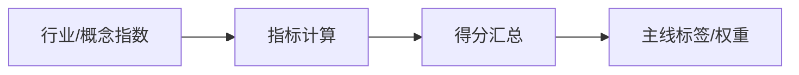

# Sage股票智能交易平台主线与行业轮动模块设计文档

## 1. 模块定位
识别市场“主线板块”和行业轮动节奏，为选股排序与信号融合提供**行业权重与趋势加成**。

---

## 2. 输入 / 输出
**输入**：
- 行业指数（申万行业指数）
- 概念/板块指数（同花顺 ths_index / ths_daily）
- 行业/概念成分股
- 资金/成交额/涨停强度（可选）

**输出**：
```json
{
  "date": "2026-02-13",
  "sector_scores": [
    {"industry": "新能源车", "score": 86, "label": "MAINLINE"}
  ]
}
```

**输出落地（建议）**：
- `data/signals/mainline_score_<YYYYMMDD>.parquet`
- 字段：`trade_date/industry/score/label`
- 概念热度：`data/processed/concepts/concept_heat.parquet`
- 概念信号：`data/signals/concept_signals.parquet`

---

## 3. 核心指标
1. **领涨强度**（相对指数收益）
2. **扩散速度**（上涨家数占比）
3. **持续性**（持续周数）
4. **兑现度**（财报或盈利支撑）
5. **拥挤度**（高换手/涨停占比，负向）

### 3.1 计算示意（简化）
```
leadership = Ret_industry_4w - Ret_index_4w
diffusion  = 上涨股票占比
persistence = 连续强势周数
crowding = 换手率/涨停比例
```

### 3.2 流程图（Mermaid）


---

## 4. 概念信号（补充）
**定位**：概念不是行业，不做 NBS→申万映射。概念仅作为“行业主线/轮动”的辅助信号（偏置或风险提示）。

**输入**：
- 同花顺概念指数（`ths_index` / `ths_daily`）
- 概念成分股（可选，用于行业覆盖判断）

**输出**：
- `data/signals/concept_signals.parquet`（全量）
- `data/signals/concept_signals_top10.parquet`（仅热点Top10）
  - 字段：`concept_code/concept_name/trade_date/heat_20d/heat_60d/concept_heat_score/overheat_flag`

字段示例：
- `trade_date`
- `concept_code`
- `concept_name`
- `heat_20d/heat_60d`
- `momentum_20d/momentum_60d`
- `overheat_flag`

**使用规则**：
- 不直接触发交易，仅作为**行业评分偏置**或**风险提示**
- 若某概念覆盖某行业成分股比例高 → 行业权重加成
- 若概念热度过高 → 行业权重降温或风险提示
 - 概念→行业覆盖率表：`data/processed/concepts/concept_industry_coverage.parquet`

---

## 5. 与现有代码映射
- `scripts/strategy/mainline_logic_system.py`
- `scripts/strategy/mainline_logic_system_optimized.py`
- `scripts/strategy/concept_heat_from_ths.py`

---

## 6. 应用规则
- 主线行业分数 TopN → 行业权重上调  
- 过热行业 → 风险提示（非直接剔除）  

---

## Q&A
- Q: 行业/概念数据来源优先级？  
  A: 申万行业指数（Tushare） + 同花顺板块指数（Tushare ths_*）
