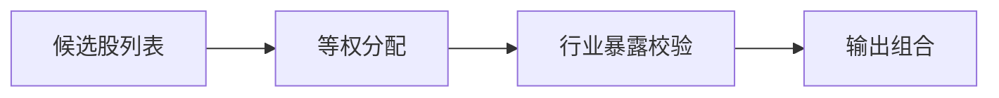

# Sage股票智能交易平台组合构建与风控模块设计文档

## 1. 模块定位
将候选股票构建为组合，并执行风控约束。

---

## 2. 组合约束（已确认）
- 最大持仓数：10  
- 权重方式：等权  
- 单行业最大权重：40%（申万一级）  
- 单股最大权重：不设（可配置）  

---

## 3. 输入 / 输出
**输入**：
- 候选股票（已过滤）
- 行业标签（申万一级）

**输出**：
```json
{
  "date": "2026-02-13",
  "positions": [
    {"ts_code": "600519.SH", "weight": 0.1}
  ],
  "risk_flags": []
}
```

**输出落地（建议）**：
- `data/portfolio/positions_<YYYYMMDD>.parquet`
- 字段：`trade_date/ts_code/weight/sector/risk_flags`

---

## 4. 风控检查
- 行业暴露限制  
- 总仓位限制  
- 回撤阈值（可选）  

### 4.1 流程图（Mermaid）


---

## 5. 与现有代码映射
- `sage_core/portfolio/construction.py`  
- `sage_core/portfolio/risk_control.py`  

---

## Q&A
- Q: 是否引入波动率或风险平价权重？  
  A: 暂不优先。
