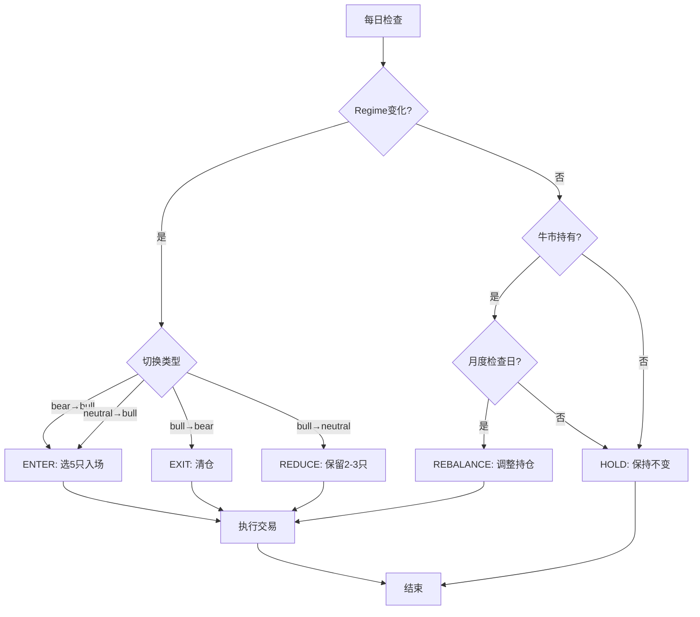

# Sage趋势驱动波段交易系统设计文档

> 创建日期：2026-02-18
> 版本：v1.0
> 目标：结合趋势判断和基本面选股，实现低频高质量的波段交易

---

## 1. 系统定位

### 1.1 核心理念

**趋势驱动 + 基本面选股 + 低频交易**

- **趋势驱动**：只在牛市入场，熊市离场，规避系统性风险
- **基本面选股**：选择优质企业，赚企业成长的钱
- **低频交易**：持仓周期6个月-2年，交易成本极低

### 1.2 与短周期策略的差异

| 维度 | 短周期策略（现有） | 波段策略（新增） |
|------|------------------|----------------|
| 调仓频率 | 每20天 | 趋势切换时（不定期） |
| 持仓周期 | 20天 | 6个月-2年 |
| 收益来源 | 短期价量博弈 | 企业价值增长 + 趋势红利 |
| 特征体系 | 70%价量特征 | 90%基本面特征 |
| 交易成本 | -22%/3年 | -2%~-3%/3年 |
| 持仓数量 | 10只 | 5只 |
| 风险控制 | 回撤降仓 | 趋势离场 + 基本面排雷 |

---

## 2. 系统架构

### 2.1 整体架构

```
┌─────────────────────────────────────────────────┐
│      Multi-Strategy Portfolio Manager           │
│      (多策略组合管理器)                          │
│                                                  │
│  - 资金分配：波段70% + 短周期30%                 │
│  - 调仓协调：独立调仓，互不干扰                  │
│  - 回撤控制：组合层统一管理                      │
└─────────────────────────────────────────────────┘
           │                         │
    ┌──────┴──────┐          ┌──────┴──────┐
    │ 波段策略(70%)│          │ 短周期(30%) │
    │ (新增)      │          │ (现有)      │
    └─────────────┘          └─────────────┘
           │
    ┌──────┴──────────────────────────────┐
    │  Trend-Driven Long Position Strategy │
    │  (趋势驱动波段策略)                  │
    ├──────────────────────────────────────┤
    │ 1. 趋势判断模块                      │
    │    - Regime Model (MA20/MA60)        │
    │    - 状态：bull / neutral / bear     │
    │                                      │
    │ 2. 选股模块（可配置）                │
    │    - 价值股选股器                    │
    │    - 成长股选股器                    │
    │                                      │
    │ 3. 调仓决策模块                      │
    │    - 趋势切换触发                    │
    │    - 持仓期间月度检查                │
    │                                      │
    │ 4. 持仓管理模块                      │
    │    - 最多5只股票                     │
    │    - 等权或按score加权               │
    └──────────────────────────────────────┘
```

### 2.2 模块职责

#### **2.2.1 趋势判断模块**
- **输入**：沪深300日线数据
- **输出**：当前regime状态（bull/neutral/bear）
- **实现**：复用现有`RegimeModel`（MA20/MA60）

#### **2.2.2 选股模块**
- **输入**：全市场股票 + 基本面数据
- **输出**：Top 5候选股票
- **实现**：
  - `ValueStockSelector`：价值股选股器
  - `GrowthStockSelector`：成长股选股器

#### **2.2.3 调仓决策模块**
- **输入**：当前regime + 上期regime + 持仓信息
- **输出**：调仓动作（ENTER/EXIT/REDUCE/HOLD/REBALANCE）
- **实现**：`RebalanceDecisionEngine`

#### **2.2.4 持仓管理模块**
- **输入**：调仓动作 + 候选股票
- **输出**：目标持仓
- **实现**：`PositionManager`

---

## 3. 调仓逻辑设计

### 3.1 调仓触发条件

| 场景 | 条件 | 动作 | 说明 |
|------|------|------|------|
| **入场1** | bear → bull | ENTER | 熊市转牛市，满仓入场 |
| **入场2** | neutral → bull | ENTER | 震荡转牛市，满仓入场 |
| **离场1** | bull → bear | EXIT | 牛市转熊市，清仓离场 |
| **减仓** | bull → neutral | REDUCE | 牛市转震荡，减仓50% |
| **观望** | bear / neutral | HOLD | 熊市或震荡，保持空仓/低仓 |
| **调整** | bull持有期间 | REBALANCE | 每月检查一次，调整持仓 |

### 3.2 调仓决策流程



### 3.3 月度检查逻辑（牛市期间）

**目的**：在牛市持有期间，定期检查持仓质量，剔除基本面恶化的股票

**频率**：每月第一个交易日

**检查内容**：
1. 基本面恶化：ROE下降、现金流恶化、业绩预警
2. 估值过高：PE超过历史90%分位
3. 技术面破位：个股跌破MA60
4. 更优标的：有更高分的候选股票

**调整规则**：
- 剔除1-2只问题股票
- 补充新的高分股票
- 保持5只满仓

---

## 4. 选股策略设计

### 4.1 价值股选股器（ValueStockSelector）

**适用场景**：长期持有，穿越牛熊

**核心逻辑**：选择盈利稳定、现金流好、估值低、持续分红的优质企业

#### **筛选条件（一票否决）**

| 条件 | 阈值 | 说明 |
|------|------|------|
| ROE 5年均值 | > 12% | 持续盈利能力 |
| 现金流/净利润 | > 0.8 | 利润质量 |
| 有息负债率 | < 30% | 财务安全 |
| 连续分红年数 | ≥ 3年 | 股东回报 |
| 股息率 | > 3% | 分红收益 |
| PE历史分位 | < 30% | 估值安全边际 |
| 行业排名 | 前3名 | 行业地位 |

#### **评分模型**

```python
score = (
    roe_5y_mean * 0.30 +           # 盈利能力
    cf_quality * 0.20 +             # 现金流质量
    dividend_yield * 0.20 +         # 分红收益
    (1 - pe_percentile) * 0.30      # 估值安全边际
)
```

#### **选股流程**

1. 加载全市场股票基本面数据
2. 应用一票否决条件筛选
3. 计算综合得分
4. 选择Top 5

### 4.2 成长股选股器（GrowthStockSelector）

**适用场景**：趋势持有，牛市入场熊市离场

**核心逻辑**：选择高成长、高ROE、估值合理、机构认可的成长企业

#### **筛选条件（一票否决）**

| 条件 | 阈值 | 说明 |
|------|------|------|
| 营收3年CAGR | > 20% | 高成长 |
| 净利润3年CAGR | > 25% | 盈利增长 |
| ROE | > 15% | 盈利质量 |
| 研发费用率 | > 5% | 技术壁垒 |
| PEG | < 1.5 | 估值合理 |
| 机构持仓变化 | > 0 | 机构认可 |

#### **评分模型**

```python
score = (
    revenue_cagr_3y * 0.25 +        # 营收增长
    profit_cagr_3y * 0.25 +         # 利润增长
    roe * 0.20 +                    # 盈利质量
    rd_ratio * 0.15 +               # 研发投入
    (1 / peg) * 0.15                # 估值合理性
)
```

#### **选股流程**

1. 加载全市场股票基本面数据
2. 应用一票否决条件筛选
3. 计算综合得分
4. 选择Top 5

### 4.3 选股器配置

用户可通过配置选择使用哪种选股器：

```python
long_term_config = {
    "stock_type": "growth",  # "value" or "growth"
    "max_positions": 5,
    "weight_method": "equal",  # "equal" or "score_weighted"
}
```

---

## 5. 持仓管理

### 5.1 仓位配置

| 状态 | 仓位比例 | 持仓数量 | 说明 |
|------|---------|---------|------|
| bull | 100% | 5只 | 满仓 |
| neutral | 50% | 2-3只 | 半仓 |
| bear | 0% | 0只 | 空仓 |

### 5.2 权重分配

#### **方案A：等权（推荐）**
- 每只股票 20%
- 简单稳健，避免过度集中

#### **方案B：按分数加权**
- 根据选股得分分配权重
- 高分股票获得更多资金
- 风险：可能过度集中

### 5.3 交易执行

- **T+2延迟**：信号生成后2天执行
- **交易成本**：单边0.3%（佣金+印花税+滑点）
- **涨跌停处理**：无法买入则跳过，次日重试

---

## 6. 风险控制

### 6.1 系统性风险控制

**趋势离场机制**：
- 牛市转熊市：立即清仓
- 牛市转震荡：减仓50%
- 规避深度熊市的系统性风险

### 6.2 个股风险控制

**基本面排雷**：
- 一票否决条件筛选
- 月度基本面检查
- 及时剔除问题股票

**估值风险控制**：
- 价值股：PE < 30%分位
- 成长股：PEG < 1.5
- 避免高位接盘

### 6.3 组合层风险控制

**分散化**：
- 最多5只股票
- 单只最多20%
- 行业分散（可选）

**回撤控制**：
- 复用现有回撤降仓机制
- 回撤-15%减仓50%
- 回撤-25%清仓

---

## 7. 回测方案

### 7.1 回测区间

**区间1：2021-02 ~ 2024-02（熊市主导）**
- 验证趋势离场的价值
- 预期：规避2022-2023熊市大幅回撤

**区间2：2024-09 ~ 2024-12（牛市）**
- 验证选股能力
- 预期：捕捉牛市收益

### 7.2 对比基准

| 策略 | 说明 |
|------|------|
| 纯短周期 | 现有策略，每20天调仓 |
| 纯波段 | 新策略，趋势驱动调仓 |
| 组合策略 | 波段70% + 短周期30% |
| 沪深300 | 市场基准 |

### 7.3 评估指标

| 指标 | 目标 |
|------|------|
| 累计收益 | > 沪深300 |
| 年化收益 | > 10% |
| 最大回撤 | < 20% |
| 夏普比率 | > 1.0 |
| 交易成本 | < 5%/3年 |
| 交易次数 | < 10次/3年 |

### 7.4 预期效果（2021-2024）

**时间线模拟**：
```
2021-02: regime=bull → 入场，选5只成长股
2021-08: regime=neutral → 减仓50%，保留3只
2022-01: regime=bear → 清仓
2022-01~2024-08: 空仓（规避熊市）
2024-09: regime=bull → 入场，选5只成长股
2024-12: regime=bull → 持有
```

**预期结果**：
- 交易次数：4次（入场2次 + 离场2次）
- 交易成本：4 × 0.6% = 2.4%（vs 短周期22%）
- 累计收益：+15%~+25%（vs 短周期-23%）
- 最大回撤：-15%~-20%（vs 短周期-25%）

---

## 8. 实施计划

### Phase 1：基础框架（1天）
- [ ] 创建`TrendDrivenLongTermSelector`类
- [ ] 实现调仓决策逻辑
- [ ] 集成现有`RegimeModel`

### Phase 2：选股器开发（2天）
- [ ] 实现`ValueStockSelector`
- [ ] 实现`GrowthStockSelector`
- [ ] 补充缺失的基本面特征

### Phase 3：组合管理（1天）
- [ ] 创建`MultiStrategyPortfolioManager`
- [ ] 实现70/30资金分配
- [ ] 统一回撤控制

### Phase 4：回测验证（1天）
- [ ] 回测2021-2024区间
- [ ] 对比纯短周期 vs 纯波段 vs 组合
- [ ] 调优参数

---

## 9. 配置示例

```python
# 波段策略配置
long_term_config = {
    # 基础配置
    "enabled": True,
    "capital_ratio": 0.7,  # 70%资金
    "max_positions": 5,
    "stock_type": "growth",  # "value" or "growth"

    # 调仓规则
    "rebalance_triggers": {
        "bear_to_bull": "ENTER",      # 熊转牛：入场
        "neutral_to_bull": "ENTER",   # 震荡转牛：入场
        "bull_to_bear": "EXIT",       # 牛转熊：离场
        "bull_to_neutral": "REDUCE",  # 牛转震荡：减仓50%
    },

    # 持有期间管理
    "monthly_rebalance": True,  # 牛市期间每月检查
    "rebalance_day": 1,         # 每月第1个交易日

    # 权重分配
    "weight_method": "equal",  # "equal" or "score_weighted"

    # 风险控制
    "enable_drawdown_control": True,
    "drawdown_reduce_threshold": 0.15,
    "drawdown_clear_threshold": 0.25,
}

# 多策略组合配置
portfolio_config = {
    "strategies": {
        "long_term": {
            "weight": 0.7,
            "config": long_term_config,
        },
        "short_term": {
            "weight": 0.3,
            "config": short_term_config,
        },
    },
}
```

---

## 10. 后续优化方向

### 10.1 短期优化（1-2个月）
1. 补充缺失的基本面特征
2. 优化选股评分模型
3. 引入行业轮动逻辑

### 10.2 中期优化（3-6个月）
1. 机器学习选股模型
2. 动态调整资金分配比例
3. 个股止损机制

### 10.3 长期优化（6-12个月）
1. 多因子模型优化
2. 量化择时优化
3. 组合优化算法

---

## 附录

### A. 数据需求

| 数据类型 | 字段 | 来源 |
|---------|------|------|
| 日线数据 | close, volume, turnover | tushare daily |
| 基本面数据 | pe_ttm, pb, total_mv | tushare daily_basic |
| 财务数据 | roe, revenue, profit | tushare fina_indicator |
| 分红数据 | dividend, div_yield | tushare dividend |
| 研发数据 | rd_exp | tushare fina_indicator |

### B. 关键假设

1. 趋势模型（MA20/MA60）能有效判断牛熊
2. 基本面特征能筛选出优质股票
3. 历史回测能预测未来表现
4. 交易成本按0.3%单边计算

### C. 风险提示

1. 趋势判断可能滞后，错过入场时机
2. 基本面选股可能遗漏短期爆发股
3. 低频交易可能错过短期机会
4. 历史表现不代表未来收益
