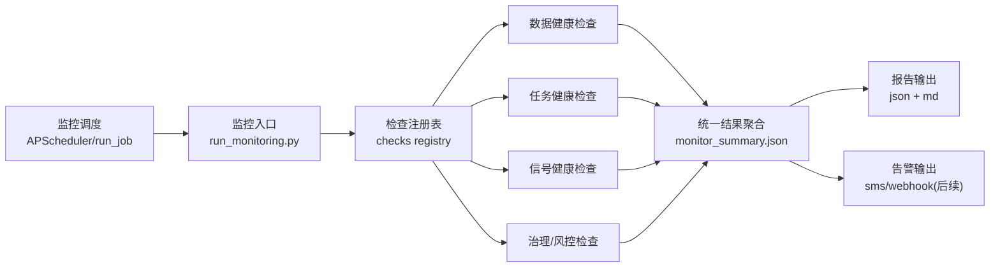

# Sage股票智能交易平台监控与报告模块设计文档（V1）

## 1. 模块定位与目标
监控模块不是“只看数据”，而是覆盖全链路健康度，保障研究/回测/执行链路稳定可追踪。

V1 目标：
- 统一监控口径：数据、任务、信号、策略治理、组合风控、执行接口（预留）。
- 统一输出契约：所有检查输出同一 JSON schema，便于告警与报表聚合。
- 统一运行入口：支持 `run_job`/APScheduler 定时执行与手动执行。

---

## 2. 监控范围（V1）

### 2.1 数据健康监控（Data Health）
- 新鲜度：最新日期距今日的滞后天数（stale_days）。
- 完整性：按日/周/月连续性检查、缺月/缺日检测。
- 唯一性：主键重复（如 `ts_code + trade_date`）检查。
- 字段契约：核心字段是否存在、类型是否可解析。
- 合理性：关键指标区间与突变检查（如收益率、成交额、资金流）。

### 2.2 任务健康监控（Pipeline Health）
- 任务状态：成功/失败、返回码、异常摘要。
- 时效与耗时：开始时间、结束时间、运行时长、超时检查。
- 断点状态：是否卡在同一断点超过阈值天数。

### 2.3 信号健康监控（Signal Health）
- 覆盖率：行业/股票信号覆盖比例。
- 新鲜度：各信号源（policy/concept/northbound）滞后检查。
- 置信度：有效置信度均值与衰减后下限阈值。
- 一致性：同日同标的多信号冲突比例（可先做统计，不做阻断）。

### 2.4 策略治理健康监控（Governance Health）
- Champion/Challenger 状态：当前冠军、晋升决策记录完整性。
- 阴影评估完整性：是否按周生成 `shadow_eval`。
- 自动晋升护栏：晋升前后回撤/换手/成本后收益差异检查。

### 2.5 组合与风控健康监控（Risk & Portfolio Health）
- 组合约束：单股上限、行业上限、持仓数量是否越界。
- 仓位门控：趋势建议仓位与最终执行仓位偏离监控。
- 风险暴露：行业集中度、最大回撤、波动率目标偏离。

### 2.6 执行健康监控（Execution Health，预留）
- 订单生命周期完整性（NEW/ACK/PARTIAL/FILLED/CANCEL/REJECT）。
- 下单失败率、撤单率、成交偏离（滑点偏差）。

---

## 3. V1 技术架构

核心设计：
- 检查器插件化：每类检查独立脚本/函数，可按配置启停。
- 配置驱动：阈值与数据集定义统一放配置文件，不把阈值写死在代码里。
- 结果标准化：所有检查返回统一结构，便于报告与告警。

---

## 4. 统一输出契约（Monitoring Result Schema）

单检查结果字段（建议）：
- `check_id`：检查唯一标识（如 `data.ths_daily.completeness`）
- `category`：`data|pipeline|signal|governance|risk|execution`
- `status`：`PASS|WARN|FAIL`
- `severity`：`P0|P1|P2`
- `metrics`：关键数值（如 stale_days、coverage）
- `thresholds`：使用的阈值
- `issues`：问题明细（缺失月份、重复键示例等）
- `generated_at`：生成时间

汇总结果字段（建议）：
- `run_id`、`scope(daily/weekly/full)`、`overall_status`
- `passed_count/warn_count/fail_count`
- `fail_checks[]`、`warn_checks[]`
- `artifacts`（关联报告路径）

---

## 5. 告警分级与阻断策略
- `P0`（阻断）：核心数据缺失、主键重复严重、核心任务失败、风控越界。
- `P1`（告警）：数据滞后超阈值、信号覆盖下降、运行时长异常。
- `P2`（观察）：轻微漂移或可容忍异常，不阻断。

阻断原则（V1）：
- 研究链路默认“不中断主流程”，先告警并产出报告。
- 交易前链路（未来实盘）对 `P0` 采用硬阻断。

---

## 6. 运行节奏（V1）
- 日频（交易日收盘后）：数据新鲜度 + 核心任务状态 + 信号新鲜度。
- 周频（周末）：全量完整性 + 策略治理 + 风控约束 + 周报。
- 月频（可选）：回测统计与策略稳定性复盘。

---

## 7. 与现有代码的衔接关系
现有脚本保留并纳入统一注册：
- `scripts/monitoring/check_ths_daily_completeness.py`
- `scripts/monitoring/check_industry_signal_quality.py`
- `scripts/monitoring/check_data_quality.py`
- `scripts/monitoring/check_missing_values.py`

V1 新增统一入口（后续实现）：
- `scripts/monitoring/run_monitoring.py`
- `config/monitoring/monitoring_rules.yaml`

---

## 8. 输出路径规范（V1）
- 原始检查结果：`data/monitoring/results/<YYYYMMDD>/<check_id>.json`
- 汇总结果：`data/monitoring/results/<YYYYMMDD>/monitor_summary.json`
- 报告：`reports/monitoring/daily_<YYYYMMDD>.md`、`reports/monitoring/weekly_<YYYYMMDD>.md`
- 日志：`logs/monitoring/<YYYYMMDD>_<NNN>.log`

---

## 9. 分阶段落地计划
### Phase 1（先落地）
- 数据 + 信号 + 任务三类监控接入统一入口。
- 输出统一 JSON 汇总与日报。

### Phase 2
- 策略治理 + 风控约束监控接入。
- 增加周报与异常趋势对比（环比/同比）。

### Phase 3
- 实盘执行监控接入（券商接口后）。
- 推送联动（短信/企业微信/钉钉）。

---

## Q&A
- Q: 监控模块是否只监控数据？
  A: 否。V1 明确覆盖数据、任务、信号、策略治理、风控与执行预留六大类。

- Q: 是否需要自动发送通知（邮件/钉钉/短信）？
  A: V1 先统一结果与报告，推送在 Phase 3 接入。短信参考：`/Users/dongxg/SourceCode/Kronos/scripts/sms_notifier.py`。
