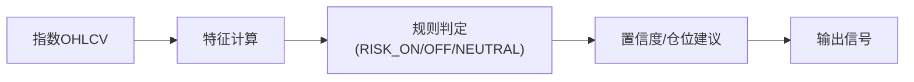

# Sage股票智能交易平台趋势状态模块设计文档

## 1. 模块定位
趋势状态模块用于判断市场处于 **RISK_ON / NEUTRAL / RISK_OFF** 状态，作为**策略门控**信号，决定整体仓位与风险暴露。

> 对齐历史讨论：趋势模块不追求“预测指数点位”，只负责**状态识别 + 风险门控**。

---

## 2. 输入与输出
**输入**（日频/周频）：
- 指数 OHLCV（沪深300为主，可选上证/创业板）
- 波动率与回撤指标
- 成交额变化、广度指标（可选）
- 宏观辅助指标（可选）

**输出**（标准契约）：
```json
{
  "state": "RISK_ON",
  "confidence": 0.78,
  "position_suggestion": 0.8,
  "reason": ["MA多头排列", "波动率下降", "回撤受控"]
}
```

**输出落地（建议）**：
- `data/signals/trend_state_<YYYYMMDD>.parquet`
- 字段：`trade_date/state/confidence/position_suggestion/reason`
- 说明：**主信号默认采用“均线确认”**，落地列名为 `label_main`（源自 `label_ma_confirmation`）

---

## 3. 特征设计（与现有代码对齐）
**基础特征（已在 `MarketFeatures`/`TrendModelRule` 体现）**：
- 均线：MA20/MA60/MA120
- 4周/12周波动率
- MACD
- 价格位置（相对均线/区间）
- 成交额变化
- 回撤/ATR

**扩展特征**（可选）：
- 量价相关性
- 极端波动次数
- 市场广度（涨跌家数比）

**特征清单（MVP v1）**：
- `ma_20`, `ma_60`, `ma_120`
- `ret_4w`, `ret_12w`
- `vol_4w`, `vol_12w`
- `macd`, `macd_signal`, `macd_hist`
- `price_rank_20d`, `price_rank_60d`
- `trend_strength`, `vol_ratio`
- `max_dd_20d`, `drawdown_count`, `atr`

**完整计算规则详见**：`docs/2.21 Sage股票智能交易平台特征字典与计算规则.md`

---

## 4. 规则基线（首选）
**RISK_ON**
- MA20 > MA60 > MA120 且 MA60 上行  
- 波动率 < 历史中位数  
- 回撤未超过阈值（如 -10%）

**NEUTRAL**
- 均线混乱或趋势不明  
- 波动率处于中位区间

**RISK_OFF**
- MA20 < MA60 或指数跌破 MA60  
- 波动率明显抬升  
- 回撤超过阈值

> 规则基线优先：符合“低频、可解释、稳定”的目标。

### 4.1 流程图（Mermaid）


### 4.2 当前选择与可视化
**当前选择**：日级别“均线确认”作为趋势门控基线信号（MA20/MA60 + 斜率 + 连续确认天数）。  
**理由**：在中线/低频框架下更稳定、可解释、对噪声鲁棒。

**示例输出图**（已保存到 `images/`）：  


---

## 5. 置信度与仓位建议
**置信度计算建议**：
```
confidence = w1*MA一致性 + w2*波动率位置 + w3*回撤安全度
```

**仓位映射**：
- RISK_ON：0.7~0.9  
- NEUTRAL：0.4~0.6  
- RISK_OFF：0~0.3  

---

## 6. 可选增强（研究阶段）
- **TrendModelEnhanced（12状态）**：用于更精细的市场分段  
- HMM/Regime Switching：仅作为研究备选（非主线）

---

## 7. 与现有代码的对应关系
**已有实现**：
- `sage_core/models/trend_model.py`（规则版雏形）
- `sage_core/models/trend_model_enhanced.py`（12状态雏形）
- `sage_core/features/market_features.py`

**当前缺陷（需修复）**：
- `trend_model.py` 中 `ma_medium` 赋值错误
- `trend_model_enhanced.py` 存在逻辑变量未定义问题
- `market_features.py` 有 API 调用问题

---

## 8. 测试策略
- 单元测试：规则判定边界（趋势/震荡/下跌）
- 回测对照：有无趋势门控的收益/回撤差异
- 稳定性测试：不同年份/不同指数下的一致性

---

## Q&A
- Q: 趋势判断使用日频还是周频？  
  A: 建议日频评估、周/月执行（低频）。
- Q: 指数基准是否单一沪深300？  
  A: 待确认（可配置多指数合成）。
