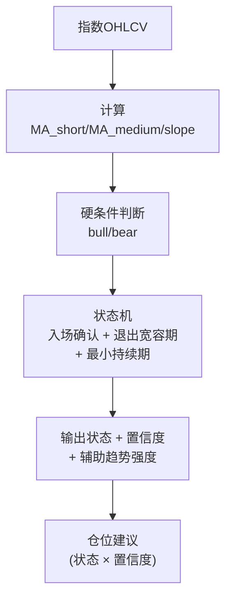

# Sage股票智能交易平台趋势状态模块设计文档

## 1. 模块定位
趋势状态模块用于判断市场处于 **RISK_ON / NEUTRAL / RISK_OFF** 状态，作为**策略门控**信号，决定整体仓位与风险暴露。

> 对齐历史讨论：趋势模块不追求“预测指数点位”，只负责**状态识别 + 风险门控**。

---

## 2. 输入与输出
**输入**（日频/周频）：
- 指数 OHLCV（沪深300为主，可选上证/创业板）
- 波动率与回撤指标
- 成交额变化、广度指标（可选）
- 宏观辅助指标（可选）

**输出**（标准契约）：
```json
{
  "state": "RISK_ON",
  "confidence": 0.78,
  "position_suggestion": 0.8,
  "reason": ["MA多头排列", "波动率下降", "回撤受控"]
}
```

**输出落地（建议）**：
- `data/signals/trend_state_<YYYYMMDD>.parquet`
- 字段：`trade_date/state/confidence/position_suggestion/reason`
- 说明：**主信号默认采用“均线确认”**，落地列名为 `label_main`（源自 `label_ma_confirmation`），
  同时提供 `label_main_confidence`（0~1）

---

## 3. 特征设计（与现有代码对齐）
**基础特征（已在 `MarketFeatures`/`TrendModelRule` 体现）**：
- 均线：MA20/MA60/MA120
- 4周/12周波动率
- MACD
- 价格位置（相对均线/区间）
- 成交额变化
- 回撤/ATR

**扩展特征**（可选）：
- 量价相关性
- 极端波动次数
- 市场广度（涨跌家数比）

**特征清单（MVP v1）**：
- `ma_20`, `ma_60`, `ma_120`
- `ret_4w`, `ret_12w`
- `vol_4w`, `vol_12w`
- `macd`, `macd_signal`, `macd_hist`
- `price_rank_20d`, `price_rank_60d`
- `trend_strength`, `vol_ratio`
- `max_dd_20d`, `drawdown_count`, `atr`

**完整计算规则详见**：`docs/2.21 Sage股票智能交易平台特征字典与计算规则.md`

---

## 4. 规则基线 V2（改进版）

### 4.1 核心设计思想：硬条件 + 状态机平滑

```
┌─────────────────────────────────────────────────────────────┐
│                Layer 2: 状态输出层                            │
│    入场确认 + 退出宽容期 + 最小持续期 → 离散状态 0/1/2        │
└─────────────────────────────────────────────────────────────┘
                              ↑
┌─────────────────────────────────────────────────────────────┐
│                Layer 1: 硬条件判断                            │
│    bull = MA_s > MA_m AND close > MA_s AND slope > 0        │
│    bear = MA_s < MA_m AND close < MA_s AND slope < 0        │
└─────────────────────────────────────────────────────────────┘
                              ↑
┌─────────────────────────────────────────────────────────────┐
│                Layer 0: 证据层                                │
│    MA20/MA60, 斜率(MA20.diff), 收盘价                        │
└─────────────────────────────────────────────────────────────┘
```

> **设计原则**：保持原始均线确认的准确性，仅在状态机层面增加平滑机制。
> 趋势强度仅作为辅助信息输出，不参与状态判断。

### 4.2 关键改进点

**问题1：条件不满足立即退出**
- **原因**：原版均线确认中，任一条件不满足就立即重置为NEUTRAL
- **解决**：退出宽容期（Exit Tolerance）
  - 条件不满足后，宽容N天（默认5天）才退出
  - 宽容期内条件重新满足则重置计数
  - 解决短暂回调打断趋势的问题

**问题2：趋势持续性不足**
- **原因**：一次回调就打断趋势
- **解决**：最小持续期（Minimum Hold Period）
  - 状态切换后强制保持 N 天（日线默认7天）
  - 在持续期内忽略反向信号

**问题3：入场需要确认**
- **保留**：入场确认（Confirmation）
  - 连续N天（默认3天）满足条件才切换状态
  - 与原版均线确认逻辑一致

### 4.3 硬条件定义

```python
# 牛市条件（与原版均线确认一致）
bull = (MA_short > MA_medium) and (close > MA_short) and (slope > 0)

# 熊市条件
bear = (MA_short < MA_medium) and (close < MA_short) and (slope < 0)

# 其他情况 → 维持当前状态（由状态机决定）
```

### 4.4 状态机逻辑

```python
if 当前状态 == NEUTRAL:
    if bull连续满足 >= confirmation_periods:
        → RISK_ON (强制保持 min_hold_periods 天)
    elif bear连续满足 >= confirmation_periods:
        → RISK_OFF (强制保持 min_hold_periods 天)

elif 当前状态 == RISK_ON:
    if bull:
        fail_count = 0  # 条件满足，重置宽容计数
    else:
        fail_count += 1
        if fail_count >= exit_tolerance:
            → NEUTRAL

elif 当前状态 == RISK_OFF:
    if bear:
        fail_count = 0
    else:
        fail_count += 1
        if fail_count >= exit_tolerance:
            → NEUTRAL
```

### 4.5 流程图（Mermaid）



### 4.6 参数配置

| 参数 | 日线默认值 | 周线默认值 | 说明 |
|------|-----------|-----------|------|
| ma_short | 20 | 4 | 短期均线 |
| ma_medium | 60 | 12 | 中期均线 |
| ma_long | 120 | 24 | 长期均线 |
| confirmation_periods | 5 | 2 | 入场确认天数 |
| exit_tolerance | 8 | 3 | 退出宽容期天数 |
| min_hold_periods | 10 | 2 | 最小持续期 |
| weight_price_pos | 0.20 | 0.20 | 价格位置权重 |
| weight_volatility | 0.15 | 0.15 | 波动率权重 |

### 4.7 输出示例

```python
TrendState(
    state=2,                      # RISK_ON
    state_name='RISK_ON',
    confidence=0.78,              # 置信度
    trend_strength=0.45,          # 趋势强度（连续值）
    position_suggestion=0.85,     # 建议仓位
    prob_risk_on=0.72,            # 牛市概率
    prob_neutral=0.23,            # 震荡概率
    prob_risk_off=0.05,           # 熊市概率
    reasons=[
        "MA短期>中期",
        "MA多头排列",
        "价格>短期均线",
        "趋势强度偏多"
    ],
    diagnostics={
        'ma_short': 3850.23,
        'ma_medium': 3720.45,
        'ma_long': 3650.12,
        'current_price': 3920.50,
        'atr': 45.67
    }
)
```

---

## 5. 置信度与仓位建议

### 5.1 置信度计算

```python
# 牛市/熊市态：基于状态概率
if state == RISK_ON:
    confidence = 0.5 + prob_risk_on * 0.5  # [0.5, 1.0]
elif state == RISK_OFF:
    confidence = 0.5 + prob_risk_off * 0.5

# 震荡态：强度越接近0，置信度越高
else:
    confidence = 0.5 + (1 - |trend_strength|) * 0.3  # [0.5, 0.8]
```

### 5.2 仓位映射（动态）

```python
# 根据状态 + 置信度动态计算
if state == RISK_ON:
    position = 0.70 + (0.95 - 0.70) * confidence  # [0.70, 0.95]
elif state == NEUTRAL:
    position = 0.30 + (0.60 - 0.30) * confidence  # [0.30, 0.60]
else:  # RISK_OFF
    position = 0.0 + (0.25 - 0.0) * confidence    # [0.0, 0.25]
```

**示例**：
- RISK_ON + 高置信度(0.9) → 仓位 0.93
- RISK_ON + 低置信度(0.6) → 仓位 0.78
- NEUTRAL + 中置信度(0.7) → 仓位 0.51
- RISK_OFF + 高置信度(0.8) → 仓位 0.20

### 5.3 概率输出（供高级策略使用）

除了离散状态，模型同时输出三个状态的概率分布：

```python
prob_risk_on, prob_neutral, prob_risk_off = compute_probability(trend_strength)

# 使用sigmoid映射
p_risk_on = 1 / (1 + exp(-k * (strength - enter_threshold)))
p_risk_off = 1 / (1 + exp(-k * (-strength - enter_threshold)))
p_neutral = 1 - p_risk_on - p_risk_off
```

**用途**：
- 多策略权重分配（牛市策略权重 = prob_risk_on）
- 风险预算动态调整
- 止损阈值动态设置  

---

## 6. 模型实现

### 6.1 TrendModelRuleV2（推荐）

**文件**：`sage_core/trend/trend_model.py`

**核心类**：
- `TrendModelConfig`: 配置数据类
- `TrendModelRuleV2`: 改进版规则模型（主力）
- `TrendModelRule`: 旧版兼容类（继承自V2）
- `TrendModelHMM`: HMM版本（研究用）
- `TrendModelLGBM`: LGBM版本（待实现）

**使用示例**：

```python
from sage_core.trend.trend_model import create_trend_model, TrendModelConfig

# 方式1：使用默认配置
model = create_trend_model('rule')

# 方式2：自定义配置
config = TrendModelConfig(
    ma_short=20,
    ma_medium=60,
    confirmation_periods=5,
    exit_tolerance=8,
    min_hold_periods=10,
)
model = TrendModelRuleV2(config)

# 预测
result = model.predict(df_index)
print(f"状态: {result.state_name}")
print(f"置信度: {result.confidence}")
print(f"建议仓位: {result.position_suggestion}")
print(f"趋势强度: {result.trend_strength}")
```

### 6.2 配置文件

**文件**：`config/app/trend_model.yaml`

```yaml
# 趋势模型配置
model_type: rule  # rule / hmm / lgbm

rule_params:
  # 均线参数
  ma_short: 20
  ma_medium: 60
  ma_long: 120

  # 状态机参数
  confirmation_periods: 5   # 入场确认天数
  exit_tolerance: 8         # 退出宽容期天数
  min_hold_periods: 10      # 最小持续期

  # 仓位映射
  position_risk_on: [0.70, 0.95]
  position_neutral: [0.30, 0.60]
  position_risk_off: [0.0, 0.25]

  # 市场广度（可选）
  use_breadth: false
  weight_breadth: 0.10

hmm_params:
  n_components: 3
  sticky_factor: 0.90
  min_duration: 5

lgbm_params:
  # 待实现
  pass
```

### 6.3 输出契约

**TrendState 数据类**：

```python
@dataclass
class TrendState:
    state: int                    # 0/1/2
    state_name: str               # RISK_OFF/NEUTRAL/RISK_ON
    confidence: float             # [0, 1]
    trend_strength: float         # [-1, 1]
    position_suggestion: float    # [0, 1]
    prob_risk_on: float           # [0, 1]
    prob_neutral: float           # [0, 1]
    prob_risk_off: float          # [0, 1]
    reasons: List[str]            # 状态原因
    diagnostics: Dict             # 诊断信息
```

### 6.4 可选增强（研究阶段）

- **TrendModelEnhanced（12状态）**：用于更精细的市场分段（已有雏形，待完善）
- **HMM/Regime Switching**：仅作为研究备选（非主线）
- **LGBM分类器**：使用历史数据训练三分类模型（待实现）

---

## 7. 与现有代码的对应关系

**已完成实现**：
- ✅ `sage_core/trend/trend_model.py`（V2版本，完整实现）
  - `TrendModelRuleV2`: 改进版规则模型
  - `TrendModelHMM`: HMM版本（基础实现）
  - `TrendModelLGBM`: LGBM版本（占位，待实现）
  - `create_trend_model()`: 工厂函数
- ✅ `sage_core/features/market_features.py`（特征计算）

**待完善**：
- ⏳ `sage_core/trend/trend_model_enhanced.py`（12状态版本，需重构）
- ⏳ `config/app/trend_model.yaml`（配置文件，需创建）
- ⏳ 单元测试（`sage_core/tests/test_trend_model.py`）

**已修复问题**：
- ✅ 边界抖动问题（回滞阈值）
- ✅ 趋势持续性不足（最小持续期）
- ✅ 离散状态不平滑（输出连续强度+概率）
- ✅ 旧版兼容性（TrendModelRule继承自V2）

**关键改进**：
1. 三层架构：证据层 → 强度层 → 状态层
2. 回滞阈值：进入0.30 / 退出0.12
3. 最小持续期：7天（日线）
4. ATR归一化：价格位置用ATR标准化
5. 概率输出：同时输出三个状态的概率分布

---

## 8. 测试策略

### 8.1 单元测试

**文件**：`sage_core/tests/test_trend_model.py`

**测试用例**：
- ✅ 趋势强度计算正确性
- ✅ 回滞状态机逻辑
- ✅ 最小持续期约束
- ✅ 边界条件（NaN处理、数据不足）
- ✅ 配置参数有效性
- ✅ 输出契约完整性

### 8.2 回测对照

**对比维度**：
1. **有无趋势门控**
   - 无门控：全时段满仓
   - 有门控：根据趋势状态调仓
   - 预期：门控版回撤更小，夏普更高

2. **不同参数组合**
   - enter_threshold: [0.20, 0.25, 0.30, 0.35]
   - exit_threshold: [0.10, 0.12, 0.15]
   - min_hold_periods: [5, 7, 10]
   - 选择稳定性最好的参数

3. **不同模型对比**
   - Rule V2 vs Rule V1
   - Rule vs HMM
   - 单指数 vs 多指数合成

### 8.3 稳定性测试

**测试维度**：
- 不同年份（2018-2025）
- 不同指数（沪深300/上证50/中证500/创业板）
- 不同市场状态（牛市/熊市/震荡）
- 参数敏感性分析

**评估指标**：
- 状态切换次数（越少越好）
- 平均持续期（越长越好）
- 状态准确率（与未来收益相关性）
- 回撤控制效果

### 8.4 实盘验证

**灰度测试流程**：
1. 纸面交易（1个月）
2. 小资金实盘（10%仓位，1个月）
3. 逐步放大（每月+10%）
4. 持续监控与调优

**监控指标**：
- 实盘 vs 回测偏差
- 状态切换及时性
- 仓位调整执行情况
- 异常情况告警

---

## Q&A

### Q1: 趋势判断使用日频还是周频？
**A**: 建议日频计算、周频执行（低频调仓）。日频计算可以更及时捕捉状态变化，但实际调仓仍然保持周频，避免过度交易。

### Q2: 指数基准是否单一沪深300？
**A**: 当前以沪深300为主，未来可配置多指数合成（如沪深300 + 中证500加权）。

### Q3: 为什么选择回滞阈值而不是简单平滑？
**A**:
- 简单平滑（如移动平均）会引入滞后
- 回滞阈值保持及时性的同时避免抖动
- 符合交易心理（进入需要更强信号，退出可以更早）

### Q4: 最小持续期会不会错过重要转折点？
**A**:
- 7天持续期是经验值，可根据回测调整
- 真正的趋势转折通常持续时间更长
- 短期噪声造成的"假转折"更多，强制持续期可以过滤

### Q5: 趋势强度和状态哪个更重要？
**A**:
- 状态用于门控（开/关仓）
- 强度用于仓位调节（开多少仓）
- 两者配合使用效果最好

### Q6: HMM和LGBM版本什么时候用？
**A**:
- Rule V2是主力，稳定可解释
- HMM用于研究市场状态转换规律
- LGBM待实现，用于探索非线性关系
- 生产环境优先Rule V2

### Q7: 如何处理极端行情（如熔断）？
**A**:
- 波动率组件会自动识别（vol_strength变负）
- 建议增加熔断检测逻辑（单日跌幅>7%强制RISK_OFF）
- 配合组合层面的单日冲击止损

### Q8: 参数如何优化？
**A**:
- 使用Walk-Forward验证
- 优先优化enter_threshold和exit_threshold
- 避免过度拟合（参数稳定性 > 绝对收益）
- 建议每季度重新评估参数
