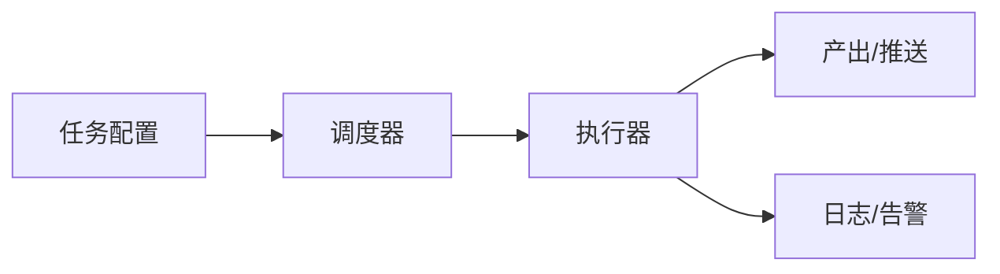

# Sage股票智能交易平台异步任务模块设计文档

## 1. 模块定位
提供**定时任务/异步任务**能力，用于数据入库、消息推送、任务编排与告警。

---

## 2. 典型任务类型
- 定时拉取/更新数据  
- 特征与标签定时生成  
- 回测/报告定时产出  
- 异常告警（邮件/钉钉/企业微信可选）

---

## 3. 输入 / 输出
**输入**：
- 任务配置（cron/interval）
- 数据源与目标路径

**输出**：
- 执行日志
- 产出文件或推送消息

**输出落地（建议）**：
- `logs/jobs/<YYYYMMDD>_<NNN>.log`
- `data/processed/`、`data/features/`、`reports/`

---

## 4. 任务调度方案（候选）
- 本地：`cron` / `launchd`  
- Python：`APScheduler`  
- 后续可扩展：`Celery + Redis`

## 4.1 推送实现参考
- 参考实现：`/Users/dongxg/SourceCode/Kronos/scripts/sms_notifier.py`
- 推送方式：PushPlus 微信推送（HTML 模板）
- 配置文件：`config/notify_config.json`、`config/user_config.json`

---

## 5. 流程图（Mermaid）

---

## 6. 与现有代码映射
- `scripts/macro/*`（可迁移为任务）
- `scripts/backup/*`（同步与备份任务）

---

## Q&A
- Q: 推送渠道优先级（邮件/钉钉/企业微信）？  
  A: 参考 Kronos PushPlus 方案（微信推送）。
