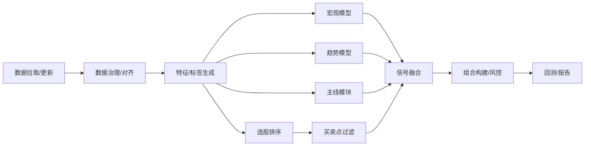

# Sage股票智能交易平台接口与调用流程设计文档

## 1. 模块输入输出契约（摘要版）
| 模块 | 输入 | 输出 |
|---|---|---|
| 数据治理 | 原始行情/宏观数据 | 标准化表（processed） |
| 特征/标签 | processed表 | features/labels |
| 宏观模型 | 宏观+行业数据 | 行业机会列表 |
| 趋势模型 | 指数数据 | 状态/置信度/仓位 |
| 主线模块 | 行业指数 | 行业主线得分 |
| 选股排序 | 特征+标签 | 排名得分 |
| 买卖点过滤 | 排名候选 | 买入/卖出列表 |
| 组合构建 | 候选股 | 持仓组合 |
| 回测引擎 | 组合+行情 | 指标+曲线 |

---

## 2. 端到端调用流程（Mermaid）

---

## 3. 关键输出文件
- `data/processed/`：清洗后数据  
- `data/features/`：特征/标签  
- `data/signals/`：宏观/趋势/主线/排序/过滤信号  
- `data/portfolio/`：组合权重  
- `data/backtest/`：回测指标/曲线  
