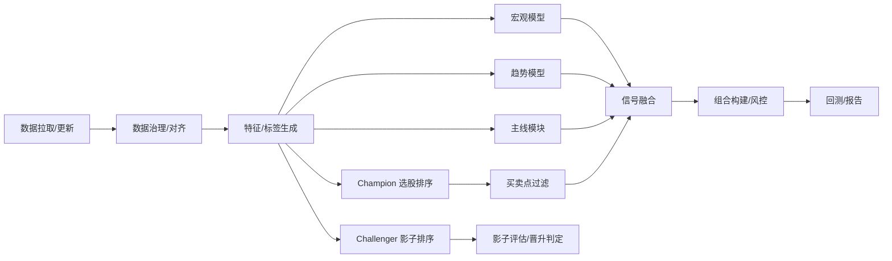

# Sage股票智能交易平台接口与调用流程设计文档

## 1. 模块输入输出契约（摘要版）
| 模块 | 输入 | 输出 |
|---|---|---|
| 数据治理 | 原始行情/宏观数据 | 标准化表（processed） |
| 特征/标签 | processed表 | features/labels |
| 宏观模型 | 宏观+行业数据 | 行业机会列表 |
| 趋势模型 | 指数数据 | 状态/置信度/仓位 |
| 主线模块 | 行业指数 | 行业主线得分 |
| 选股排序 | 特征+标签 | 统一信号契约（score/rank/confidence/model_version） |
| 买卖点过滤 | 排名候选 | 买入/卖出列表 |
| 组合构建 | 候选股 | 持仓组合 |
| 回测引擎 | 组合+行情 | 指标+曲线 |

---

## 2. 策略治理契约（Champion/Challenger）
### 2.1 策略标识
- Champion（线上唯一）：`seed_balance_strategy`
- Challengers（影子运行）：`balance_strategy_v1` / `positive_strategy_v1` / `value_strategy_v1` / `satellite_strategy_v1`
- 兼容别名：`seed_banlance_strategy` -> `seed_balance_strategy`

### 2.2 信号接口（强约束）
所有策略输出必须完全一致：
- `trade_date`（`YYYYMMDD`）
- `ts_code`
- `score`
- `rank`
- `confidence`（`0~1`）
- `model_version`（如 `seed_balance_strategy@v1.0.0`）

统一契约落地（跨趋势/行业/选股）：
- `data/signals/contracts/unified_signal_contract_<trade_date>.parquet`
- 核心字段：`trade_date/signal_domain/entity_type/entity_id/signal_name/score/confidence/direction/rank/source/model_version`

示例：
```json
{
  "trade_date": "20260215",
  "ts_code": "600519.SH",
  "score": 0.918,
  "rank": 1,
  "confidence": 0.84,
  "model_version": "seed_balance_strategy@v1.0.0"
}
```

### 2.3 执行读取规则
- 执行层只读取 `active_champion_id` 的信号文件；
- 影子策略文件仅进入评估层，不进入执行层；
- 禁止多策略同时下单。

---

## 3. 端到端调用流程（Mermaid）


---

## 4. 关键输出文件
- `data/processed/`：清洗后数据
- `data/features/`：特征/标签
- `data/signals/`：宏观/趋势/主线/排序/过滤信号
- `data/portfolio/`：组合权重
- `data/backtest/`：回测指标/曲线

补充建议（策略治理）：
- `data/signals/champion/<YYYYMMDD>.parquet`
- `data/signals/challenger/<strategy_id>/<YYYYMMDD>.parquet`
- `data/backtest/shadow_eval/<strategy_id>.parquet`
- `data/backtest/governance/promotion_decisions.json`
