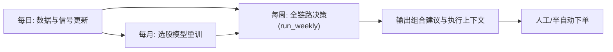

# Sage股票智能交易平台执行手册（V1）

> 目标：给出一套“可直接执行”的日/周/月操作清单。
> 说明：本手册先覆盖当前已落地链路，后续持续补充。

---

## 1. 执行总览


---

## 2. 运行环境与约定
### 2.1 工作目录
- 项目根目录：`/Users/dongxg/SourceCode/Sage`

### 2.2 Python解释器（固定）
- 推荐：`conda run -n base python ...`
- 可选：`./venv/bin/python ...`

### 2.3 基础约定
- 日志目录：`logs/<module>/`
- 数据目录：`data/tushare/`（主）+ `data/signals/`（含 `data/signals/portfolio/`）
- 敏感信息（如 Tushare Token）仅用环境变量，不写入代码/文档。

---

## 3. 每日任务（D）
> 目标：保证周流程可用输入持续更新。

### D1 数据拉取（行情/财务/指数/行业）
```bash
cd /Users/dongxg/SourceCode/Sage
conda run -n base python scripts/data/tushare_downloader.py --task daily
conda run -n base python scripts/data/tushare_downloader.py --task daily_basic
conda run -n base python scripts/data/tushare_downloader.py --task index_ohlc
conda run -n base python scripts/data/tushare_downloader.py --task sw_index_member
```

### D2 宏观更新（按需）
```bash
cd /Users/dongxg/SourceCode/Sage
./scripts/macro/fetch_all_macro_data.sh
./scripts/macro/check_macro_data.sh
```

### D3 政策抓取与信号
```bash
cd /Users/dongxg/SourceCode/Sage
conda run -n base python scripts/data/policy/fetch_gov_policy.py
conda run -n base python scripts/data/policy/fetch_eastmoney_industry_reports.py
conda run -n base python scripts/data/policy/policy_signal_pipeline.py
```

### D4 概念热度与行业契约
```bash
cd /Users/dongxg/SourceCode/Sage
conda run -n base python scripts/strategy/concept_signals_from_ths.py --top-k 10
conda run -n base python scripts/strategy/build_industry_concept_bias.py --top-k 10
conda run -n base python scripts/strategy/build_industry_signal_contract.py
```

### D5 每日验收（最小）
检查以下文件是否更新：
- `data/processed/policy/policy_signals.parquet`
- `data/signals/industry/industry_signal_snapshot_latest.parquet`
- `data/signals/industry/industry_signal_contract.parquet`

---

## 4. 每周任务（W）
> 目标：跑一次完整决策流程，生成可执行组合建议。

### W1 运行周流程
```bash
cd /Users/dongxg/SourceCode/Sage
conda run -n base python sage_app/pipelines/run_weekly.py weekly
```

### W2 周流程关键产物
- 组合建议：`data/signals/portfolio/portfolio_<YYYYMMDD>.csv`
- 执行上下文：`data/signals/portfolio/execution_context_<YYYYMMDD>.json`
- 选股契约：`data/signals/stock_selector/contracts/stock_signal_contract_<trade_date>.parquet`
- 执行信号：`data/signals/stock_selector/contracts/execution_signals_<trade_date>.parquet`
- 统一信号契约：`data/signals/contracts/unified_signal_contract_<trade_date>.parquet`
- 券商提交回执（入口）：`data/signals/portfolio/broker_submit_<YYYYMMDD_HHMMSS>.json`

### W3 周流程验收清单
- `execution_context` 内 `active_champion_id` 非空
- `execution_context` 内 `risk_checks` 全部为 `true`
- `portfolio` 持仓数 <= 10
- `portfolio` 权重和 <= 1.0（当前默认约 0.3/0.6/0.9 门控）

### W4 券商执行入口（平安证券，默认 dry-run）
```bash
cd /Users/dongxg/SourceCode/Sage
conda run -n base python scripts/run_job.py broker_submit -- --broker pingan
```

可选参数：
- `--portfolio-path <path>`：指定组合文件（不指定时取最新 `portfolio_*.csv`）
- `--execution-context-path <path>`：指定执行上下文（不指定时取最新 `execution_context_*.json`）
- `--top-n 10`：下单股票上限（默认10）
- `--submit`：实盘提交开关（当前 PingAn 仅预留接口，`--submit` 会报 `NotImplementedError`）

配置文件：
- `config/app/broker.yaml`（仅放结构与环境变量名，不放真实密钥）

---

## 5. 每月任务（M）
> 目标：重训选股模型，更新模型与特征重要性。

### M1 月度重训
```bash
cd /Users/dongxg/SourceCode/Sage
conda run -n base python scripts/stock/run_stock_selector_monthly.py \
  --train-lookback-days 900 \
  --top-n 10 \
  --allow-rule-fallback
```

### M2 重训产物
- `data/signals/stock_selector/monthly/models/stock_selector_<model_type>_<date>.*`
- `data/signals/stock_selector/monthly/feature_importance_<date>.parquet`
- `data/signals/stock_selector/monthly/training_summary_<date>.json`

---

## 6. 调度建议（先手工，后自动）
- 每日：收盘后运行 D1~D4
- 每周：周五收盘后运行 W1
- 每月：首个交易日收盘后运行 M1

> 后续可统一接入 APScheduler/cron，把本手册命令固化为定时任务。

---

## 7. 常见问题排查
### Q1 `run_weekly.py` 提示缺少数据
- 先执行每日任务 D1~D4，确认输入文件存在。

### Q2 趋势总是默认震荡
- 检查 `data/tushare/index/index_000300_SH_ohlc.parquet` 是否存在且有最新日期。

### Q3 选股只出一个策略
- 检查 `config/app/strategy_governance.yaml` 的 `active_champion_id` 与 `auto_promotion` 配置。

### Q4 日志查看
```bash
cd /Users/dongxg/SourceCode/Sage
tail -f logs/weekly/<最新日志文件>
```

---

## 8. 后续补充位（TODO）
- [ ] 增加“实盘下单执行手册”（券商适配、订单状态流、失败重试；当前已预留 PingAn dry-run 入口）
- [ ] 增加“异常告警手册”（短信/邮件/钉钉）
- [ ] 增加“回测复盘模板”（周报固定格式）
- [ ] 增加“参数变更审批与回滚手册”

---

## 9. 行业回测评估（新增）
> 目标：补齐行业命中率、行业超额、行业回撤贡献、换手与成本后收益评估。

```bash
cd /Users/dongxg/SourceCode/Sage
conda run -n base python scripts/strategy/evaluate_industry_backtest.py \
  --top-n 2 \
  --hold-days 5 \
  --rebalance-step 5 \
  --cost-rate 0.005
```

增强对照（趋势门控 + 拥挤度降温 + 行业暴露惩罚）：
```bash
cd /Users/dongxg/SourceCode/Sage
conda run -n base python scripts/strategy/evaluate_industry_backtest.py \
  --top-n 2 \
  --hold-days 5 \
  --rebalance-step 5 \
  --cost-rate 0.005 \
  --compare-enhanced
```

默认输出：
- `data/backtest/industry/industry_backtest_summary.json`
- `data/backtest/industry/industry_backtest_period_metrics.parquet`
- `data/backtest/industry/industry_backtest_drawdown_contribution.parquet`
- `data/backtest/industry/industry_backtest_summary_enhanced.json`（对照运行时）
- `data/backtest/industry/industry_backtest_compare.json`（对照差异）

参数网格搜索（寻找更优门控/降温组合）：
```bash
cd /Users/dongxg/SourceCode/Sage
conda run -n base python scripts/strategy/grid_search_industry_overlay.py \
  --neutral-multipliers 0.6,0.7 \
  --risk-off-multipliers 0.1,0.2 \
  --crowding-z-thresholds 1.2,1.5 \
  --crowding-penalty-factors 0.8,0.85 \
  --exposure-windows 8 \
  --exposure-thresholds 0.5,0.6 \
  --exposure-factors 0.8
```

网格搜索输出：
- `data/backtest/industry/grid_search/industry_overlay_grid_results.parquet`
- `data/backtest/industry/grid_search/industry_overlay_grid_best.json`
- `data/backtest/industry/grid_search/industry_overlay_grid_compare_to_baseline.json`
