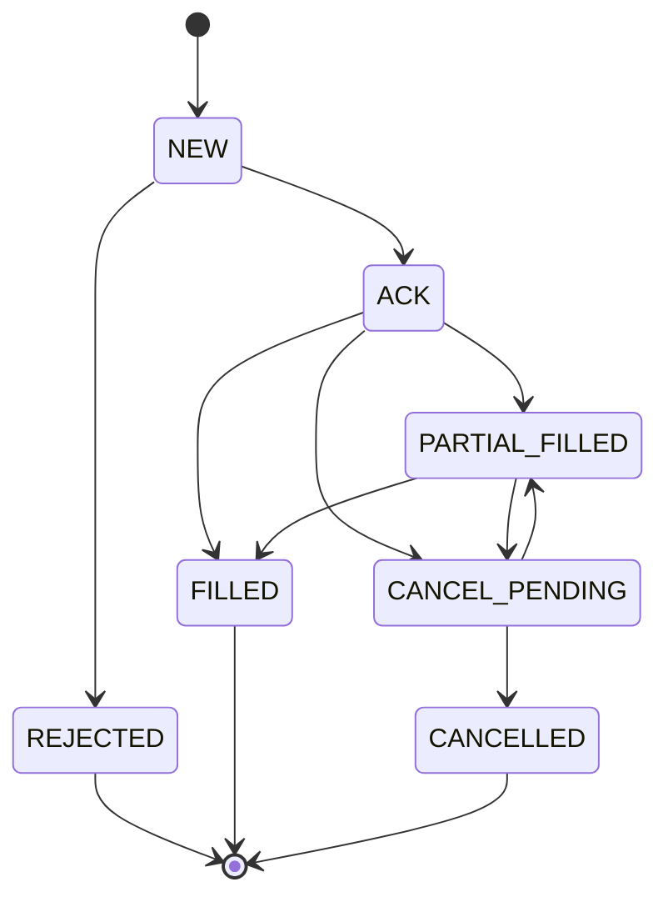

# Sage股票智能交易平台平安证券实盘执行闭环设计文档（V1）

> 版本：v1（设计稿）
> 日期：2026-02-15
> 范围：在现有 `portfolio.csv + execution_context.json` 基础上，补齐“券商执行闭环”。

---

## 1. 目标与边界

### 1.1 目标
- 在不改变当前策略主链路的前提下，补齐“下单 -> 回报 -> 成交 -> 对账 -> 归档”闭环。
- 先保证**下限稳定**（可回滚、可追溯、可重放），再提升自动化程度。
- 平安证券接入采用“**dry-run 已上线，实盘 submit 后续切换**”策略。

### 1.2 非目标（V1不做）
- 不做高频/盘口级执行优化。
- 不做多券商同时实盘路由。
- 不做智能拆单（TWAP/VWAP）。

---

## 2. 当前基线（已完成）
- 执行入口脚本：`scripts/stock/run_broker_execution.py`
- 统一入口：`python scripts/run_job.py broker_submit -- --broker pingan`
- 产物：`data/portfolio/broker_submit_<YYYYMMDD_HHMMSS>.json`
- 状态：PingAn 仅 `dry-run`，`--submit` 显式未实现（防误下单）。

---

## 3. 闭环架构（V1）

---

## 4. 状态机定义（订单生命周期）

### 4.1 状态说明
- `NEW`：本地生成订单，未发往券商。
- `ACK`：券商已接收。
- `PARTIAL_FILLED`：部分成交。
- `FILLED`：全部成交。
- `CANCEL_PENDING`：撤单已请求，等待回报。
- `CANCELLED`：订单终止且未全成。
- `REJECTED`：被券商拒绝。

---

## 5. 数据契约（V1）

### 5.1 输入契约
- 组合输入（来自周流程）：
  - `ts_code` / `code`
  - `weight`（目标权重）
- 执行上下文输入：
  - `trade_date`
  - `active_champion_id`
  - `risk_checks`
  - `target_exposure`

### 5.2 输出契约（建议）
- `broker_submit_*.json`：提交请求与回执摘要（已实现）
- `broker_orders_*.parquet`：逐单状态快照（待实现）
- `broker_fills_*.parquet`：成交明细（待实现）
- `broker_reconcile_*.json`：目标 vs 实际持仓偏差（待实现）

### 5.3 关键字段（统一建议）
- 主键：`run_id + client_order_id`
- 业务字段：`ts_code`, `target_weight`, `order_qty`, `order_price`, `side`
- 状态字段：`status`, `status_time`, `reject_reason`
- 对账字段：`filled_qty`, `filled_amount`, `avg_fill_price`, `slippage_bp`

---

## 6. 关键控制点

### 6.1 下单前硬校验
- `risk_checks` 必须全通过，否则拒绝执行。
- 持仓总权重、单股上限、行业上限再次校验。
- 交易时段与交易日校验（非交易时段只允许 `dry-run`）。

### 6.2 幂等与重试
- 同一 `run_id + ts_code + side` 保证幂等，重复调用不重复下单。
- 网络失败采用指数退避重试（例如 1s/2s/5s），超过阈值转人工。

### 6.3 回滚策略
- 批量提交失败：整体标记 `FAILED_BATCH`，不继续后续动作。
- 部分失败：成功单继续跟踪，失败单进入待人工列表。

---

## 7. 配置与密钥规范

- 配置文件：`config/app/broker.yaml`
- 密钥规范：
  - `PINGAN_API_KEY`
  - `PINGAN_API_SECRET`
  - `PINGAN_API_TOKEN`
- 严禁在仓库记录真实账号、密钥、签名串。

---

## 8. 分阶段实施计划

### Phase A（已完成）
- `dry-run` 执行入口 + 回执落盘。

### Phase B（下一个里程碑）
- 接通 PingAn 鉴权与下单接口（仅模拟盘/测试环境）。
- 接通订单查询与撤单接口。
- 增加 `broker_orders` 与 `broker_fills` 产物。

### Phase C（实盘切换）
- 接通持仓/资金查询，对账报告自动化。
- 加入失败告警（短信/企业微信）与人工介入流程。
- 开启 `--submit` 实盘模式白名单。

---

## 9. Q&A（待确认）

- Q1：实盘首批是“全自动提交”还是“人工确认后提交”？
  A：建议先“人工确认后提交”，稳定后再全自动。

- Q2：单笔下单口径是“权重转金额”还是“权重转股数（按开盘价）”？
  A：V1 建议“权重转金额 + 最小交易单位取整”。

- Q3：撤单策略是固定超时还是盘口条件触发？
  A：V1 用固定超时，后续升级为盘口条件。
