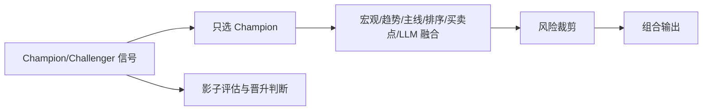

# Sage股票智能交易平台信号融合与策略编排功能设计文档

## 1. 功能定位
该功能负责将 **宏观/趋势/主线/选股/买卖点** 等模块结果统一融合为可执行的组合信号，输出仓位与风控建议。

本模块采用明确的生产策略治理模式：
- **单主线生产**：只允许 1 个冠军策略进入执行层；
- **多策略影子**：其余策略仅做影子运行与评估，不参与下单；
- **先稳后进**：先提高下限稳定性，再通过晋升机制提升收益上限。

---

## 2. 输入 / 输出
**输入**：
- 宏观模型输出（行业景气度、场景、置信度）
- 趋势状态输出（RISK_ON/OFF/NEUTRAL）
- 主线/行业轮动得分
- 选股排序结果（score/rank/confidence/model_version）
- 买卖点过滤结果（规则/模型）
- LLM/NLP信号（政策/产业/概念：主题/情绪/风险标签）
- 风控约束（仓位上限、行业暴露）

**输出**：
```json
{
  "date": "2026-02-13",
  "state": "RISK_ON",
  "positions": [
    {"ts_code": "600519.SH", "weight": 0.08, "action": "BUY"}
  ],
  "risk_flags": ["行业集中度偏高"]
}
```

**输出落地（建议）**：
- `data/signals/portfolio/positions_<YYYYMMDD>.parquet`
- 字段：`trade_date/ts_code/weight/action/risk_flags`

---

## 3. 架构原则（已定版）
### 3.1 低复杂度生产架构
- 主线模型：行业主线评分（mainline）
- 选股模型：单模型 `StockSelector(lgbm)`
- 门控模型：三状态趋势门控（`RISK_ON / 震荡 / RISK_OFF`）
- 调仓频率：周频
- 训练频率：月度重训
- 数据时序：严格 `ann_date` 与 `T+2` 延迟
- 风控规则：最大回撤阈值、行业上限、单股上限、仓位乘数

### 3.2 Champion / Challenger 策略治理
策略分层：
- **Champion（线上唯一）**：`seed_balance_strategy`（豆包硬指标均衡方案）
- **Challenger（影子运行）**：
  - `balance_strategy_v1`
  - `positive_strategy_v1`
  - `value_strategy_v1`
  - `satellite_strategy_v1`

说明：
- 历史命名兼容：若旧配置仍使用 `seed_banlance_strategy`，统一映射到 `seed_balance_strategy`。
- 执行层只读取 `active_champion_id`，不读取挑战者输出，不允许并行下单。

### 3.3 统一信号契约（强约束）
所有策略必须输出同一契约（parquet/csv/json 均可）：
- `trade_date`：交易日（`YYYYMMDD`）
- `ts_code`：股票代码
- `score`：原始分数（可比较）
- `rank`：当期名次（1 为最高）
- `confidence`：置信度（`0~1`）
- `model_version`：策略/模型版本（例如 `seed_balance_strategy@v1.0.0`）

可选字段（不影响执行层读取）：
- `industry_l1`, `risk_flags`, `feature_snapshot_hash`, `run_id`

### 3.4 晋升与降级机制
**晋升门槛（Challenger -> Champion）**：
- 样本外连续周期优于冠军（建议至少连续 3 个评估窗口）
- 指标同时满足：收益、最大回撤、夏普、换手、成本后收益
- 不允许“仅收益好但回撤显著恶化”直接晋升

**降级机制（Champion 失效）**：
- 触发失效阈值（如滚动回撤或成本后收益劣化）后
- 自动回退到 `baseline_conservative`
- 触发后需保留失效审计记录：阈值命中时间、窗口、指标快照

### 3.5 手动设置 Champion（允许但留痕）
支持手动设置冠军与策略开关，建议配置：
```yaml
strategy_governance:
  active_champion_id: seed_balance_strategy
  champion_source: manual   # manual / auto
  manual_effective_date: "20260216"
  manual_reason: "版本灰度通过"
  challengers:
    - balance_strategy_v1
    - positive_strategy_v1
    - value_strategy_v1
    - satellite_strategy_v1
```
约束：
- 手动切换必须写入 `effective_date` 与 `reason`
- 切换日志必须可追溯，禁止无记录替换冠军
- 自动晋升与手动切换互斥（同一周期只能触发一种）

---

## 4. 融合规则（优先级）
1. **趋势门控**：RISK_OFF → 空仓
2. **宏观过滤**：仅保留景气度 TopN 行业
3. **主线加权**：行业主线分高 → 权重上调
4. **选股排序**：行业内 TopK
5. **买卖点过滤**：规则/模型通过
6. **LLM仅作为加权/过滤**：不得单独触发交易
7. **风险裁剪**：单股/行业/总仓位限制

### 4.1 冲突处理原则
- 信号冲突时以“风险优先”原则裁决
- LLM信号仅加权，不可改变趋势门控

---

## 5. 信号评分（示意）
```
final_score = w1*rank_score + w2*macro_conf + w3*mainline_score
```
权重可配置，并随市场状态调整。

### 5.1 流程图（Mermaid）


---

## 6. 模块扩展
- 策略注册机制：`StrategyRegistry`
- 多策略并行：仅允许影子并行，不允许执行并行
- 模块替换：规则/树模型可插拔

---

## 7. 测试
- 单元测试：规则优先级与裁剪逻辑
- 集成测试：多模块输入联动
- 治理测试：Champion 读取唯一性、手动切换留痕、晋升/降级触发正确性

---

## Q&A
- Q: 多策略冲突时如何裁决？
  A: 生产层不发生“多策略冲突”，因为执行层只读 Champion；冲突仅存在于模块内信号融合，按“风险优先”规则裁决。
- Q: 输出包含“建议换手率/调仓频率”吗？
  A: 需要，周频调仓固定，换手率作为评估与告警字段输出。
- Q: LLM信号来源（政策/公告/研报/舆情）与频率？
  A: 作为可选增强，默认不影响 Champion 主路径，只做权重微调与风险提示。
