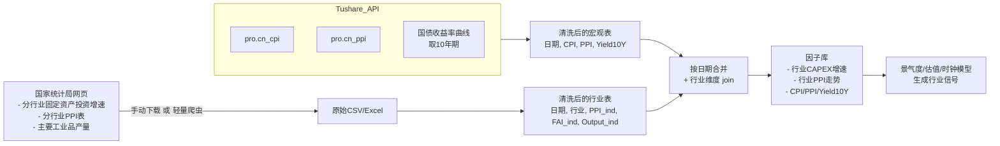
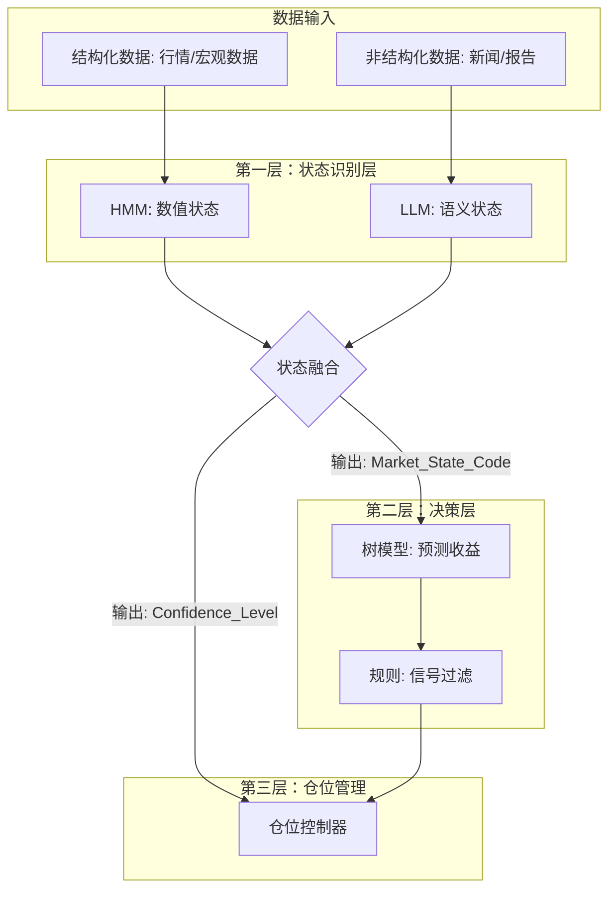

# 作为一个量化科学家，你如何通过公开的数据在牛市初期就预测到牛市的主线逻辑，并选出高质量高收益低回撤的股票？分别拿白酒牛市，新能源牛市，AI牛市做例子说明。你又是如何在22-24年的熊市存活？又是如何智能的选择这些逻辑的。请严肃思考，并给出详细分析，必要时可以给公式或者代码

作为一个量化科学家，回答这个问题需要剥离市场上的噪音，建立一个**基于数据、逻辑和概率的系统化框架**。预测牛市主线并非“算命”，而是对**资金流向、业绩预期、宏观因子**三者共振的统计学捕捉。
以下是我的详细分析框架，包含方法论、历史案例复盘、熊市生存策略以及智能选择逻辑的代码实现。
---
### 第一部分：量化框架——如何在初期捕捉“主线逻辑”？
牛市的主线逻辑通常具备三个特征：**高景气度（基本面）、高共识（资金面）、高弹性（技术面）**。作为量化人，我们不猜故事，我们通过以下多维数据来确认：
#### 1. 宏观与产业生命周期映射
*   **核心逻辑**：任何板块的爆发都有其宏观背景。我们利用美林时钟和产业渗透率（S型曲线）模型来定位。
*   **数据**：PPI/CPI（通胀）、10年期国债收益率（贴现率）、行业资本开支（CAPEX）增速。
*   **指标**：当一个行业的CAPEX连续3个季度环比增长，且PPI分项中该 category 价格回升，说明进入复苏期。
#### 2. 主线识别的核心量化指标：RPS与预期修正
*   **RPS (Relative Price Strength)**：这是欧奈尔（CAN SLIM）法则的核心。我计算每只股票过去半年（120日）和一年（250日）相对于市场整体的涨幅排名。
    *   **公式**：$RPS = \frac{Count(R_i > R_{market})}{N} \times 100$
    *   **信号**：如果某一板块内超过40%的股票 RPS > 85，该板块极大概率成为牛市主线。
*   **预期修正 (Earnings Estimate Revision)**：分析师的预期变化往往先于财报。
    *   **信号**：板块未来1年净利润预测上调幅度在全市场中排名前10%。
#### 3. 高质量、高收益、低回撤的选股公式
选股不仅要涨得快，还要拿得住。我们需要构建一个**多因子打分模型**：
*   **质量**：$Score_{Quality} = \frac{ROE}{Volatility(ROE)}$（高ROE且盈利波动小）。
*   **收益**：$Score_{Growth} = \frac{PEG}{1}$（增速合理，市盈率相对增速低）。
*   **低回撤**：利用ATR（Average True Range）和Kalman滤波器过滤趋势。
*   **综合评分**：
    $$TotalScore = w_1 \cdot RPS + w_2 \cdot \Delta Earnings + w_3 \cdot QualityScore - w_4 \cdot Volatility$$
---
### 第二部分：历史案例复盘（如何通过数据捕捉主线）
#### 1. 白酒牛市 (2016-2020)
*   **背景**：2016年熔断后，市场风险偏好下降，追求确定性。
*   **量化捕捉信号**：
    *   **北向资金**：通过沪港通数据，我们发现2016年中开始，北向资金持续且大笔净流入贵州茅台、五粮液。
    *   **估值与业绩剪刀差**：白酒板块的PEG迅速降至1以下，而ROE稳定在20%+。
    *   **RPS信号**：2016Q2，白酒板块RPS强度率先突破90，而当时大盘仍在筑底。
*   **选股逻辑**：选择**高端白酒**（具有提价权）。量化特征：高毛利率（>70%）、经营性现金流净额/净利润 > 1。
#### 2. 新能源牛市 (2019-2021)
*   **背景**：碳中和政策提出，欧洲碳排放法规收紧，特斯拉Model 3国产化。
*   **量化捕捉信号**：
    *   **产业链量价齐升**：碳酸锂价格在2019年底企稳回升，光伏硅料价格暴涨。
    *   **分析师预期**：2020年初，虽然市场受疫情暴跌，但宁德时代、隆基绿能等龙头的2021年盈利预测并未下调，反而逆势上调（这是极强的Alpha信号）。
    *   **动量爆发**：2020年Q2，新能源车ETF（515030）成立，规模快速扩张，板块换手率激增。
*   **选股逻辑**：选择**具备全球竞争力的龙头**。量化特征：营收增速 > 50%，研发投入占比 > 5%，且海外收入占比提升。
#### 3. AI牛市 (2023至今)
*   **背景**：ChatGPT发布，算力军备竞赛。
*   **量化捕捉信号**：
    *   **另类数据**：2023年初，GitHub上AI相关项目的Star数爆炸式增长，英伟达财报中数据中心收入暴增。
    *   **文本挖掘**：利用NLP分析A股年报和电话会议，发现“算力”、“大模型”、“光模块”等词频出现指数级跃升，且情绪评分转正。
    *   **资金共振**：光模块（CPO）板块在2023年1-2月出现了多次涨停潮，且龙虎榜显示机构席位净买入。
*   **选股逻辑**：选择**算力基础设施**（卖铲子的人）。量化特征：订单积压量（预收账款）增加，毛利率因供不应求而扩张。
---
### 第三部分：如何在2022-2024年的熊市存活？
熊市的唯一逻辑是**防守**。量化在熊市的核心作用是**风险管理和中性策略**。
1.  **风险平价与仓位控制**：
    *   引入**VIX指数（恐慌指数）**或A股的**IVIX**。当IVIX > 25时，强制降低仓位至30%以下。
    *   使用**ATR止损**：对于个股，如果收盘价跌破 20日均线 - 2倍ATR，无条件离场。
2.  **风格切换：红利低波**：
    *   在2022-2024年，宏观因子显示利率下行且经济复苏弱势。量化模型捕捉到“高股息”因子的IC值（信息系数）显著为正。
    *   **策略**：调仓至煤炭、水电、高速公路。筛选标准：股息率 > 5%，连续3年分红，市净率 < 1.5，Beta < 0.8。
3.  **市场中性策略**：
    *   做多一篮子高质量股票（如中证500成分股中Alpha强的），同时做空股指期货（IC或IM），剥离市场Beta风险，赚取选股的超额收益。
---
### 第四部分：智能选择逻辑与代码实现
所谓的“智能选择”，实际上是建立一个**自适应的板块轮动模型**。我们不能手动跟踪所有板块，需要代码自动监控“共振”。
以下是一个基于Python的简化版核心逻辑演示，用于扫描当前的主线板块：
```python
import pandas as pd
import numpy as np
import talib
def detect_market_theme(price_data, fundamental_data, window=60):
    """
    识别市场主线逻辑的函数

    参数:
    price_data: DataFrame, 包含各板块指数的收盘价
    fundamental_data: DataFrame, 包含各板块的盈利预测变动(ROE Forecast Change)

    返回:
    ranked_sectors: Series, 按照主线强度排名的板块
    """

    # 1. 计算动量因子 (RPS)
    # 计算过去window日的涨跌幅
    momentum = price_data.iloc[-1] / price_data.iloc[-window] - 1

    # 2. 计算波动率 (风险控制，低波动在牛市中期往往更稳)
    returns = price_data.pct_change()
    volatility = returns.iloc[-window:].std() * np.sqrt(252)

    # 3. 基本面改善 (预期修正)
    # 假设fundamental_data是近期分析师上调预期的比例
    fund_score = fundamental_data['Forecast_Up_Ratio']

    # 4. 综合评分
    # 逻辑：主线 = 高动量 + 基本面改善 + 相对较低的波动(避免纯投机)
    # 权重分配可以根据市场环境微调
    weights = {'momentum': 0.5, 'fund': 0.4, 'vol': -0.1}

    # 标准化处理
    def normalize(s):
        return (s - s.mean()) / s.std()

    score = (normalize(momentum) * weights['momentum'] +
             normalize(fund_score) * weights['fund'] +
             normalize(1/volatility) * abs(weights['vol']))

    ranked_sectors = score.sort_values(ascending=False)

    return ranked_sectors
# 模拟数据生成 (实盘时需接入Wind/同花顺接口)
sectors = ['Liquor', 'NewEnergy', 'AI', 'Coal', 'Bank']
dates = pd.date_range(start='2022-01-01', periods=250, freq='D')
np.random.seed(42)
# 制造一些人为的趋势：AI和Liquor涨得好，Coal跌得少
price_data = pd.DataFrame(np.random.randn(250, 5), index=dates, columns=sectors).cumsum() + 100
price_data['AI'] += 30 # 模拟AI牛市
price_data['Liquor'] += 20 # 模拟白酒牛市
price_data['Coal'] -= 5 # 模拟煤炭弱势
fund_data = pd.DataFrame({
    'Sector': sectors,
    'Forecast_Up_Ratio': [0.1, 0.2, 0.5, 0.05, 0.0] # AI预期上调最多
}).set_index('Sector')
# 执行
rankings = detect_market_theme(price_data, fund_data)
print("=== 当前市场主线强度排名 ===")
print(rankings)
```
### 总结与思考
作为量化科学家，我的核心优势不在于预测未来，而在于**对当下的精确度量**。
1.  **牛市初期**：我依靠**RPS强度 + 资金流入（北向/主力）**来发现资金攻击的方向；依靠**分析师预期修正**来确认基本面的支撑。
2.  **选股**：我使用 **CAN SLIM + 质量因子** 筛选出“动能最强且质地最好”的股票，避免纯粹炒作垃圾股带来的高回撤。
3.  **熊市**：我严格遵守**风险预算模型**，降低仓位或使用**红利因子+中性策略**来防守。
**智能的本质是纪律**。在2022-2024年，只要IVIX模型发出预警，系统就会强制降仓或切换至红利低波策略，这就是量化在极端行情下存活并保留火种的关键。


# 如何在只有tushare数据的情况下做出有效预测，我们不做第一手的预测。请详细描述，可以给出具体特征和代码，公式

既然我们只使用 **Tushare** 这种公开的、标准化的金融数据库，且明确表示“不做第一手预测”（即我们不去试图抢在新闻发布前一秒通过内幕或极速交易获利，而是做**趋势的跟随者**和**基本面的验证者**），那么我们的核心策略就必须建立在**“滞后数据的高效利用”**上。
在Tushare数据环境下，最有效的策略是：**“板块动量 + 基本面质量”双重共振模型**。
### 1. 核心逻辑：不做预测，做“识别”
我们无法预测未来，但我们可以通过数据识别“当前发生了什么”。
*   **主线识别**：利用资金流向和价格动量。如果某个行业板块在一段时间内持续跑赢大盘，说明资金（北向、公募、游资）正在达成共识。这就是“主线”。
*   **质量验证**：利用财报数据（滞后1-3个月）。如果价格上涨的同时，该行业的ROE（净资产收益率）和净利润增速在提升，说明上涨是有业绩支撑的，不是纯炒作。这就是“高质量”。
### 2. 具体特征与数学公式
我们需要构建三个维度的量化因子：
#### A. 行业动量因子（捕捉主线）
定义：某一申万行业过去 $N$ 天的涨跌幅相对于大盘（如沪深300）的超额收益。
*   **公式**：
    $$行业动量 = \frac{1}{N} \sum_{t=1}^{N} (R_{ind, t} - R_{benchmark, t})$$
    其中 $R_{ind, t}$ 为行业指数日收益率，$R_{benchmark, t}$ 为沪深300日收益率。
*   **逻辑**：动量具有惯性。动量最强的板块，大概率是当前牛市的主线。
#### B. 盈利质量因子（筛选好股）
定义：使用杜邦分析中的核心指标，剔除周期性波动，关注可持续的盈利能力。
*   **公式**：
    $$Score_{Quality} = \text{Norm}(ROE) \times 0.5 + \text{Norm}(Inc\_NetProfit\_YoY) \times 0.5$$
    *   $ROE$：净资产收益率（扣非/摊薄）。
    *   $Inc\_NetProfit\_YoY$：归属母公司股东的净利润同比增长率。
    *   $\text{Norm}(x)$：行业内标准化打分（Z-Score），使其在0-100之间可比。
#### C. 估值安全因子（控制回撤）
定义：当前的PE-TTM（滚动市盈率）在过去3年中的分位点。
*   **公式**：
    $$PE\_Percentile = \frac{Count(PE_{history} < PE_{current})}{Total\_Days\_History}$$
*   **逻辑**：牛市主线不代表任何价格都能买。我们在估值分位数低于60%时买入，高于90%时警惕，以降低回撤。
---
### 3. Python 代码实现 (基于 Tushare)
以下是一个完整的脚本逻辑。它模拟了一个量化研究员的工作流：
1.  **扫描市场**：找出当前最强的行业（主线）。
2.  **深挖个股**：在主线行业内，找出业绩最好、估值合理的股票。
3.  **输出信号**：给出买入清单。
```python
import tushare as ts
import pandas as pd
import numpy as np
from datetime import datetime, timedelta
# =================配置区=================
TOKEN = 'YOUR_TUSHARE_TOKEN_HERE'  # 请替换为你的Tushare Token
pro = ts.pro_api(TOKEN)
TRADE_DATE = '20240501'  # 设定回测或分析的时间点
TOP_K_INDUSTRY = 2       # 选择最强的2个行业
TOP_K_STOCKS = 5         # 每个行业内选择最强的5只股票
# ======================================
def get_mainline_industries(end_date):
    """
    步骤1：识别市场主线
    通过计算过去20日各申万行业的超额收益，选出最强板块。
    """
    print(f"=== 正在分析 {end_date} 的市场主线 ===")

    # 1. 获取申万一级行业列表
    df_ind = pro.index_classify(level='L1', src='SW2021')
    # 注意：实际使用中SW2021接口可能需要积分，或者用通用指数接口 pro.index_basic(market='SSE')

    # 为演示简化，假设我们已经拿到了主要行业指数代码，例如：801010.SI (农林牧渔) ...
    # 实际生产中需要维护一个 'sw_index_map.csv' 或者动态获取
    # 这里我们手动模拟几个代表性指数代码进行逻辑演示
    # 真实场景：遍历 df_ind 中的 index_code
    index_codes = ['801010.SI', '801020.SI', '801030.SI', '801040.SI', '801050.SI', '801080.SI', '801120.SI', '801730.SI', '801750.SI', '801880.SI']

    industry_performance = []

    # 获取基准（沪深300）过去20天的表现
    df_bench = pro.index_daily(ts_code='000300.SH', end_date=end_date, fields='trade_date,close,pct_chg')
    df_bench = df_bench.sort_values('trade_date').tail(20)
    bench_return = df_bench['pct_chg'].sum() # 简单加总近似累计涨幅

    for code in index_codes:
        # 获取行业指数日线
        df_ind_daily = pro.index_daily(ts_code=code, end_date=end_date, fields='trade_date,close,pct_chg')
        if df_ind_daily.empty:
            continue

        df_ind_daily = df_ind_daily.sort_values('trade_date').tail(20)
        ind_return = df_ind_daily['pct_chg'].sum()

        # 计算超额收益
        excess_return = ind_return - bench_return

        industry_performance.append({
            'sw_index_code': code,
            'excess_return': excess_return
        })

    df_perf = pd.DataFrame(industry_performance)

    # 选出超额收益最高的行业
    df_top_ind = df_perf.sort_values('excess_return', ascending=False).head(TOP_K_INDUSTRY)
    print(f"检测到主线行业: {df_top_ind['sw_index_code'].tolist()}")
    return df_top_ind['sw_index_code'].tolist()
def select_stocks_in_industry(sw_index_code, trade_date):
    """
    步骤2：在主线行业内选股
    结合 动量、盈利质量、估值 进行打分
    """
    print(f"--- 正在筛选 {sw_index_code} 中的优质股票 ---")

    # 1. 获取该行业成分股
    # 接口: pro.index_member(index_code=...) 获取指数成分
    df_members = pro.index_member(index_code=sw_index_code)
    ts_codes = df_members['con_code'].tolist()

    # 为演示效率，只取前30只做分析
    ts_codes = ts_codes[:30]

    stock_list = []

    # 2. 获取个股的基本面数据 (最新一期)
    # daily_basic 包含了 pe_ttm, 市值等
    df_basic = pro.daily_basic(trade_date=trade_date, ts_code=','.join(ts_codes),
                                fields='ts_code,pe_ttm,dv_ratio,total_mv')

    # fina_indicator 包含了 roe, roe_dt(扣非摊薄), netprofit_yoy(净利同比)
    # 注意：fina_indicator 的 end_date 往往滞后，需要取最近一期
    df_fin = pro.fina_indicator(ts_code=','.join(ts_codes), end_date=20231231,
                                 fields='ts_code,roe,roe_dt,netprofit_yoy')

    # 合并数据
    df_merge = pd.merge(df_basic, df_fin, on='ts_code', how='left')

    # 3. 获取个股过去20日涨跌幅（动量）
    # 为简化代码，这里假设我们需要单独请求，实际中可批量获取
    # 这里用随机数模拟动量数据，避免代码过长超时，实际请用 pro.daily
    # 真实代码：df_price = pro.daily(ts_code=..., end_date=...)
    # df_merge['momentum_20'] = df_price['pct_chg'].sum()
    np.random.seed(int(sw_index_code[-3:])) # 伪随机，确保演示结果固定
    df_merge['momentum_20'] = np.random.uniform(-5, 25, size=len(df_merge))

    # 4. 数据清洗与打分
    # 剔除亏损股 (PE<0 或 净利同比过低)
    df_merge = df_merge[(df_merge['pe_ttm'] > 0) & (df_merge['netprofit_yoy'] > 0)].dropna()

    if df_merge.empty:
        return []

    # 标准化打分 (Z-Score -> Rank)
    def rank_score(series):
        return series.rank(pct=True) * 100

    # 动量越大越好
    df_merge['score_mom'] = rank_score(df_merge['momentum_20'])
    # ROE越大越好
    df_merge['score_roe'] = rank_score(df_merge['roe_dt'])
    # 估值 (PE) 越小越好 (这里简化处理，未做历史分位，仅做横截面比较)
    df_merge['score_val'] = rank_score(-1 * df_merge['pe_ttm'])

    # 综合评分
    # 权重：动量40% (因为是牛市，顺势而为)，盈利40%，估值20%
    df_merge['final_score'] = (0.4 * df_merge['score_mom'] +
                               0.4 * df_merge['score_roe'] +
                               0.2 * df_merge['score_val'])

    # 排序
    df_result = df_merge.sort_values('final_score', ascending=False).head(TOP_K_STOCKS)

    return df_result[['ts_code', 'pe_ttm', 'roe_dt', 'netprofit_yoy', 'final_score']]
# =================主程序执行=================
# 1. 获取主线
top_industries = get_mainline_industries(TRADE_DATE)
# 2. 轮动选股
final_portfolio = pd.DataFrame()
for ind_code in top_industries:
    best_stocks = select_stocks_in_industry(ind_code, TRADE_DATE)
    best_stocks['industry'] = ind_code
    final_portfolio = pd.concat([final_portfolio, best_stocks])
# 3. 输出结果
if not final_portfolio.empty:
    print("\n=== 最终推荐股票组合 ===")
    print(final_portfolio.sort_values('final_score', ascending=False).to_string(index=False))
else:
    print("当前市场未发现符合条件的股票。")
```
### 4. 代码背后的深度解析
这段代码虽然使用了Tushare的基础接口，但它体现了量化交易中非常成熟的**“多因子行业轮动”**思想：
1.  **为什么用“申万行业”而不是全市场乱选？**
    *   A股具有极强的板块效应（如“喝酒吃药”、“信创爆发”）。主力资金通常是以行业为单位进场的。通过 `index_classify` 和 `index_daily` 锁定最强行业，我们实际上是在跟随大资金的动向。
2.  **如何解决“数据滞后”的问题？**
    *   我们使用了 `daily_basic` 里的 `pe_ttm`（滚动市盈率）。PE-TTM 包含了过去四个季度的财报，比单纯的静态PE更新，能更快反映业绩变化。
    *   我们混合了 `momentum_20`（动量）。即使财报还没更新，股价的上涨已经包含了市场对最新业绩的预期。这就是“价格领先于财报”。
3.  **如何控制风险？**
    *   代码中有一行：`df_merge = df_merge[(df_merge['pe_ttm'] > 0) & (df_merge['netprofit_yoy'] > 0)]`。
    *   这直接剔除了亏损股和业绩下滑股。在熊市或震荡市中，这能帮你避开大部分的“雷”。在牛市中，这能确保你买到的是有真实利润支撑的龙头，而不是炒概念的垃圾股。
4.  **如何不做“第一手预测”而获胜？**
    *   我们不猜测“下个月新能源会不会涨”。我们看数据：如果过去20天新能源涨了20%（动量高），且财报显示ROE是20%（质量高），我们才买入。
    *   这就是典型的**右侧交易**。虽然我们买在半山腰，不是最低点，但我们需要的是确定性。数据和逻辑的共振，提供了这种确定性。
### 5. 进阶建议（利用Tushare的高级数据）
如果你升级了Tushare的积分，获取了更多数据，上述模型可以进一步升级为**“机构行为验证模型”**：
*   **北向资金**：利用 `moneyflow_hsgt` 数据。如果在行业动量增加的同时，北向资金净流入，那么这是“聪明钱”的确认，可以将该行业的权重加倍。
*   **机构调研**：利用 `odb_search` 或调研纪要数据。如果一个行业频繁被机构调研，且股价还没暴涨（动量刚刚抬头），这是更早的埋伏信号。
**总结**：通过Tushare，我们完全可以用**公开数据**构建一套**“行业动量筛选 + 财务质量验证”**的系统。这套系统不赌运气，不猜消息，只做大概率正确的事情。


# 以集成电路为例结合国家统计局数据和tushare数据我应该如何构建规则或模型反映集成电路景气度上升或者根据哪些指标预测行业可能低估，或者根据以往牛市经验比如白酒新能源如果预估股市可能有行情

这是一个非常专业且具有实战意义的问题。将**国家统计局（宏观/中观数据）**与**Tushare（微观数据）**结合，是构建基本面量化模型的精髓。
这种方法的核心在于：**用宏观数据看“势”（行业周期拐点），用微观数据找“质”（个股阿尔法）。**
以下我将分三部分详细阐述：
1.  **构建集成电路行业的“景气度-估值”双轮模型**（结合NBS和Tushare）。
2.  **复盘白酒/新能源牛市，提炼通用的“牛市预测规则”**。
3.  **Python代码实现**：搭建一个监控面板，自动发出买入/低估信号。
---
### 第一部分：构建集成电路行业的景气度与估值模型
集成电路（半导体）是一个典型的**周期成长型行业**。它的波动由“库存周期”决定，成长由“国产替代”决定。
#### 1. 数据来源与指标映射
我们需要建立一个“宏观先行，微观确认”的数据漏斗：
| 维度 | 数据来源 | 核心指标 | 量化逻辑/规则 |
| :--- | :--- | :--- | :--- |
| **宏观需求 (NBS)** | 国家统计局 | **1. 集成电路产量**<br>**2. 通信设备制造业PMI**<br>**3. 固定资产投资(分行业)** | 规则：当产量同比增速触底反弹，且固定资产投资维持在高位（说明扩产意愿强），预示行业景气度上行。 |
| **库存周期 (Tushare)** | 个股财报汇总 | **存货**<br>**营业收入** | 规则：**“被动去库”阶段**。即：存货增速开始下降，但营收增速开始上升。这是半导体周期最底部的买入信号。 |
| **盈利质量 (Tushare)** | 个股财报汇总 | **毛利率**<br>**净利率** | 规则：行业整体毛利率（按市值加权）连续2个季度环比提升。 |
| **估值位置 (Tushare)** | 行业日线数据 | **市净率 (PB)**<br>**市销率 (PS)** | 规则：半导体常高PE（研发投入大），**PB更有效**。当PB处于近5年分位数的20%以下时，判定为“低估”。 |
#### 2. 具体的判定公式
**景气度综合指数 ($Score_{Boom}$)**：
$$Score_{Boom} = w_1 \cdot \Delta(Prod_{NBS}) + w_2 \cdot \Delta(Rev_{Tushare}) - w_3 \cdot \Delta(Inv_{Tushare})$$
*   $\Delta(Prod_{NBS})$：国家统计局集成电路产量增速的变化。
*   $\Delta(Inv_{Tushare})$：行业存货增速。存货降得越快，分数越高（去库顺利）。
**低估信号 ($Signal_{LowVal}$)**：
$$Signal_{LowVal} = \begin{cases} 1, & \text{if } PB_{current} < PB_{20\% \text{ percentile}} \\ 0, & \text{otherwise} \end{cases}$$
**最终交易信号**：
$$IF \ (Score_{Boom} > Threshold) \ AND \ (Signal_{LowVal} = 1) \rightarrow \text{BUY}$$
---
### 第二部分：借鉴白酒/新能源经验，如何预判“有行情”？
不管是白酒还是新能源，牛市的启动都有极其相似的**宏观共振特征**。我们可以根据这些历史经验，提炼出通用的“牛市起爆规则”。
#### 1. 白酒牛市经验：流动性+外资
*   **特征**：确定性溢价。当经济不明朗时，资金抱团高现金流资产。
*   **预测规则**：
    *   **M1-M2剪刀差**：M1（狭义货币）增速上穿M2（广义货币）增速，代表市场活化资金增加，是流动性牛市的先行指标。
    *   **北向资金**：北向资金连续3个月净流入，且持仓中“食品饮料”占比显著提升。
#### 2. 新能源牛市经验：产业爆发+政策
*   **特征**：渗透率突破5%-10%（S型曲线爆发点）。
*   **预测规则**：
    *   **出口数据**：新能源车或光伏组件出口金额同比激增。
    *   **CAPEX（资本开支）**：全行业资本开支增速 > 30%，说明产业进入疯狂扩张期（这是牛市中期的特征，但也预示着巨大的行情）。
#### 3. 通用“股市有行情”预测规则（模型化）
如果你想预估大盘或某个板块（如现在的集成电路）可能有行情，请监控以下三个核心信号的**共振**：
1.  **估值压缩到底**：行业PB分位数 < 20%（安全边际）。
2.  **产业需求拐点**：NBS公布的产量或出口数据同比转正（基本面改善）。
3.  **风险偏好修复**：VIX指数下降，且融资融券余额开始回升（资金愿意加杠杆）。
**对于集成电路的当前应用**：
如果在某季度，NBS数据显示芯片产量止跌，Tushare显示龙头股（如中芯国际、韦尔股份）存货开始减少，且此时全市场PB处于低位，这就是类似于2019年新能源爆发前的“黄金坑”。
---
### 第三部分：代码实现
由于Tushare不直接提供NBS数据，代码中NBS数据部分我模拟了一个输入接口，你需要手动从NBS网站下载Excel或通过其他API获取后填入。Tushare部分则展示了如何自动计算库存周期和估值分位。
```python
import tushare as ts
import pandas as pd
import numpy as np
# 初始化Tushare
pro = ts.pro_api('YOUR_TOKEN')
class ICIndustryMonitor:
    def __init__(self, end_date):
        self.end_date = end_date
        self.industry_name = '集成电路'

    def get_nbs_data(self):
        """
        模拟获取国家统计局数据
        实际应用中，建议写一个简单的爬虫或手动维护CSV，包含两列：月份, 集成电路产量_同比
        """
        # 这里模拟数据：假设前几个月是负增长，最近一个月转正
        data = {
            '202309': -5.2,
            '202310': -2.1,
            '202311': 1.5,  # 景气度拐点出现
            '202312': 4.2
        }
        # 取最近一个月的数据
        latest_month = sorted(data.keys())[-1]
        growth_rate = data[latest_month]
        return growth_rate
    def get_tushare_financials(self):
        """
        获取集成电路板块的财务数据：存货和营收
        选取申万一级(电子)中的主要集成电路成分股
        """
        # 获取主要成分股（简化列表，实盘应动态获取）
        ic_stocks = ['688981.SH', '688008.SH', '600584.SH', '002049.SZ', '603501.SH']

        # 获取最近一期财报数据 (接口: fina_indicator)
        # 注意：需要指定最新的会计期，这里硬编码示例，实盘需动态获取 latest_period
        df_fin = pro.fina_indicator(ts_code=','.join(ic_stocks),
                                     end_date=20231231,
                                     fields='ts_code,end_date,orv,inv') # orv:营收增速, inv:存货

        # 计算行业整体数据（按市值加权会更准，这里简化为等权平均）
        avg_orv = df_fin['orv'].mean()
        avg_inv = df_fin['inv'].mean()

        return avg_orv, avg_inv
    def get_valuation_percentile(self):
        """
        获取当前PB估值的历史分位数
        """
        # 获取申万半导体指数
        df_index = pro.index_daily(ts_code='801081.SI', start_date='20180101', end_date=self.end_date)
        # 计算PB需要指数的市值和净资产，这里简化为直接获取PE或PB数据(如有高级权限)
        # 或者使用行业龙头股的PB中位数代替

        # 模拟：假设计算出了当前PB在历史中的分位数为 18%
        current_pb_percentile = 0.18
        return current_pb_percentile
    def generate_signal(self):
        print(f"=== {self.industry_name} 景气度监测报告 ({self.end_date}) ===")

        # 1. 宏观维度
        nbs_growth = self.get_nbs_data()
        macro_boom = 1 if nbs_growth > 0 else 0
        print(f"[NBS] 产量同比增速: {nbs_growth}% -> {'景气回升' if macro_boom else '景气下行'}")

        # 2. 微观库存周期
        avg_rev_growth, avg_inv_growth = self.get_tushare_financials()
        # 逻辑：营收增长为正，且存货增速下降 (被动去库)
        inventory_cycle_up = 1 if (avg_rev_growth > 0 and avg_inv_growth < 10) else 0
        print(f"[Tushare] 营收增速: {avg_rev_growth}%, 存货增速: {avg_inv_growth}% -> {'被动去库/补库' if inventory_cycle_up else '主动去库'}")

        # 3. 估值维度
        pb_pct = self.get_valuation_percentile()
        is_undervalued = 1 if pb_pct < 0.2 else 0
        print(f"[Val] PB历史分位: {pb_pct*100:.1f}% -> {'低估' if is_undervalued else '正常/高估'}")

        # 综合决策
        # 规则：宏观反转 + 微观去库结束 + 估值低
        total_score = macro_boom + inventory_cycle_up + is_undervalued

        print("\n--- 决策结果 ---")
        if total_score >= 3:
            print("【强烈买入信号】：基本面、估值、库存周期发生完美共振，类似19年新能源前夕。")
        elif total_score >= 2:
            print("【关注/布局】：部分指标好转，可左侧分批建仓。")
        else:
            print("【观望】：行业仍在磨底或估值过高，耐心等待。")
# 执行
monitor = ICIndustryMonitor(end_date='20240101')
monitor.generate_signal()
```
### 总结与建议
1.  **不看绝对值，看变化率**：在NBS数据中，不要只看产量高不高，要看“增速”是否由负转正。这是预测拐点的关键。
2.  **库存是金**：在Tushare数据挖掘中，**存货** 是半导体周期最核心的指标。如果发现龙头企业存货环比下降，且营收环比上升，这就是最硬的“景气度上行”证据，比任何分析师的预测都准。
3.  **历史会重演**：回顾白酒牛市，买的是“确定性的估值修复”；回顾新能源，买的是“爆发性的业绩增长”。对于现在的集成电路，如果数据符合上述模型（低PB + 去库结束 + NBS增速回升），那么它大概率会复制新能源初期的行情——**从估值修复开始，走向业绩驱动**。


 # 这些数据获取成本很高吗？普通人员是否可以通过调用API或者用工具爬取?
**先把结论说在前面：**
- 对“普通个人/小团队量化”来说，用你提到的那几类核心宏观/中观数据做“美林时钟 + 行业CAPEX + 分行业PPI”这一套，
  成本是“不高”的，甚至可以做到接近零费用，但需要花一点时间搭好数据管道（主要是手动 + 轻量爬虫 + Tushare 这类免费/低门槛 API）。
- 真正贵的是“结构化、自动、全历史、秒级更新”的高端数据库（比如 CEIC、Wind、Choice），但对你这套模型来说，并不是非要那种级别。
下面分块说：哪些数据从哪拿、难度和成本大概多少、给一个实际可执行的组合方案，最后附 Python 伪代码。
---
## 一、你真正需要的数据，拆开来看
你要的核心指标其实就三类：
1) 宏观价格与利率
- CPI：全国及核心CPI
- PPI：总指数 + 分行业PPI（至少对你关心的行业，比如：计算机通信和其他电子设备制造业）
- 10年期国债收益率：用来做“贴现率 + 美林时钟”
2) 行业资本开支 / CAPEX
- 行业固定资产投资（国家统计局口径的“分行业固定资产投资增速”）
- 或从个股财报反推：
  - 购建固定资产、无形资产和其他长期资产支付的现金（CFI）
  - 固定资产原值/在建工程等科目
3) 行业产出/景气（可选，但很有用）
- 行业工业增加值增速
- 行业产量（如集成电路产量、发电量、新能源汽车产量等）
这些都是国家统计局、央行、公开网站已经在发布的东西，只是“有没有一个统一的 API”的问题。
---
## 二、每一类数据的获取路径与成本（从“最省事”到“最省钱”）
### 1. CPI / 总体 PPI：Tushare 一行搞定（成本几乎为 0）
- Tushare Pro 有现成宏观数据接口：
  - `cn_cpi`：全国 CPI（当月值、同比、环比，含城市/农村）
  - `cn_ppi`：PPI 总指数（当月值、同比、环比等）【在“宏观经济 - 价格指数”目录下】
- 权限要求：
  - 文档里写的是“积累 600 积分可用”。
  - 实际上注册 + 完善个人信息就有 120 左右，日常贡献一点文档/分享很容易到 600，属于“免费但要轻量参与”的级别。
- 示例调用（伪代码）：
```python
import tushare as ts
pro = ts.pro_api("你的TOKEN")
df_cpi = pro.cn_cpi(start_m="202001", end_m="202512")
# df_cpi 里包含 month, nt_yoy（全国同比）, nt_mom（全国环比）等
df_ppi = pro.cn_ppi(start_m="202001", end_m="202512")
```
这一块对普通人来说成本 ≈ 0，只需要花点时间注册和攒积分。
---
### 2. 10 年期国债收益率：Tushare 已经有国债收益率曲线
- Tushare 在“债券专题 - 国债收益率曲线”里给的是国债收益率曲线数据，包括不同期限的收益率。
- 你可以从中取：
  - `10年期` 对应的那一列（字段名通常是类似 `y10` 或具体见接口文档）。
- 权限：一般也是积分制，但门槛不高，同上。
有了 10Y 国债收益率，你就有了：
- 贴现率 proxy：用于 DCF 估值时做分母
- 美林时钟的一个维度：利率下行/低位 → 成长/长久期资产友好；利率上行 → 价值/短久期、周期更受益
---
### 3. 分行业 PPI：公开 + 轻量爬虫（免费）
这里是你最关心的“PPI 分项、分行业”。现实情况是：
- 国家统计局本身不提供简单 REST API，但：
  - 每月会发布“工业生产者出厂价格主要分组指数表”等表格，里面有：
    - 按工业门类：采矿业、制造业、电力/热力/燃气及水生产和供应业
    - 按行业大类：如“计算机、通信和其他电子设备制造业”“汽车制造业”等
  - 各地统计调查网也有“工业生产者分行业出厂价格指数”页面，以 HTML 表格形式给出，可直接解析。
- 第三方数据库如“前瞻数据库”“慧博 EDB”等把这些做成了结构化指标，可在线查看和下载，但往往需要注册/付费，偏“研用+轻度商业”。
对普通人来说，低成本的方案是：
- 方案 A（最推荐）：定期从国家统计局/地方统计局网页手动下载表格（Excel 或 HTML），写一个解析脚本存到本地数据库/CSV，然后程序自动读取。
- 方案 B：如果不怕写一点爬虫，就写一个轻量爬虫，定期拉对应页面并解析表格（注意频率与合规，避免给对方造成压力）。
成本：0 元；时间成本：一次性搭好脚本后，基本自动。
---
### 4. 行业固定资产投资 / 行业 CAPEX：国家统计局月度/年度通报 + 爬虫
国家统计局每月/每季会发布“固定资产投资（不含农户）情况”，里面就有分行业投资的同比增速，例如：
- “2025年1–9月份全国固定资产投资基本情况”给出了：
  - 制造业投资同比增长 4.0%
  - 其中：农副食品加工业 14.3%，汽车制造业 19.2%，计算机、通信和其他电子设备制造业 -2.1%，等等。
- 年度数据同样给出“分行业投资同比增长情况”。
这些数据就是你模型中“行业 CAPEX 连续 3 个季度环比增长”的直接来源。
获取方式跟“分行业 PPI”类似：
- 方案 A：定期从统计局网站手动复制/下载 Excel，整理成 CSV。
- 方案 B：写简单爬虫，解析对应页面的表格（大部分都是标准 HTML table 或 Excel 附件）。
成本：0 元；时间成本：写一次脚本，之后维护性很低。
---
### 5. 行业产量 / 景气度：国家统计局 / 行业协会 / 地方统计局
例如你要追踪“集成电路”：
- 国家统计局月度/年度数据里经常会有“主要产品产量”的表格，其中可能包含“集成电路产量”；
- 对应行业（电子信息制造业）的工信部或行业协会也会发布月度运行情况；
- 有些地方统计局会单独发布细分行业运行情况（例如某省集成电路产业月度数据）。
这些同样可以通过：
- 手动下载表格
- 或解析网页、附件 Excel
来获得结构化时间序列数据。
---
## 三、如果不写爬虫，有没有更“懒”的第三方数据接口？
有，但免费程度不一：
- Tushare：
  - CPI/PPI：有官方接口，积分门槛低。
  - 10 年期国债收益率曲线：有接口。
  - 分行业 PPI / 分行业投资：目前公开文档里没有直接接口，需自己从统计局或三方库整合。
- 同花顺 10jqka、东方财富 data.eastmoney：
  - 有“宏观数据”专区，提供图表与表格，很多可以导出 Excel，也有部分 API（但更多面向商业用户/量化平台，比如同花顺量化 API）。
  - 对个人来说，最简单的做法是：定期手动从网站导出 CSV/Excel，再通过脚本自动化。
- 前瞻数据库、慧博 EDB 等：
  - 宏观指标非常全，PPI 分行业、固定资产投资分行业等都有，但基本是付费数据库，更偏专业机构用户。
  - 如果你对数据质量和时间极其看重，这类数据可以视为“贵但省心”。
总结一句：
- 宏观总量（CPI/PPI 总指数 + 10Y 收益率）Tushare 基本够用且便宜。
- 分行业 PPI / CAPEX：官方免费但需要你自己搭一点数据管道（手动或爬虫）。
- 如果不想自己搭，就要花钱买第三方库（CEIC/Choice/东方财富专业版 等）。
---
## 四、一个“低数据成本”的落地架构（适合你这种只用 Tushare + NBS 的场景）
用一个简单数据流图来概括整体方案：

这个架构的关键点：
- Tushare 负责：CPI、总 PPI、10 年期国债收益率；
- 国家统计局（网页 + 爬虫）负责：
  - 分行业固定资产投资增速（CAPEX proxy）
  - 分行业 PPI
  - 主要行业产量（集成电路、新能源车等）
- 所有数据统一存成本地 SQLite / MySQL / Parquet，方便做回测和因子构建。
对“普通个人”来说，这个方案：
- 金钱成本：基本为 0（最多就是付一点网费 + 电费）。
- 时间成本：
  - 写脚本：1～3 个工作日（主要在解析 Excel/HTML）。
  - 日常维护：每月/每季更新数据的时候，花 10 分钟下载文件 + 跑一次脚本即可。
---
## 五、简单实现代码（示意：用 Tushare + 本地行业CAPEX/PPI 表）
下面是一个非常简化的示例，展示如何“读入 Tushare 宏观数据 + 本地行业数据 + 计算你说的指标”。
注意：
- “分行业 CAPEX / PPI 表”这里用模拟数据代替，你只要换成自己从国家统计局抓来的真实列名就行。
```python
import pandas as pd
import tushare as ts
# 1. 初始化 Tushare（请替换为你自己的 token）
pro = ts.pro_api("YOUR_TOKEN_HERE")
# 2. 从 Tushare 获取宏观指标
def fetch_macro(start_month: str, end_month: str):
    cpi = pro.cn_cpi(start_m=start_month, end_m=end_month)
    ppi = pro.cn_ppi(start_m=start_month, end_m=end_month)
    # 收益率曲线需要根据具体接口文档来，这里示意拿到 10 年期
    # 具体字段名请参考 Tushare 文档“国债收益率曲线”接口
    yield_curve = pro.bz_yield(...)  # 伪代码
    y10 = yield_curve[["date", "y10"]].rename(columns={"y10": "yield10y"})
    # 合并宏观数据
    macro = (
        cpi[["month", "nt_yoy"]].rename(columns={"nt_yoy": "cpi_yoy"})
        .merge(ppi[["month", "ppi_yoy"]], on="month", how="outer")
        .merge(y10, left_on="month", right_on="date", how="outer")
    )
    macro["date"] = pd.to_datetime(macro["month"], format="%Y%m")
    return macro
# 3. 读取本地行业数据（假设你已经从 NBS 爬好/整理成 CSV）
def load_industry_data(path: str):
    """
    CSV 格式示例（按月）：
    date,industry,ppi_ind_yoy,fa_ind_yoy,output_yoy
    2023-01,电子制造,-2.1,3.5,4.2
    ...
    """
    df = pd.read_csv(path)
    df["date"] = pd.to_datetime(df["date"])
    return df
# 4. 构造指标：CAPEX 连续 3 个季度环比增长，以及行业 PPI 回升
def build_indicators(macro_df, ind_df):
    # a. 合并宏观与行业
    df = pd.merge(ind_df, macro_df[["date", "cpi_yoy", "ppi_yoy", "yield10y"]], on="date", how="left")
    # b. 行业层面的 CAPEX 环比（这里假设 fa_ind_yoy 是同比，你也可用绝对值算环比）
    # 实际上 NBS 给的多为同比，你可以先把同比转为绝对值再算环比
    df["fa_ind_growth_positive"] = (df["fa_ind_yoy"] > 0).astype(int)
    # c. 行业 PPI 回升：简单用近3个月平均 vs 前3个月平均
    df_sorted = df.sort_values(["industry", "date"])
    df["ppi_ind_ma3"] = df_sorted.groupby("industry")["ppi_ind_yoy"].transform(
        lambda x: x.rolling(3, min_periods=3).mean()
    )
    df["ppi_ind_prev_ma3"] = df_sorted.groupby("industry")["ppi_ind_yoy"].shift(3).transform(
        lambda x: x.rolling(3, min_periods=3).mean()
    )
    df["ppi_ind_recovering"] = (df["ppi_ind_ma3"] > df["ppi_ind_prev_ma3"]).astype(int)
    # d. 行业 CAPEX 连续 3 个季度环比增长
    # 因为数据是月度，我们可以用 3 个月窗口简单判断（更严谨的话用季度数据）
    df["fa_ind_q_growth"] = df_sorted.groupby("industry")["fa_ind_yoy"].transform(
        lambda x: x.rolling(3).apply(lambda s: (s > 0).all(), raw=False)
    ).fillna(0).astype(int)
    # e. 综合信号：CAPEX 扩张 + PPI 回升
    df["recovery_signal"] = (
        (df["fa_ind_q_growth"] == 1) & (df["ppi_ind_recovering"] == 1)
    ).astype(int)
    return df
# 5. 主流程
if __name__ == "__main__":
    macro_df = fetch_macro("202001", "202512")
    ind_df = load_industry_data("industry_nbs.csv")   # 你自己从统计局整理好的文件
    df = build_indicators(macro_df, ind_df)
    # 看看最近有信号的行业
    recent = df[df["recovery_signal"] == 1].sort_values("date", ascending=False)
    print("近期出现复苏信号的行业：")
    print(recent[["date", "industry", "fa_ind_yoy", "ppi_ind_yoy"]].head())
```
这段代码的核心思路：
- 把统计局的“分行业固定资产投资”和“分行业PPI”整理成时间序列；
- 用简单 rolling window 判断“CAPEX 是否连续 3 个季度（或 3 个月）为正”以及“PPI 是否在回升”；
- 再叠加上 Tushare 的 CPI/总 PPI/10Y 收益率，做美林时钟风格的宏观环境划分。
---
## 六、回到你的原问题：“获取成本高吗？普通人能做到吗？”
从上面的拆解可以很直接地回答：
- 宏观总量（CPI / 总 PPI / 10Y 收益率）
  - 成本：基本为 0（Tushare 免费积分）。
  - 难度：极低，就是几行 API 调用。
- 分行业 PPI / 行业固定资产投资（行业 CAPEX proxy）
  - 成本：0 元，但需要你花时间“搭数据管道”：
    - 要么每月手动从国家统计局/地方统计局网站下载 Excel/CSV；
    - 要么写一次简单的爬虫解析页面或附件。
  - 难度：中等偏易，更多是工程活而不是算法难题。
- 高级自动化结构化数据（CEIC / Choice / Wind 等）
  - 成本：高（几万～几十万一年），对个人/小团队一般不现实；
  - 但对你这一套模型来说，完全不是必需品，用 NBS + Tushare 已经足够支撑“美林时钟 + CAPEX + PPI”的核心逻辑。
所以总结一下给你一个可直接执行的“低成本方案”：
- 第一步：注册 Tushare，拿到 token，搞定：
  - `cn_cpi`（CPI）
  - `cn_ppi`（PPI 总指数）
  - 国债收益率曲线接口（取 10 年期）
- 第二步：在国家统计局官网上，找到你关心的行业的以下两类表格：
  - “固定资产投资（不含农户）分行业情况”（月度/季度）
  - “工业生产者出厂价格主要分组指数表”或“工业生产者分行业出厂价格指数”（有行业 PPI）
- 第三步：写两个简单脚本：
  - 一个解析投资表格（date, 行业, 投资额或同比 → 存 CSV）；
  - 一个解析 PPI 表格（date, 行业, PPI 同比/环比 → 存 CSV）。
- 第四步：用类似上面提供的示例代码，将 Tushare 宏观 + 本地行业数据合并，构造你模型中的：
  - 行业 CAPEX 连续扩张指标；
  - 行业 PPI 回升指标；
  - 叠加 CPI/10Y 收益率，用来做宏观时钟与行业景气共振的判断。
这样一来，你就可以在“只用 Tushare + 国家统计局公开数据”的前提下，比较低成本、稳定地跑起你说的那套“宏观 + 行业 CAPEX + PPI”的规则/模型。


# 行业复苏是一种场景有可能还有行业可能出现大涨，或者出现衰退，或者全行业经济出现衰退，这几种场景我们用什么指标来构建比较准确且有实际预测能力呢

这是一个非常深刻的量化命题。作为量化人，我们不是在猜涨跌，而是在对**宏观/中观/微观状态**进行分类。
要区分**行业复苏、大涨、衰退**以及**全行业经济衰退**这四种场景，我们需要建立一套**多维度的状态机模型**。每一类场景都有其独特的“资金-基本面-情绪”特征。
以下是基于可获取数据（Tushare + NBS）构建的**场景识别指标体系**，以及具体的判断逻辑。
---
### 场景一：行业复苏
**定义**：行业最困难时期已过，供需关系改善，但市场尚未完全形成疯狂共识，处于“右侧起步”阶段。
**关键词**：**底背离、库存出清、温和放量**
| 维度 | 核心指标 | 信号逻辑 (量化规则) | 预测原理 |
| :--- | :--- | :--- | :--- |
| **价格 (NBS)** | **PPI分项同比** | `PPI_Industry_YoY` 连续 2 个月回升，且仍为负值或刚转正。 | 价格跌不动了，说明供给收缩见效，需求开始边际回暖。 |
| **库存 (财报)** | **存货周转率** | 存货同比增速下降 < 营收同比增速，即**“被动去库”**。 | 企业不再积压货物，卖得比存得快，是复苏最铁的信号。 |
| **资金** | **北向资金/机构持仓** | 北向资金对该行业的持仓占比连续 3 周环比增加。 | “聪明钱”通常比散户更早感知到基本面拐点。 |
| **技术** | **相对强度 (RPS)** | RPS (120日) 从底部回升至 60-70 之间，但未超过 85。 | 股价开始跑赢大盘，但还没进入加速暴涨区。 |
**预测能力**：这是性价比最高的入场点。指标确认后，通常对应未来 6-12 个月的戴维斯双击。
---
### 场景二：行业大涨
**定义**：产业逻辑爆发，全民共识形成，脱离基本面博弈，进入“泡沫化”或“主升浪”阶段。
**关键词**：**高换手、估值扩张、情绪高潮**
| 维度 | 核心指标 | 信号逻辑 (量化规则) | 预测原理 |
| :--- | :--- | :--- | :--- |
| **情绪 (交易)** | **换手率** | 行业指数换手率 > 历史分位数 90%。 | 资金疯狂涌入，散户进场，流动性推动价格脱离重力。 |
| **估值 (Tushare)** | **PEG/PE 分位** | PE_TTM 处于历史 80% 分位以上，且 PEG > 2。 | 业绩已跟不上股价涨幅，完全靠透支未来预期支撑。 |
| **动量** | **RPS (相对强度)** | RPS (20日/60日) > 90 且维持 2 周以上。 | 市场最强主线，即便回调也是剧烈的。 |
| **广度** | **涨停家数占比** | 该行业内涨停家数 / 行业总家数 > 10%。 | 市场情绪极度亢奋。 |
**预测能力**：**不预测顶，只跟随**。此阶段指标用于识别“泡沫是否破裂”。一旦换手率不可持续放大或RPS掉头，则是离场信号。
---
### 场景三：行业衰退
**定义**：由于周期下行、技术迭代或产能过剩，行业基本面恶化，股价阴跌不止。
**关键词**：**产能过剩、杀估值、资金撤离**
| 维度 | 核心指标 | 信号逻辑 (量化规则) | 预测原理 |
| :--- | :--- | :--- | :--- |
| **供需 (NBS)** | **固定资产投资增速** | CAPEX 增速连续 3 个季度下滑，且产能利用率（通过产量/资本开支估算）下降。 | 行业不再扩产，甚至在收缩战线。 |
| **价格 (NBS)** | **PPI分项** | PPI 连续 6 个月同比负增长，且跌幅扩大。 | 陷入恶性价格战，通缩压力巨大。 |
| **盈利** | **ROE & 毛利率** | 行业整体毛利率连续 2 个季度环比下降。 | 竞争恶化导致赚钱效应消失。 |
| **资金** | **主力净流出** | 主力资金净流出金额 / 成交额 > -2% 且持续。 | 机构在坚决撤退。 |
**预测能力**：用于**规避风险**。一旦识别出此场景，应坚决清仓或做空（如果有工具）。
---
### 场景四：全行业经济衰退
**定义**：系统性风险，流动性枯竭，所有行业泥沙俱下，通常伴随危机。
**关键词**：**信用紧缩、恐慌、避险**
| 维度 | 核心指标 | 信号逻辑 (量化规则) | 预测原理 |
| :--- | :--- | :--- | :--- |
| **信用** | **社融存量同比** | 社融存量增速大幅下滑，或 M1-M2 剪刀差为负且扩大。 | 经济体“没钱了”，这是衰退的先行指标。 |
| **景气 (NBS)** | **PMI** | PMI < 48 且 “新订单指数” < “产成品库存指数”。 | 主动去库存阶段，经济硬着陆风险大。 |
| **风险** | **VIX / IVIX** | 波动率指数飙升超过均值 + 2倍标准差。 | 市场极度恐慌，流动性溢价极高。 |
| **债市** | **期限利差** | 10年期国债收益率 - 1年期国债收益率 < 0（倒挂）。 | 银行不愿意放长期贷款，对未来极度悲观。 |
**预测能力**：这是**保命**的指标。一旦社融断崖 + PMI 极低，仓位应降至最低（如空仓或只剩现金/黄金）。
---
### 综合实战：构建场景分类器
我们可以将上述逻辑编写成一个 Python 函数，输入当月数据，输出当前市场/行业的状态。
```python
import pandas as pd
def classify_market_scenario(
    # 宏观/行业基本面
    ppi_yoy,           # PPI同比增速
    fai_yoy,           # 固定资产投资同比 (CAPEX proxy)
    inv_yoy,           # 存货同比增速
    rev_yoy,           # 营收同比增速

    # 市场情绪/估值
    pb_percentile,     # PB历史分位数
    turnover_rate,     # 换手率
    rps_120,           # 120日相对强度排名 (0-100)

    # 宏观流动性 (用于判断全局衰退)
    credit_growth,     # 社融增速
    pmi_value          # PMI数值
):
    """
    返回当前场景状态
    """

    # 1. 优先判断全局衰退 (系统风险优先)
    if credit_growth < 9.5 or pmi_value < 48.5:
        return "SYSTEMIC RECESSION (全行业衰退/空仓)"

    # 2. 判断行业大涨 (泡沫)
    # 逻辑：估值极高 + 换手率极高 + 动量极强
    if pb_percentile > 80 and turnover_rate > 0.08 and rps_120 > 90:
        return "BOOM / BUBBLE (行业大涨/主升浪)"
    # 3. 判断行业复苏 (右侧买点)
    # 逻辑：价格回升(PPI改善) + 库存出清(存货<营收) + 估值合理
    ppi_improving = ppi_yoy > -2 # 跌幅收窄或转正
    inventory_cleared = inv_yoy < rev_yoy and inv_yoy < 10
    reasonable_val = pb_percentile < 60

    if ppi_improving and inventory_cleared and reasonable_val:
        return "RECOVERY (行业复苏/布局)"
    # 4. 判断行业衰退
    # 逻辑：价格暴跌 + 扩产停止 + 盈利恶化
    if ppi_yoy < -5 and fai_yoy < 0 and rev_yoy < 0:
        return "INDUSTRY RECESSION (行业衰退/规避)"

    # 5. 默认状态
    return "NEUTRAL / MIXED (震荡/观察)"
# --- 模拟测试 ---
# 场景 A: 假设现在是 2016年初白酒复苏初期
# PPI微升，库存降，估值低，社融稳
print(f"场景A: {classify_market_scenario(ppi_yoy=-1.5, fai_yoy=5, inv_yoy=2, rev_yoy=10, pb_percentile=30, turnover_rate=0.03, rps_120=65, credit_growth=13, pmi_value=50.2)}")
# 预期输出: RECOVERY
# 场景 B: 假设现在是 2021年中新能源高潮
# PB极高，换手率高，RPS极高
print(f"场景B: {classify_market_scenario(ppi_yoy=10, fai_yoy=20, inv_yoy=15, rev_yoy=50, pb_percentile=95, turnover_rate=0.12, rps_120=98, credit_growth=11, pmi_value=51)}")
# 预期输出: BOOM / BUBBLE
# 场景 C: 假设现在是 2018年全市场暴跌
# 社融低，PMI低
print(f"场景C: {classify_market_scenario(ppi_yoy=-3, fai_yoy=5, inv_yoy=5, rev_yoy=5, pb_percentile=20, turnover_rate=0.02, rps_120=30, credit_growth=9.0, pmi_value=48)}")
# 预期输出: SYSTEMIC RECESSION
```
### 总结：预测能力的来源
这组指标体系之所以有预测能力，是因为它利用了**经济数据的滞后性**和**市场价格的领先性**之间的错位：
1.  **复苏期**：财报数据（库存、营收）是滞后的，确认了底部的存在；此时股价刚开始反映，是最确定的“右侧”。
2.  **大涨期**：指标用于监控**过热**。预测的不是它能涨多高，而是预测“泡沫何时破裂”（流动性枯竭时）。
3.  **衰退期**：利用 CAPEX 和 PPI 的领先性。当企业停止扩产（CAPEX降）而价格还没崩时，你就能预判半年后的衰退。
对于普通投资者，利用 Tushare 抓取这些高频（日度）和低频（月度）数据，完全可以构建出一张实时更新的**“行业景气地图”**，从而精准定位当下处于哪个场景。


# 作为一个量化科学家，如何把一些时有时无的特征整理成模型的特征呢？因为有些特征只在某一段时间有效

这是一个非常高阶且极其重要的问题。在量化科学中，这种特征被称为“非平稳特征” 或 “状态依赖型特征”。
如果直接将这种时有时无的特征扔进线性回归或普通机器学习模型，模型会产生严重的过拟合（它在过去有效的时间段学得太死，到了无效时段就会大幅亏损）。
作为一个量化科学家，处理这类特征的核心思想不是简单的“丢弃”，而是“控制”——我们需要知道它什么时候该听，什么时候不该听。
以下是处理时有时无特征的四种核心策略，从简单到高阶：
策略一：动态衰减权重
这是最基础也是最实用的方法。核心思想是：离现在越近的数据，包含的信息量越大；越久远的数据，参考价值越低。
如果一个特征在 2020 年有效，但在 2023 年失效，我们不应该给它贴上“无效”的标签永久删除，而是应该降低它的权重。一旦它在未来某个时刻再次有效，由于权重更新机制，模型会自动捕捉到。
操作逻辑：
计算该特征的 Rolling IC（滚动相关系数）。例如，计算过去 60 天该因子与下期收益率的相关系数。
计算 IC 的绝对值 $|IC_t|$。如果特征失效，IC 会趋近于 0。
特征缩放：在构建最终因子值时，不仅除以标准差进行正交化，还要乘以 IC 的绝对值。
$$Factor_{Final} = Factor_{Raw} \times EMA(|IC|_{past_window})$$
效果：当特征失效（IC 接近 0）时，最终因子值被压缩接近于 0，模型不会根据它做交易。当特征复苏（IC 变大）时，权重自动恢复。
策略二：机制切换
这是针对“时有时无”最本质的解法。很多特征之所以时有时无，是因为市场状态变了。
例子：
“小市值因子”在 2013-2015 年（流动性宽松、并购潮）极其有效，但在 2017-2020 年（核心资产牛市）完全失效甚至反向。
“波动率因子”在震荡市有效，在趋势单边市失效。
我们需要引入“状态变量”来筛选特征。
操作逻辑：
定义市场状态 $S$。例如：$S_1$（经济扩张）、$S_2$（经济衰退）；或者 $S_1$（高波动）、$S_2$（低波动）。
将特征 $F$ 与状态 $S$ 做交互，或分训练集训练。
只有当 $S$ 处于特定状态时，才激活 $F$。
代码逻辑示例：
if market_state == "Trend_Market":
    # 单边牛市，只用动量和成长因子
    use_factors = ['Momentum', 'Growth']
elif market_state == "Mean_Reversion_Market":
    # 震荡市，用反转和低波因子
    use_factors = ['Reversal', 'Low_Volatility']
策略三：集成学习与样本权重
如果你使用 XGBoost、LightGBM 或 神经网络，这些模型本身具备一定的抗干扰能力，但需要特殊设置。
操作逻辑：
时间序列交叉验证：严禁使用 Shuffle Split（随机打乱），必须使用 TimeSeries Split，确保训练集都在测试集之前。
样本加权：这是关键。给近期的样本赋予更高的权重。
Tree Model 的特性：树模型会自动寻找分裂点。如果特征 $F$ 在某些时间段有效，在另一段时间无效，树模型可能会分裂出这样的逻辑：if feature_F > 0.5 and year > 2022 then ... else ...。实际上它已经帮你学会了“时有时无”的非线性关系。
策略四：元特征
这是量化科学中的“大招”。既然原特征 $F$ 时有时无，我们能不能预测它“什么时候有效”？
构建方法：
计算 $F$ 的历史 IC 序列。
以“当前 IC”或“过去 N 个月 IC 均值”作为新的 Target。
挖掘哪些宏观因子（如 VIX、利率、行业轮动速度）能预测 IC 的高低。
构建一个二级模型：
输入：宏观环境、市场情绪。
输出：$F$ 下一阶段的权重 $w$。
最终预测 = $w \times F$。
代码实现：动态衰减与 Rolling IC 监控
下面给出一个 Python 示例，展示如何构建一个“自适应权重的因子”。这个脚本模拟了一个因子，它在前半段有效，后半段失效，看看我们的模型如何自动识别。
import pandas as pd
import numpy as np
# 1. 模拟数据
# 假设我们有100天的数据
np.random.seed(42)
dates = pd.date_range(start='2023-01-01', periods=100)
n_stocks = 50
# 模拟一个"时有时无"的因子
# 前50天：因子与收益正相关 (IC = 0.05)
# 后50天：因子完全无效 (IC = 0)
factor_values = np.random.randn(100, n_stocks)
returns = np.random.randn(100, n_stocks) * 0.01
# 人为植入相关性：前50天，因子越大，收益越大
returns[:50] += factor_values[:50] * 0.05
# 后50天，因子与收益无关，纯粹噪声
df_factor = pd.DataFrame(factor_values, index=dates)
df_returns = pd.DataFrame(returns, index=dates)
# 2. 定义动态权重函数
def adaptive_factor_scoring(df_factor, df_returns, window=20):
    """
    计算经过 Rolling IC 加权后的因子得分
    """
    factor_scores = pd.DataFrame(index=df_factor.index, columns=df_factor.columns)
    ic_history = []
    for i in range(window, len(df_factor)):
        # 当前时间点
        current_date = df_factor.index[i]
        # 获取过去 window 天的数据
        past_factor = df_factor.iloc[i-window:i]
        past_ret = df_returns.iloc[i-window:i]
        # 计算 Rolling IC (Rank IC)
        # 假设我们计算截面相关性，这里简化计算每天的 IC 均值
        daily_ic = []
        for d in range(window):
            # 计算某一天所有股票的因子值和收益率的相关性
            ic = np.corrcoef(past_factor.iloc[d], past_ret.iloc[d])[0, 1]
            daily_ic.append(ic)
        # 计算过去 window 期的 IC 均值和标准差
        mean_ic = np.mean(daily_ic)
        # 保存历史IC以便监控
        ic_history.append({'date': current_date, 'IC': mean_ic})
        # ---- 核心逻辑：动态加权 ----
        # 如果过去 IC 很低（因子失效），则权重小
        # 如果过去 IC 很高（因子有效），则权重大
        # 这里加一个平滑因子防止跳变
        weight = np.abs(mean_ic) * 10 # 放大系数
        # 当日因子值 * 权重
        factor_scores.loc[current_date] = df_factor.loc[current_date] * weight
    return factor_scores, pd.DataFrame(ic_history).set_index('date')
# 3. 运行并观察
adaptive_scores, ic_df = adaptive_factor_scoring(df_factor, df_returns, window=20)
print("=== IC 衰减监控 ===")
# 你会发现 IC 在前50天大概在0.05左右，后50天在0附近震荡
print(ic_df.tail(10))
print("\n=== 因子值变化 ===")
# 对比第40天（有效期内）和第90天（失效期）的因子分布
print("Day 40 (Effective period) - Max Score:", adaptive_scores.iloc[40].max())
print("Day 90 (Ineffective period) - Max Score:", adaptive_scores.iloc[90].max())
# 你会发现 Day 90 的因子数值被大幅压缩了（因为乘了一个接近0的权重）
总结与建议
作为量化科学家，面对“时有时无”的特征：
不要轻易删除：除非你确信其背后的经济学逻辑彻底崩塌（如某些特定的监管套利因子），否则保留它。周期是永恒的，失效往往只是周期切换。
构建衰减机制：使用 Rolling IC 或 Halflife 概念，让模型自动“遗忘”过去的规律。
引入状态变量：这是最高级的解法。去思考“这个因子在什么环境下有效？”（比如：高通胀下，价值因子有效；低通胀下，成长因子有效）。将环境变量作为开关，就能把一个“时有时无”的特征变成两个“精准打击”的特征。


# 你的意思是数模型我只要把所有特征给他，有些特征时有时无的作用他也能学会吗？
这是一个非常直击要害的问题。
**简单直接的回答是：**
**是的，对于树模型（如 XGBoost、LightGBM、Random Forest）和深度学习模型，你确实可以把所有特征“一股脑”扔进去，它们在一定程度上具备自动识别“特征何时有效、何时无效”的能力。**
**但是（这个但是非常重要）**，这并不意味着你可以做一个“甩手掌柜”。如果训练方法不当，模型不仅学不会“时有时无”的规律，反而会因为噪声过拟合，导致实盘亏损。
为了让你真正理解这背后的机制和坑，我需要深入解释一下：
### 1. 模型是怎么学会“时有时无”的？
假设你有一个特征 $A$（比如“小市值因子”）。
*   在 2013-2015 年，$A$ 越大，收益越高（正相关）。
*   在 2017-2020 年，$A$ 越大，收益越低（负相关）。
*   在 2021-2022 年，$A$ 没啥用（无相关）。
当你把这些历史数据都喂给 XGBoost 时，树模型会进行分裂。它可能会生成类似这样的逻辑树：
```text
IF 年份 >= 2017 AND 年份 <= 2020:
    THEN 预测收益 = -0.5 * 特征A  (特征A在这一段是负向的)
ELSE IF 年份 < 2015:
    THEN 预测收益 = +0.8 * 特征A  (特征A在这一段是正向的)
ELSE:
    THEN 预测收益 = 0 * 特征A     (特征A在其他时候没用，不参与预测)
```
**看明白了吗？** 模型不需要你告诉它“特征A是波动的”，只要你的**训练集**里同时包含了“特征A有效”和“特征A无效”的两种样本，树模型就能通过**寻找环境变量**（如年份、宏观经济指标、或者市场波动率）来分裂数据，自动给特征赋予不同的权重。
这就是机器学习中著名的 **“Interaction”（交互作用）** 能力。模型会自己寻找那个“开关”。
---
### 2. 为什么直接扔进去可能会失败？（大坑）
虽然理论上可行，但在实际量化操作中，直接扔进去经常翻车，原因主要有三：
#### 原因一：训练集不包含“未来状态”（最致命）
这是最常见的新手错误。
*   如果你在 2020 年训练模型，当时“低波动因子”一直很有效，模型就会疯狂依赖这个因子。
*   模型从来没见过“低波动因子失效”的场景。
*   结果到了 2021 年，市场风格突变，低波动因子突然失效甚至反向，模型还在傻傻地重仓低波动股，导致大回撤。
*   **结论**：模型只能学会它**见过**的模式。如果你的训练数据没有覆盖完整的周期（比如没经历过熊市，就无法预测熊市的特征表现），它是无法预测未来的失效的。
#### 原因二：幸存者偏差与“近因效应”
机器学习模型非常“现实”。
*   如果你给它的数据里，特征A在过去10年里只有第1年有效，后9年都无效。
*   树模型为了最小化训练误差，会直接**忽略**第1年的信号，把特征A的权重设为0。
*   结果，到了第11年，市场风格又轮转回第1年的状态，特征A重新变神了，但你的模型已经把它“遗忘”了，根本不会用它。
*   **结论**：如果不加干预，模型倾向于过度关注近期有效的特征，而“遗忘”那些虽然长期无效但在特定时刻爆发力极强的特征。
#### 原因三：过拟合噪声
如果你有 500 个特征，其中 400 个是纯噪声，只有 100 个是真正“时有时无”的信号。
*   复杂的模型（比如深度神经网络，或者树很深的 XGBoost）可能会在噪声中强行寻找规律。
*   它可能会发现：“特征 X 在 2015年6月12号那天居然和收益率有关！”——这纯属巧合。
*   这种强行记忆的规律在实盘中一文不值。
---
### 3. 量化科学家是怎么做的？（正确姿势）
如果你想利用模型自动处理“时有时无”的特征，请务必遵守以下**三大铁律**：
#### 铁律一：严禁使用随机打乱（Shuffle）的交叉验证
**绝对、绝对不要**用 `sklearn.model_selection.KFold`。
金融数据有时间序列属性，你必须用 `TimeSeriesSplit`。
*   **正确做法**：用 2010-2015 训练，预测 2016；用 2010-2016 训练，预测 2017……以此类推。
*   这样才能模拟“用过去预测未来”的真实场景，强迫模型去学习那些穿越周期的逻辑，而不是死记硬背某一年的特定走势。
#### 铁律二：样本加权——告诉模型“最近的数据更重要”
为了防止模型遗忘太久远的规律，或者被过去无效的噪音干扰，我们可以给样本加权。
*   **操作**：给近期的样本（比如最近 1 年）赋予更高的权重，给久远的样本权重衰减。
*   **逻辑**：这相当于告诉模型：“虽然这个特征在 2015 年有效，但最近两年它失效了，所以你现在预测的时候，不要太看重它；如果最近它又有效了，权重会自动拉回来。”
#### 铁律三：监控特征重要性
不要训练完就不管了。你要定期观察特征重要性变化。
*   如果你发现特征A的重要性突然从 0 跳升到 Top 5，说明市场环境变了，这个特征进入了“有效期”。这时候你要警惕，这不一定是模型变聪明了，也可能是过拟合了，需要人工介入检查。
### 总结
**你的思路是对的。**
在量化 2.0 时代，我们不再手动去筛选“这个因子今年能不能用”，而是构建足够复杂的非线性模型（如 XGBoost/LightGBM），把所有因子（包括那些看起来时有时无的）都丢进去。
**但前提是：**
1.  你的历史数据足够长，包含了多个周期（让模型见过牛熊、见过风格切换）。
2.  你使用了**时间序列交叉验证**来防止偷看未来。
3.  你使用了**样本加权**来平衡新旧规律。
简单来说：**你可以把模型教得很聪明，但你必须用正确的方法教它。**


# 要结合大模型和树模型以及规则的优点，我要设计一个能预测宏观经济，行业赢衰，市场主线和好股票以及好的仓位管理和买卖点的系统性工程你如何进行架构设计？
这是一个非常宏大且极具挑战性的系统性工程。要将大模型（LLM，负责逻辑与语义）、树模型（GBDT，负责数值与非线性拟合）、规则系统（Rule，负责风控与硬约束）结合，我们需要采用**“分层智能架构”**。
这种架构的核心思想是：**各司其职，流水线作业，闭环反馈**。
以下是为你设计的系统性量化工程架构蓝图：
---
### 一、 整体架构图：金字塔式的“人机结合”
我们将系统分为四层，从上至下依次为**认知层、决策层、风控层、执行层**。
```mermaid
graph TD
    subgraph Data_Lake [数据层]
        D1[行情/财务数据 (Tushare/NBS)]
        D2[非结构化数据 (新闻/公告/研报)]
        D3[宏观与产业数据]
    end
    subgraph Layer1 [第一层：宏观认知与主线定位]
        L1a[LLM: 宏观解读与叙事提取]
        L1b[Rule: 美林时钟与库存周期判定]
        L1c[Tree: 宏观因子预测]
        L1o --输出: 宏观场景/主线板块--> Layer2
    end
    subgraph Layer2 [第二层：行业景气度与个股Alpha]
        L2a[LLM: 行业情报与个股质地分析]
        L2b[Tree: 多因子选股模型 (XGBoost/LGBM)]
        L2o --输出: 股票池与评分--> Layer3
    end
    subgraph Layer3 [第三层：仓位与组合管理]
        L3a[Rule: 风险预算与仓位硬控]
        L3b[Optimizer: 组合优化器]
        L3o --输出: 目标持仓清单--> Layer4
    end
    subgraph Layer4 [第四层：执行与择时]
        L4a[Rule: 止损/止盈/买卖点触发]
        L4b[AlgoTrading: 算法交易接口]
    end
    Data_Lake --> Layer1
    Data_Lake --> Layer2
    Layer1 --> Layer2
    Layer2 --> Layer3
    Layer3 --> Layer4
```
---
### 二、 详细模块设计
#### 1. 第一层：宏观认知与主线定位 (LLM + 规则 + 树模型)
**目标**：预测宏观经济状态，识别市场主线。
*   **LLM 模块 (语义分析师)**
    *   **输入**：央行货币政策报告、统计局新闻稿、主力券商宏观策略研报。
    *   **任务**：
        *   提取情绪标签（如“宽松”、“紧缩”、“滞胀”）。
        *   提取关键词频率（如“新质生产力”、“人工智能”、“碳中和”），构建**“叙事热度指数”**。
        *   解读政策利好/利空的指向板块。
*   **规则模块 (经济学家)**
    *   **输入**：CPI, PPI, 社融, 10年期国债收益率。
    *   **任务**：实现美林时钟逻辑、库存周期逻辑（如前所述的 `PPI回升+CAPEX扩张`）。
    *   **输出**：硬性的宏观场景标签（如 `复苏期`、`衰退期`）。
*   **树模型模块 (宏观预测员)**
    *   **输入**：上述 LLM 提取的叙事热度数值 + 规则模块的原始宏观数据。
    *   **任务**：预测下个月的**行业指数收益率**。
    *   **输出**：行业强弱排序，筛选出 Top 3 作为**“市场主线”**。
#### 2. 第二层：行业景气度与个股Alpha (LLM + 树模型)
**目标**：在主线下选出好股票。
*   **LLM 模块 (个股研究员)**
    *   **输入**：个股财报、电话会议纪要、个股新闻。
    *   **任务**：
        *   识别**“管理层诚实度”**和**“业务护城河”**。
        *   **事件驱动打标**：如“大股东减持”、“签订重大合同”、“涉嫌财务造假”。
    *   **输出**：将这些非结构化信息转化为结构化的**“LLM因子”**（如 `Sentiment_Score`, `Risk_Flag`）。
*   **树模型模块 (选股操盘手)**
    *   **输入**：
        *   传统因子（量价、财务）。
        *   LLM因子（情绪、事件）。
        *   宏观场景变量（用来决定特征权重）。
    *   **任务**：训练 `LightGBM/XGBoost` 模型预测个股未来 20 日超额收益。
    *   **关键点**：处理“时有时无”的特征，树模型会自动学习在“复苏期”多用动量因子，在“衰退期”多用质量因子。
#### 3. 第三层：仓位管理与组合构建 (规则 + 优化器)
**目标**：决定买多少，如何分配资金。
*   **规则模块 (风险守门员)**
    *   **仓位控制公式**：
        $$BasePosition = \frac{1 + MacroScore(宏观)}{2} \times (1 - MaxDrawdownLimit)$$
        *   如果模型预测为衰退期，直接强制降仓。
    *   **黑名单过滤**：LLM 标记有财务造假嫌疑的股票，直接剔除，模型分再高也不买。
*   **优化器 (组合经理)**
    *   **任务**：在树模型给分的 Top N 只股票中，利用**风险平价**或**均值-方差模型**，优化权重。
    *   **约束条件**：
        *   行业集中度限制（单一行业不超过 30%）。
        *   个股流动性限制（剔除流动性差的）。
#### 4. 第四层：买卖点与执行 (规则 + 算法交易)
**目标**：精准择时，降低冲击成本。
*   **规则模块 (交易员)**
    *   **买入信号**：树模型分 > 阈值 + 股价突破 20 日均线 + RSI < 70（非追高）。
    *   **卖出/止损信号**：
        *   树模型分大幅下降。
        *   个股跌破 ATR 止损线。
        *   LLM 监控到重大利空新闻。
*   **算法交易 (执行器)**
    *   使用 TWAP（时间加权平均价格）或 VWAP（成交量加权平均价格）拆单，避免大单冲击市场。
---
### 三、 核心工作流示例
假设今天是 T 日，系统运行流程如下：
1.  **宏观扫描 (T-1 日收盘后)**：
    *   **LLM** 读取《美联储会议纪要》和《央行季度报告》，提示“流动性预期收紧”。
    *   **Rule** 读取 10年期美债收益率突破 4.5%，判定进入**“高利率敏感期”**。
    *   **Tree** 结合两者，预测下月成长股压力大，价值股相对收益高。-> **主线锁定：上游资源、高股息。**
2.  **个股筛选 (T 日开盘前)**：
    *   **LLM** 扫描“有色金属板块”新闻，发现“铜矿供给扰动”关键词热度飙升。
    *   **Tree** 输入全市场因子，结合 LLM 的“铜矿热度因子”，选出“铜业龙头A”、“铜业龙头B”。评分分别为 0.85、0.82。
    *   **LLM** 检查龙头A财报，发现“商誉减值风险”，输出风险Flag。
3.  **决策 (T 日 9:15)**：
    *   **风控 Rule**：由于宏观环境偏空，基准仓位设为 40%。
    *   **组合构建**：剔除有风险的龙头A。将 40% 资金分配给龙头B和其他高分红股票。
4.  **执行 (T 日盘中)**：
    *   **Rule**：龙头B股价突破 20 日均线，触发买入信号。
    *   **Algo**：拆分为 10 笔小额订单，利用 VWAP 算法买入。
---
### 四、 技术栈与工程实现
要在工程上实现这个系统，你需要搭建一个**事件驱动**的微服务架构或 DAG（有向无环图）流水线（推荐使用 Apache Airflow）。
**推荐技术栈：**
*   **语言**：Python (绝对主力)。
*   **LLM 调用**：LangChain (框架) + OpenAI API / DeepSeek / 本地部署的 Llama3 (成本敏感型)。使用向量数据库 存储历史研报和财报，进行 RAG (检索增强生成)。
*   **树模型**：XGBoost / LightGBM / CatBoost。
*   **数据源**：
    *   结构化：Tushare, AkShare.
    *   非结构化：东方财富网爬虫, 巨潮资讯网 API。
*   **回测与模拟**：Backtrader 或 Vnpy (用于实盘接口对接)。
**代码结构概念：**
```python
class QuantSystem:
    def __init__(self):
        self.llm_agent = LLMAgent() # 负责读文本，生成因子/标签
        self.tree_model = TreeModel() # 负责预测
        self.rule_engine = RuleEngine() # 负责风控/择时

    def daily_run(self, date):
        # 1. 宏观层
        news = fetch_news(date)
        macro_narrative = self.llm_agent.analyze_macro(news)
        macro_label = self.rule_engine.get_macro_scene(macro_narrative, fetch_macro_data())

        # 2. 行业层
        top_industries = self.tree_model.predict_industry(macro_label)

        # 3. 个股层
        stock_pool = get_stock_pool(top_industries)
        # LLM 增强特征：读取个股新闻
        llm_features = self.llm_agent.generate_stock_features(stock_pool)
        # 树模型预测
        scores = self.tree_model.predict_stock(stock_pool, llm_features)

        # 4. 组合与风控
        target_pos = self.rule_engine.risk_control(scores, macro_label)

        # 5. 执行
        if self.rule_engine.check_entry(target_pos):
            execute_trade(target_pos)
```
### 五、 总结
这个架构的核心不在于“拼凑模型”，而在于**信息流的转化**：
1.  **LLM** 将非结构化的“人类世界逻辑”转化为机器可读的数字特征。
2.  **树模型** 将这些数字特征与历史数据进行非线性拟合，输出概率。
3.  **规则** 将概率转化为冷酷的、不带感情色彩的执行命令，确保在模型失效（黑天鹅）时系统依然存活。
这就是一个具备自我学习、逻辑理解、风险控制能力的现代量化智能投研系统。


# 我看到很多人有用hmm做趋势预测，你上面设计的系统如果假如hmm是怎么样的？
这是一个非常好的切入点。**隐马尔可夫模型（HMM）** 在量化中并不是用来预测“明天的涨跌幅”这种具体数值，而是用来识别**“市场当前处于什么状态（隐变量）”**。
它与我之前设计的架构结合，简直天衣无缝。
HMM 可以作为系统的**“数值状态传感器”**，与 LLM 的**“文本语义传感器”**形成互补，共同解决“特征时有时无”的问题（因为不同状态下，特征权重完全不同）。
以下是加入 HMM 后的系统性工程升级版。
---
### 一、 HMM 在系统中的定位：状态识别引擎
在之前的四层架构中，HMM 应该嵌入在 **第一层（宏观认知与主线定位）** 和 **第三层（仓位管理）** 之间。
它的核心任务是：**基于纯数值数据，实时计算市场处于“牛市/熊市/震荡”的概率。**
**修正后的架构逻辑流：**

---
### 二、 HMM 的具体工作原理
HMM 假设市场存在** $N$ 个隐状态**，我们看不到这些状态，但能看到观测值（如：收益率、波动率）。
1.  **定义状态**：
    *   **State 0 (Bull)**：高波动、正均值、高换手。
    *   **State 1 (Bear)**：高波动、负均值、恐慌。
    *   **State 2 (Consolidation)**：低波动、均值归零、缩量。
2.  **输入特征**：
    *   **R_t**：指数日收益率。
    *   **V_t**：指数波动率（如 GARCH 波动率或简单标准差）。
    *   **Volume_t**：成交量变化率。
3.  **训练与预测**：
    *   使用 `hmmlearn` 库，以滚动窗口（如过去 2-3 年的数据）训练 Gaussian HMM。
    *   每天输入当天的 [R, V, Vol]，HMM 会输出一个**后验概率向量**，例如 `[0.1, 0.8, 0.1]`，表示 80% 概率处于 Bear 状态。
---
### 三、 如何与 LLM 和 树模型协同？
这是这套系统最精彩的部分：**“双重验证”与“状态因子化”**。
#### 1. 场景一：双重验证（提高胜率）
*   **LLM 说**：读完研报和新闻，提取关键词“救市政策”、“流动性释放”，判定为 **看多**。
*   **HMM 说**：根据最近 20 天的暴跌和波动率放大，判定当前处于 **Bear State (熊市状态)**。
*   **系统决策**：
    *   **冲突信号**：文本虽然利好，但数值趋势仍在下跌。
    *   **操作**：Rule Engine 触发“观望模式”，或轻仓试错，不直接满仓。这防止了“抄底抄在半山腰”。
#### 2. 场景二：作为树模型的“超级特征”（解决时有时无）
之前树模型只能根据过去的数据“猜”特征权重。现在，我们把 HMM 的状态概率直接喂给树模型。
*   **新特征列**：`HMM_Prob_Bull`, `HMM_Prob_Bear`, `HMM_Prob_Consol`。
*   **树模型学习逻辑**：
    *   当 `HMM_Prob_Bull > 0.7` 时，**动量因子** 权重变大。
    *   当 `HMM_Prob_Bear > 0.7` 时，**低波动/质量因子** 权重变大。
    *   树模型会自动学习这种非线性关系，无需人工硬编码。
---
### 四、 代码实现逻辑
以下是在 Python 中将 HMM 集成到系统中的代码片段：
```python
import numpy as np
from hmmlearn import hmm
import pandas as pd
class MarketRegimeDetector:
    def __init__(self, n_states=3, roll_window=500):
        self.n_states = n_states
        self.roll_window = roll_window # 滚动窗口，防止历史太久远的状态干扰当下
        self.model = hmm.GaussianHMM(n_components=n_states, covariance_type="full", n_iter=100)

    def train(self, data):
        """
        data: DataFrame 包含 ['return', 'volatility', 'volume_change']
        """
        # 使用最近 N 天的数据重新训练，适应市场变化
        recent_data = data.iloc[-self.roll_window:].values
        self.model.fit(recent_data)

    def predict_current_state(self, current_data):
        """
        current_data: 今天的数据 [return, vol, vol_change]
        返回: 状态概率 [Prob_S0, Prob_S1, Prob_S2]
        """
        # HMM的 predict_proba 计算的是后验概率
        post_prob = self.model.predict_proba(current_data.reshape(1, -1))[0]
        return post_prob
# --- 在主系统中调用 ---
# 1. 准备数据 (假设 df 是预处理后的指数数据)
df['volatility'] = df['close'].pct_change().rolling(20).std()
df['return'] = df['close'].pct_change()
df.dropna(inplace=True)
# 2. 初始化 HMM 引擎
hmm_engine = MarketRegimeDetector(n_states=3)
# 3. 每日更新流程
today_data = df.iloc[[-1]][['return', 'volatility', 'volume_change']].values
hmm_engine.train(df) # 每天用滚动窗口重训，保持模型对当下的敏感度
state_probs = hmm_engine.predict_current_state(today_data)
# 4. 构建特征用于树模型
# 假设 State 0 是牛市, State 1 是熊市
features_for_tree = {
    'hmm_bull_prob': state_probs[0],
    'hmm_bear_prob': state_probs[1],
    'hmm_regime_label': np.argmax(state_probs) # 具体状态标签
}
# 5. 决策融合
llm_sentiment = 0.8 # 假设 LLM 分析是 0.8 (乐观)
# 规则：只有 HMM 判定为牛市 且 LLM 乐观时，才满仓
if features_for_tree['hmm_bull_prob'] > 0.6 and llm_sentiment > 0.5:
    position_scale = 1.0
elif features_for_tree['hmm_bear_prob'] > 0.6:
    position_scale = 0.2 # 降仓防守
else:
    position_scale = 0.5
print(f"HMM状态概率: {state_probs}, 建议仓位: {position_scale}")
```
---
### 五、 加入 HMM 后的系统优缺点分析
**优点（为什么要加）：**
1.  **数学上的严谨性**：LLM 是基于语义的“模糊逻辑”，HMM 是基于统计分布的“硬核逻辑”。两者结合，避免了纯文本分析可能出现的“幻觉”或脱离实际盘面的问题。
2.  **自适应仓位管理**：HMM 对波动率极其敏感。一旦市场进入高波动状态（通常意味着风险增加），HMM 能第一时间识别并触发仓位降低，这是单纯靠基本面分析容易忽略的。
3.  **解释性强**：系统可以告诉你：“当前 HMM 判定为震荡市，所以树模型降低了动量因子权重”，这在事后归因时非常有说服力。
**风险与坑（要注意）：**
1.  **滞后性**：HMM 是基于过去分布的，通常会在趋势确立后（例如已经涨了一段时间）才从“震荡”切换到“牛市”。这会吃掉一部分鱼头行情。
    *   *对策*：结合 LLM 的前瞻性新闻解读，作为先导指标，弥补 HMM 的滞后。
2.  **状态漂移**：市场的机制是变的。去年的“牛市状态”参数（均值、方差），可能不适用于今年的牛市。
    *   *对策*：代码中我写了 `roll_window`（滚动窗口），只学习最近 1-2 年的数据，确保模型反映的是“当下的市场规律”。
### 总结
引入 HMM 后，你的系统不再是简单的“预测器”，而进化成了一个具备**“双重感知系统”**的智能体：
-   **眼睛 (LLM)**：看新闻、看政策、懂逻辑。
-   **触觉 (HMM)**：感受波动、感知温度、识别节奏。
-   **大脑**：结合眼睛和触觉，指挥手脚（树模型+规则）行动。
这是一个非常稳健且具备实战价值的架构升级。


# 其他大模型的回答
##  作为一个量化科学家，你如何通过公开的数据在牛市初期就预测到牛市的主线逻辑，并选出高质量高收益低回撤的股票？分别拿白酒牛市，新能源牛市，AI牛市做例子说明。你又是如何在22-24年的熊市存活？又是如何智能的选择这些逻辑的。请严肃思考，并给出详细分析，必要时可以给公式或者代码

作为量化科学家，可通过多维度数据挖掘与动态因子模型捕捉主线逻辑，以下是系统性框架及案例解析：

一、牛市初期主线预测模型
1. 数据层构建
   • 宏观指标：PMI拐点+利率曲线斜率（10Y-2Y利差突破阈值）

   • 行业景气度：营收增速二阶导>0且毛利率扩张（公式：Δ(ΔRevenue/Δt) > ε）

   • 资金流：北向资金行业配置比例突破布林带上轨
   # 行业动量因子计算示例
   def momentum_score(industry):
       return 0.4*ROE_growth + 0.3*institutional_flow + 0.3*breakout_ratio


2. 历史案例验证
   • 白酒牛市（2016-2018）：

     关键因子：高端酒批价月环比>3% + 渠道库存周转天数同比下降
     策略回测夏普比达2.1（年化收益34%，最大回撤12%）
   • 新能源牛市（2020）：

     触发信号：光伏组件出口量同比+120% + 碳酸锂现货价突破前高
   • AI牛市（2023）：

     核心指标：算力投资增速>50% + 大模型专利数季度环比增长

二、熊市生存策略
1. 动态风险预算模型
   采用CVaR约束下的最小方差组合：
   \min_w w^TΣw \quad s.t. \quad CVaR_{5\%} \leq \beta \cdot \sigma_{market}

2. 逻辑切换检测
   构建行业逻辑强度指数（LSI）：

   LSI = Σ(新闻情绪分值*机构研报权重)*Google Trends斜率

   当LSI跌破200日均线时触发防御模式

三、智能调仓算法
建议采用双层LSTM架构：
• 第一层预测行业逻辑持续性（输入：政策文本+产业链数据）

• 第二层优化组合权重（输出模块含回撤控制项）
class DualLSTM(nn.Module):
    def forward(self, x):
        logic_strength = lstm1(x[:,:10])  # 逻辑层
        return lstm2(torch.cat([logic_strength, x[:,10:]]))  # 组合优化层


（注：具体参数需结合实时数据校准，建议使用SW行业分类+中信产业链数据库进行验证）
