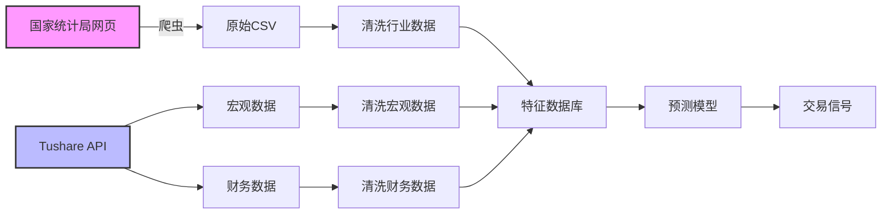

# 宏观经济预测模型设计文档

## 一、概述

本文档描述了基于国家统计局（NBS）数据和Tushare数据的宏观经济预测模型设计，用于预测行业景气度变化（复苏、大涨、衰退）以及全行业经济衰退风险。

### 1.1 核心思想

**"宏观看势，微观找质"**
- 用宏观数据（NBS）看行业周期拐点
- 用微观数据（Tushare）找个股阿尔法
- 结合建立"景气度-估值"双轮模型

### 1.2 预测场景

模型需要识别以下四种场景：

| 场景 | 定义 | 关键词 |
|------|------|--------|
| **行业复苏** | 困难时期已过，供需改善，右侧起步 | 底背离、库存出清、温和放量 |
| **行业大涨** | 产业逻辑爆发，全民共识，泡沫化 | 高换手、估值扩张、情绪高潮 |
| **行业衰退** | 周期下行、产能过剩，基本面恶化 | 产能过剩、杀估值、资金撤离 |
| **全行业衰退** | 系统性风险，流动性枯竭 | 信用紧缩、恐慌、避险 |

---

## 二、数据来源

### 2.1 国家统计局（NBS）数据

| 数据类型 | 核心指标 | 获取方式 | 更新频率 |
|---------|---------|---------|---------|
| **价格指数** | 分行业PPI、总PPI、CPI | 统计局官网/爬虫 | 月度 |
| **投资数据** | 分行业固定资产投资增速 | 统计局官网/爬虫 | 月度/季度 |
| **产量数据** | 主要工业品产量（集成电路、新能源车等） | 统计局官网/爬虫 | 月度 |
| **景气指数** | PMI、分行业PMI | Tushare API | 月度 |

### 2.2 Tushare数据

| 数据类型 | 核心指标 | 接口 | 更新频率 |
|---------|---------|------|---------|
| **宏观总量** | CPI、PPI总指数 | `cn_cpi`, `cn_ppi` | 月度 |
| **利率数据** | 10年期国债收益率 | `bz_yield` | 日度 |
| **信用数据** | 社融存量、M1/M2 | `shibor`, `m2` | 月度 |
| **行业财务** | 存货、营收、毛利率、CAPEX | `fina_indicator` | 季度 |
| **估值数据** | PB、PE、换手率 | `daily_basic` | 日度 |

---

## 三、场景识别指标体系

### 3.1 行业复苏（RECOVERY）

**特征**：最困难时期已过，供需改善，但市场尚未完全形成共识。

| 维度 | 核心指标 | 量化规则 | 预测原理 |
|------|---------|---------|---------|
| **价格** | PPI分项同比 | 连续2个月回升，仍为负或刚转正 | 价格跌不动，供给收缩见效 |
| **库存** | 存货周转率 | 存货增速 < 营收增速（被动去库） | 卖得比存得快，复苏铁信号 |
| **资金** | 北向资金持仓占比 | 连续3周环比增加 | 聪明钱先感知拐点 |
| **技术** | RPS(120日) | 从底部回升至60-70，未超85 | 股价跑赢大盘，但未暴涨 |

**综合条件**：
```python
PPI_improving AND Inventory_cleared AND Reasonable_valuation
```

### 3.2 行业大涨（BOOM/BUBBLE）

**特征**：产业逻辑爆发，全民共识，脱离基本面。

| 维度 | 核心指标 | 量化规则 | 预测原理 |
|------|---------|---------|---------|
| **情绪** | 换手率 | > 历史分位数90% | 资金疯狂涌入，散户进场 |
| **估值** | PE_TTM分位、PEG | PE处于历史80%分位以上，PEG>2 | 业绩跟不上，透支未来 |
| **动量** | RPS(20日/60日) | >90且维持2周以上 | 市场最强主线 |
| **广度** | 涨停家数占比 | >10% | 市场情绪极度亢奋 |

**综合条件**：
```python
PB_percentile > 80 AND Turnover_rate > 8% AND RPS_120 > 90
```

### 3.3 行业衰退（INDUSTRY RECESSION）

**特征**：周期下行、产能过剩，基本面恶化。

| 维度 | 核心指标 | 量化规则 | 预测原理 |
|------|---------|---------|---------|
| **供需** | CAPEX增速 | 连续3季度下滑 | 行业不再扩产，收缩战线 |
| **价格** | PPI分项 | 连续6个月负增长且跌幅扩大 | 陷入价格战，通缩压力 |
| **盈利** | ROE、毛利率 | 连续2季度环比下降 | 竞争恶化，赚钱效应消失 |
| **资金** | 主力净流出 | 净流出/成交额 > -2%且持续 | 机构坚决撤退 |

**综合条件**：
```python
PPI_yoy < -5 AND CAPEX_yoy < 0 AND Revenue_yoy < 0
```

### 3.4 全行业衰退（SYSTEMIC RECESSION）

**特征**：系统性风险，流动性枯竭，所有行业泥沙俱下。

| 维度 | 核心指标 | 量化规则 | 预测原理 |
|------|---------|---------|---------|
| **信用** | 社融存量同比 | 大幅下滑，或M1-M2剪刀差为负且扩大 | 经济体"没钱了" |
| **景气** | PMI | <48且新订单<产成品库存 | 主动去库存，硬着陆风险 |
| **风险** | VIX/IVIX | >均值+2倍标准差 | 市场极度恐慌 |
| **债市** | 期限利差 | 10Y-1Y < 0（倒挂） | 不愿放长期贷，极度悲观 |

**综合条件**：
```python
Credit_growth < 9.5 OR PMI < 48.5
```

---

## 四、系统架构设计

### 4.1 目录结构

```
Sage/
├── sage_core/
│   └── models/
│       ├── macro_predictor.py          # 宏观预测模型
│       ├── industry_classifier.py      # 行业场景分类器
│       └── cycle_detector.py           # 周期拐点检测
├── scripts/
│   ├── data/macro/
│   │   ├── fetch_macro_data.py         # 获取宏观数据（待实现）
│   │   ├── fetch_industry_data.py      # 获取行业数据（待实现）
│   │   ├── clean_macro_data.py         # 清洗宏观数据
│   │   └── clean_industry_data.py      # 清洗行业数据（待实现）
│   └── models/macro/
│       └── run_macro_prediction.py     # 运行预测
└── data/
    ├── tushare/
    │   ├── macro/                      # 宏观数据
    │   │   ├── cpi.parquet
    │   │   ├── ppi.parquet
    │   │   ├── yield_curve.parquet
    │   │   └── credit.parquet
    │   └── industry/                   # 行业数据
    │       ├── fai.parquet             # 固定资产投资
    │       ├── ppi_industry.parquet    # 分行业PPI
    │       └── output.parquet          # 产量数据
    └── processed/
        └── macro_features.parquet      # 处理后的特征
```

### 4.2 数据流程



---

## 五、核心模块设计

### 5.1 数据获取模块

#### 5.1.1 宏观数据获取（`fetch_macro_data.py`）

```python
import tushare as ts
import pandas as pd

class MacroDataFetcher:
    """宏观数据获取器"""
    
    def __init__(self, token):
        self.pro = ts.pro_api(token)
    
    def fetch_cpi(self, start_m, end_m):
        """获取CPI数据"""
        return self.pro.cn_cpi(start_m=start_m, end_m=end_m)
    
    def fetch_ppi(self, start_m, end_m):
        """获取PPI数据"""
        return self.pro.cn_ppi(start_m=start_m, end_m=end_m)
    
    def fetch_yield_curve(self, start_date, end_date):
        """获取国债收益率曲线"""
        yield_df = self.pro.bz_yield(
            start_date=start_date,
            end_date=end_date
        )
        # 提取10年期收益率
        return yield_df[['date', 'y10']].rename(columns={'y10': 'yield10y'})
    
    def fetch_pmi(self, start_m, end_m):
        """获取PMI数据"""
        return self.pro.cn_pmi(start_m=start_m, end_m=end_m)
    
    def fetch_all(self, start_date, end_date):
        """获取所有宏观数据"""
        start_m = start_date[:6]
        end_m = end_date[:6]
        
        cpi = self.fetch_cpi(start_m, end_m)
        ppi = self.fetch_ppi(start_m, end_m)
        yield10y = self.fetch_yield_curve(start_date, end_date)
        pmi = self.fetch_pmi(start_m, end_m)
        
        # 合并数据
        macro = (
            cpi[['month', 'nt_yoy']].rename(columns={'nt_yoy': 'cpi_yoy'})
            .merge(ppi[['month', 'ppi_yoy']], on='month', how='outer')
            .merge(pmi[['month', 'markit_pmi']], on='month', how='outer')
            .merge(yield10y, left_on='month', right_on='date', how='outer')
        )
        macro['date'] = pd.to_datetime(macro['month'], format='%Y%m')
        return macro
```

#### 5.1.2 行业数据获取（`fetch_industry_data.py`）

```python
import pandas as pd
import requests
from bs4 import BeautifulSoup

class IndustryDataFetcher:
    """行业数据获取器（国家统计局）"""
    
    def __init__(self):
        self.base_url = "http://www.stats.gov.cn"
    
    def fetch_fai_industry(self, year, quarter):
        """
        获取分行业固定资产投资数据
        实际应用中需要根据统计局官网的具体URL调整
        """
        # 这里需要根据统计局实际的URL和HTML结构编写爬虫
        # 示例伪代码
        url = f"{self.base_url}/tjsj/zxfb/{year}q{quarter}/"
        response = requests.get(url)
        soup = BeautifulSoup(response.text, 'html.parser')
        
        # 解析表格
        table = soup.find('table')
        rows = []
        for row in table.find_all('tr')[1:]:  # 跳过表头
            cols = row.find_all('td')
            rows.append({
                'industry': cols[0].text.strip(),
                'fai_yoy': float(cols[1].text.strip())
            })
        
        df = pd.DataFrame(rows)
        df['date'] = f"{year}Q{quarter}"
        return df
    
    def fetch_ppi_industry(self, year, month):
        """
        获取分行业PPI数据
        """
        # 类似的爬虫逻辑
        pass
    
    def fetch_output_industry(self, year, month, industry_name):
        """
        获取行业产量数据（如集成电路产量）
        """
        # 类似的爬虫逻辑
        pass
```

### 5.2 数据清洗模块

#### 5.2.1 宏观数据清洗（`clean_macro_data.py`）

```python
import pandas as pd

class MacroDataCleaner:
    """宏观数据清洗器"""
    
    def clean(self, raw_df):
        """清洗宏观数据"""
        df = raw_df.copy()
        
        # 1. 处理缺失值
        df = df.fillna(method='ffill')
        
        # 2. 计算增长率变化
        df['cpi_yoy_delta'] = df['cpi_yoy'].diff()
        df['ppi_yoy_delta'] = df['ppi_yoy'].diff()
        df['yield10y_delta'] = df['yield10y'].diff()
        
        # 3. 计算移动平均
        df['cpi_yoy_ma3'] = df['cpi_yoy'].rolling(3).mean()
        df['ppi_yoy_ma3'] = df['ppi_yoy'].rolling(3).mean()
        
        # 4. 计算M1-M2剪刀差
        if 'm1_yoy' in df.columns and 'm2_yoy' in df.columns:
            df['m1_m2_spread'] = df['m1_yoy'] - df['m2_yoy']
        
        return df
```

#### 5.2.2 行业数据清洗（`clean_industry_data.py`）

```python
import pandas as pd

class IndustryDataCleaner:
    """行业数据清洗器"""
    
    def clean(self, raw_df):
        """清洗行业数据"""
        df = raw_df.copy()
        
        # 1. 处理缺失值
        df = df.fillna(method='ffill')
        
        # 2. 统一时间格式
        df['date'] = pd.to_datetime(df['date'])
        
        # 3. 计算环比增长率（从同比转换）
        if 'fai_yoy' in df.columns:
            df['fai_mom'] = self._yoy_to_mom(df['fai_yoy'])
        
        if 'ppi_yoy' in df.columns:
            df['ppi_mom'] = self._yoy_to_mom(df['ppi_yoy'])
        
        # 4. 计算移动平均
        df['ppi_yoy_ma3'] = df.groupby('industry')['ppi_yoy'].transform(
            lambda x: x.rolling(3, min_periods=3).mean()
        )
        
        return df
    
    def _yoy_to_mom(self, yoy_series):
        """从同比估算环比"""
        mom = yoy_series.copy()
        for i in range(1, len(mom)):
            # 简化公式：环比 ≈ 同比变化 / 12
            mom.iloc[i] = yoy_series.iloc[i] - yoy_series.iloc[i-1]
        return mom
```

### 5.3 预测模型模块

#### 5.3.1 行业场景分类器（`industry_classifier.py`）

```python
import pandas as pd
import numpy as np

class IndustryScenarioClassifier:
    """行业场景分类器"""
    
    def __init__(self):
        self.thresholds = {
            'systemic_recession': {
                'credit_growth': 9.5,
                'pmi': 48.5
            },
            'boom': {
                'pb_percentile': 80,
                'turnover_rate': 0.08,
                'rps_120': 90
            },
            'recovery': {
                'ppi_yoy': -2,
                'pb_percentile': 60
            },
            'recession': {
                'ppi_yoy': -5,
                'fai_yoy': 0,
                'rev_yoy': 0
            }
        }
    
    def classify(self, data):
        """
        分类场景
        
        Args:
            data: dict or DataFrame, 包含所有指标
                - ppi_yoy: PPI同比增速
                - fai_yoy: 固定资产投资同比
                - inv_yoy: 存货同比增速
                - rev_yoy: 营收同比增速
                - pb_percentile: PB历史分位数
                - turnover_rate: 换手率
                - rps_120: 120日相对强度
                - credit_growth: 社融增速
                - pmi_value: PMI数值
        
        Returns:
            str: 场景标签
        """
        # 1. 优先判断全局衰退
        if (data['credit_growth'] < self.thresholds['systemic_recession']['credit_growth'] or
            data['pmi_value'] < self.thresholds['systemic_recession']['pmi']):
            return "SYSTEMIC RECESSION"
        
        # 2. 判断行业大涨
        if (data['pb_percentile'] > self.thresholds['boom']['pb_percentile'] and
            data['turnover_rate'] > self.thresholds['boom']['turnover_rate'] and
            data['rps_120'] > self.thresholds['boom']['rps_120']):
            return "BOOM / BUBBLE"
        
        # 3. 判断行业复苏
        ppi_improving = data['ppi_yoy'] > self.thresholds['recovery']['ppi_yoy']
        inventory_cleared = data['inv_yoy'] < data['rev_yoy'] and data['inv_yoy'] < 10
        reasonable_val = data['pb_percentile'] < self.thresholds['recovery']['pb_percentile']
        
        if ppi_improving and inventory_cleared and reasonable_val:
            return "RECOVERY"
        
        # 4. 判断行业衰退
        if (data['ppi_yoy'] < self.thresholds['recession']['ppi_yoy'] and
            data['fai_yoy'] < self.thresholds['recession']['fai_yoy'] and
            data['rev_yoy'] < self.thresholds['recession']['rev_yoy']):
            return "INDUSTRY RECESSION"
        
        # 5. 默认状态
        return "NEUTRAL / MIXED"
    
    def batch_classify(self, df):
        """批量分类"""
        results = []
        for idx, row in df.iterrows():
            scenario = self.classify(row.to_dict())
            results.append(scenario)
        return pd.Series(results, index=df.index)
```

#### 5.3.2 周期拐点检测（`cycle_detector.py`）

```python
import pandas as pd
import numpy as np

class CycleDetector:
    """周期拐点检测器"""
    
    def __init__(self, window=3):
        self.window = window
    
    def detect_recovery(self, ppi_series, fai_series):
        """
        检测复苏拐点
        
        条件：
        1. PPI连续2个月回升
        2. CAPEX连续3个季度增长
        """
        ppi_improving = ppi_series.diff().rolling(2).apply(lambda x: (x > 0).all())
        fai_expanding = fai_series.rolling(3).apply(lambda x: (x > 0).all())
        
        recovery_signal = ppi_improving & fai_expanding
        return recovery_signal
    
    def detect_boom(self, pb_series, turnover_series, rps_series):
        """
        检测大涨信号
        
        条件：
        1. PB分位数>80%
        2. 换手率>8%
        3. RPS>90
        """
        pb_high = pb_series > 80
        turnover_high = turnover_series > 8
        rps_high = rps_series > 90
        
        boom_signal = pb_high & turnover_high & rps_high
        return boom_signal
    
    def detect_recession(self, ppi_series, fai_series, rev_series):
        """
        检测衰退信号
        
        条件：
        1. PPI<-5%
        2. CAPEX<0
        3. 营收<0
        """
        ppi_low = ppi_series < -5
        fai_low = fai_series < 0
        rev_low = rev_series < 0
        
        recession_signal = ppi_low & fai_low & rev_low
        return recession_signal
    
    def detect_systemic_risk(self, credit_series, pmi_series):
        """
        检测系统性风险
        
        条件：
        1. 社融增速<9.5%
        2. PMI<48.5
        """
        credit_low = credit_series < 9.5
        pmi_low = pmi_series < 48.5
        
        risk_signal = credit_low | pmi_low
        return risk_signal
```

#### 5.3.3 综合预测模型（`macro_predictor.py`）

```python
import pandas as pd
import numpy as np
from .industry_classifier import IndustryScenarioClassifier
from .cycle_detector import CycleDetector

class MacroPredictor:
    """宏观经济预测模型"""
    
    def __init__(self):
        self.classifier = IndustryScenarioClassifier()
        self.detector = CycleDetector()
        self.feature_db = None
    
    def load_features(self, path):
        """加载特征数据库"""
        self.feature_db = pd.read_parquet(path)
        return self.feature_db
    
    def predict_scenario(self, industry=None, date=None):
        """
        预测场景
        
        Args:
            industry: 行业名称（可选）
            date: 日期（可选）
        
        Returns:
            dict: 预测结果
        """
        if self.feature_db is None:
            raise ValueError("请先加载特征数据库")
        
        # 筛选数据
        if industry:
            df = self.feature_db[self.feature_db['industry'] == industry].copy()
        else:
            df = self.feature_db.copy()
        
        if date:
            df = df[df['date'] == date]
        else:
            df = df[df['date'] == df['date'].max()]
        
        if len(df) == 0:
            return {'error': '没有找到对应数据'}
        
        # 分类场景
        scenarios = self.classifier.batch_classify(df)
        
        # 构建结果
        results = []
        for idx, row in df.iterrows():
            results.append({
                'date': row['date'],
                'industry': row.get('industry', '整体'),
                'scenario': scenarios[idx],
                'confidence': self._calculate_confidence(row, scenarios[idx]),
                'key_indicators': self._extract_key_indicators(row)
            })
        
        return results
    
    def _calculate_confidence(self, row, scenario):
        """计算预测置信度"""
        # 根据各指标偏离阈值的程度计算置信度
        if scenario == "SYSTEMIC RECESSION":
            # 离阈值越远，置信度越高
            credit_dev = min(abs(row['credit_growth'] - 9.5) / 2, 1)
            pmi_dev = min(abs(row['pmi_value'] - 48.5) / 2, 1)
            return max(credit_dev, pmi_dev)
        
        elif scenario == "BOOM / BUBBLE":
            pb_dev = min((row['pb_percentile'] - 80) / 20, 1)
            turnover_dev = min((row['turnover_rate'] - 8) / 5, 1)
            rps_dev = min((row['rps_120'] - 90) / 10, 1)
            return min(pb_dev, turnover_dev, rps_dev)
        
        else:
            return 0.5  # 默认中等置信度
    
    def _extract_key_indicators(self, row):
        """提取关键指标"""
        return {
            'ppi_yoy': row.get('ppi_yoy', None),
            'fai_yoy': row.get('fai_yoy', None),
            'pb_percentile': row.get('pb_percentile', None),
            'turnover_rate': row.get('turnover_rate', None),
            'rps_120': row.get('rps_120', None),
            'credit_growth': row.get('credit_growth', None),
            'pmi_value': row.get('pmi_value', None)
        }
    
    def get_recovery_signals(self, industry=None, start_date=None, end_date=None):
        """获取复苏信号"""
        if self.feature_db is None:
            raise ValueError("请先加载特征数据库")
        
        df = self.feature_db.copy()
        
        if industry:
            df = df[df['industry'] == industry]
        
        if start_date:
            df = df[df['date'] >= pd.Timestamp(start_date)]
        if end_date:
            df = df[df['date'] <= pd.Timestamp(end_date)]
        
        # 检测复苏信号
        ppi_series = df.groupby('date')['ppi_yoy'].mean()
        fai_series = df.groupby('date')['fai_yoy'].mean()
        
        recovery_signals = self.detector.detect_recovery(ppi_series, fai_series)
        
        return recovery_signals[recovery_signals == True]
    
    def generate_report(self, date=None):
        """生成预测报告"""
        results = self.predict_scenario(date=date)
        
        report = f"""
=== 宏观经济预测报告 ===
日期: {date or '最新'}

场景分布:
"""
        if isinstance(results, list):
            for result in results:
                report += f"""
【{result['industry']}】
场景: {result['scenario']}
置信度: {result['confidence']:.1%}

关键指标:
  - PPI同比: {result['key_indicators']['ppi_yoy']}%
  - FAI同比: {result['key_indicators']['fai_yoy']}%
  - PB分位: {result['key_indicators']['pb_percentile']}%
  - 换手率: {result['key_indicators']['turnover_rate']}%
  - RPS: {result['key_indicators']['rps_120']}
  - 社融增速: {result['key_indicators']['credit_growth']}%
  - PMI: {result['key_indicators']['pmi_value']}
"""
        else:
            report += f"错误: {results.get('error', '未知错误')}"
        
        return report
```

### 5.4 主运行脚本（`run_macro_prediction.py`）

```python
import sys
import os
import argparse
import pandas as pd
from datetime import datetime

# 添加项目路径
sys.path.append(os.path.abspath(os.path.join(os.path.dirname(__file__), '..', '..', '..')))

from scripts.data.macro.fetch_macro_data import MacroDataFetcher
from scripts.data.macro.clean_macro_data import MacroDataCleaner
from scripts.data.macro.fetch_industry_data import IndustryDataFetcher
from scripts.data.macro.clean_industry_data import IndustryDataCleaner
from sage_core.industry.macro_predictor import MacroPredictor

def main():
    parser = argparse.ArgumentParser(description='宏观经济预测模型')
    parser.add_argument('--mode', type=str, default='predict',
                       choices=['fetch', 'clean', 'predict', 'all'],
                       help='运行模式')
    parser.add_argument('--start-date', type=str, default='20200101',
                       help='开始日期')
    parser.add_argument('--end-date', type=str, default='20251231',
                       help='结束日期')
    parser.add_argument('--industry', type=str, default=None,
                       help='行业名称')
    
    args = parser.parse_args()
    
    token = '2bcc0e9feb650d9862330a9743e5cc2e6469433c4d1ea0ce2d79371e'
    
    # 数据目录
    macro_dir = 'data/tushare/macro'
    industry_dir = 'data/tushare/industry'
    processed_dir = 'data/processed'
    
    os.makedirs(macro_dir, exist_ok=True)
    os.makedirs(industry_dir, exist_ok=True)
    os.makedirs(processed_dir, exist_ok=True)
    
    if args.mode in ['fetch', 'all']:
        print("=" * 80)
        print("步骤1: 获取数据")
        print("=" * 80)
        
        # 获取宏观数据
        macro_fetcher = MacroDataFetcher(token)
        macro_raw = macro_fetcher.fetch_all(args.start_date, args.end_date)
        macro_path = os.path.join(macro_dir, f'macro_raw_{datetime.now().strftime("%Y%m%d")}.parquet')
        macro_raw.to_parquet(macro_path, index=False)
        print(f"✓ 宏观数据已保存: {macro_path}")
        
        # 获取行业数据（这里用模拟数据）
        industry_fetcher = IndustryDataFetcher()
        # 实际应用中需要从统计局获取
        print("! 行业数据需要从国家统计局获取（待实现）")
    
    if args.mode in ['clean', 'all']:
        print("\n" + "=" * 80)
        print("步骤2: 清洗数据")
        print("=" * 80)
        
        # 清洗宏观数据
        macro_cleaner = MacroDataCleaner()
        macro_cleaned = macro_cleaner.clean(macro_raw)
        macro_cleaned_path = os.path.join(processed_dir, 'macro_features.parquet')
        macro_cleaned.to_parquet(macro_cleaned_path, index=False)
        print(f"✓ 宏观数据已清洗: {macro_cleaned_path}")
    
    if args.mode in ['predict', 'all']:
        print("\n" + "=" * 80)
        print("步骤3: 运行预测")
        print("=" * 80)
        
        # 加载特征
        predictor = MacroPredictor()
        predictor.load_features(macro_cleaned_path)
        
        # 预测场景
        results = predictor.predict_scenario(industry=args.industry)
        
        # 生成报告
        report = predictor.generate_report()
        print(report)
        
        # 保存结果
        if isinstance(results, list):
            results_df = pd.DataFrame(results)
            results_path = os.path.join(processed_dir, f'prediction_results_{datetime.now().strftime("%Y%m%d")}.csv')
            results_df.to_csv(results_path, index=False, encoding='utf-8-sig')
            print(f"\n✓ 预测结果已保存: {results_path}")

if __name__ == '__main__':
    main()
```

---

## 六、实施计划

### 6.1 第一阶段：数据获取（1-2周）

- [ ] 实现Tushare宏观数据获取（CPI、PPI、收益率曲线、PMI）
- [ ] 实现国家统计局数据爬虫（分行业PPI、固定资产投资、产量）
- [ ] 建立数据存储结构（Parquet格式）
- [ ] 编写数据更新脚本

### 6.2 第二阶段：数据清洗（1周）

- [ ] 实现宏观数据清洗逻辑
- [ ] 实现行业数据清洗逻辑
- [ ] 计算衍生指标（增长率变化、移动平均、环比等）
- [ ] 处理缺失值和异常值

### 6.3 第三阶段：模型开发（2-3周）

- [ ] 实现行业场景分类器
- [ ] 实现周期拐点检测器
- [ ] 实现综合预测模型
- [ ] 编写预测报告生成器

### 6.4 第四阶段：测试验证（1-2周）

- [ ] 历史回测验证
- [ ] 参数优化
- [ ] 性能评估
- [ ] 文档完善

---

## 七、数据更新策略

### 7.1 更新频率

| 数据类型 | 更新频率 | 更新时间 |
|---------|---------|---------|
| CPI/PPI | 月度 | 每月9-10日 |
| PMI | 月度 | 每月1日 |
| 10Y收益率 | 日度 | 每日收盘后 |
| 分行业PPI | 月度 | 每月15日左右 |
| 固定资产投资 | 月度/季度 | 每月15日左右 |
| 产量数据 | 月度 | 每月15日左右 |

### 7.2 自动化更新

建议使用cron定时任务：

```bash
# 每周一凌晨2点更新数据
0 2 * * 1 cd /path/to/project && venv/bin/python scripts/models/macro/run_macro_prediction.py --mode fetch

# 每周三凌晨2点运行预测
0 2 * * 3 cd /path/to/project && venv/bin/python scripts/models/macro/run_macro_prediction.py --mode predict
```

---

## 八、风险与注意事项

### 8.1 数据风险

- **国家统计局数据可能延迟**: 某些数据可能发布时间不固定
- **数据口径变化**: 历史数据可能存在口径调整
- **缺失数据**: 某些行业或时间点可能数据缺失

### 8.2 模型风险

- **滞后性**: 宏观数据本身具有滞后性
- **假信号**: 指标可能产生假信号
- **黑天鹅事件**: 无法预测突发事件

### 8.3 使用建议

1. **结合其他信号**: 不要仅依赖宏观数据，结合技术面、资金面
2. **动态调整阈值**: 根据市场环境动态调整判断阈值
3. **风险控制**: 设置止损，严格执行仓位管理
4. **持续监控**: 定期回测，优化模型

---

## 九、后续扩展方向

1. **加入更多行业**: 扩展到更多细分行业
2. **机器学习模型**: 使用机器学习替代规则模型
3. **实时监控**: 实现实时数据监控和预警
4. **可视化**: 开发可视化监控面板
5. **回测系统**: 集成回测系统验证策略

---

## 十、参考文献

1. 国家统计局官网：http://www.stats.gov.cn/
2. Tushare Pro文档：https://tushare.pro/
3. 美林时钟理论
4. 库存周期理论
5. 行业生命周期理论
